## Introduction

Hello. You may not know how happy I am to meet you, even if only through these pages. I do not believe a book is completed by the author alone. A writer creates sentences, but it is ultimately the reader who gives those sentences meaning and completes them to the end. In that sense, I sincerely thank you for opening this book.

First, I want to explain why I came to write it. I was commissioned as an officer in 2011. That was when I first began receiving a salary, so it has now been fifteen years since I started my working life. Looking back, I knew for a long time how to earn money, but I did not know how to protect it or grow it. When I received my salary, I saved some of it, signed up for products other people said were good, and trusted people who sounded like experts. I thought that was the best I could do.

The results were different from what I expected. The funds I chose after trusting people around me and so-called investment experts produced returns lower than bank interest over ten years. A variable insurance policy I bought without even understanding what business expenses were ended up losing money. I even lost KRW 30 million to fraud, wiping out the seed money I had barely managed to save. These are embarrassing and painful memories now. At the same time, those experiences taught me in my bones how important financial knowledge is.

Then, in 2021, partly on a senior colleague's recommendation and partly by my own decision, I began reading books on economics. From that point, many things changed. My view of money changed, my attitude toward investing changed, and most importantly, I found an investment method that fit me. As I invested steadily with conviction, my assets began to grow rapidly as well.

I am not writing this book to boast that I made some money. It is closer to the opposite. I did not want to hide my inadequate past. I wanted to speak honestly about how little I knew, how easily I was swayed, and how foolish some of my choices were. There is only one reason: I do not want you to go through the same trial and error that I went through.

What benefit would I gain if you followed the investment method I describe? What I sincerely hope is that, even amid your busy daily life, you can understand a rational way to invest with minimal effort and protect the assets of yourself and your family. When you lack financial knowledge, you too easily become prey for someone else. They approach with friendly faces, use difficult terminology, and speak as if they are offering an opportunity prepared only for you. But if you do not understand and invest for yourself, the side that ultimately loses is always us.

Soldiers in particular are often unfamiliar with how the world works. I was the same. When you live inside an organization faithfully carrying out assigned duties, there are not many chances to look deeply into the flow of money outside or the structure of financial products. Your salary arrives on a fixed day, life is relatively regular, and finance and investing can feel like something far away from you. Precisely for that reason, however, you must be more careful. The world does not go easy on us because we do not know. If anything, it exploits people who do not know more easily.

There are many complex and diverse investment methods in the world. Every day countless news stories appear, and countless experts express their own views. Some talk about short-term trading, some about real estate, and some about coins or individual stocks. Of course, some of those methods may be good. But in this book, I wanted to convey that by understanding only the essentials and investing in a very simple way, you can still achieve sufficient returns. If you have a main job, spending all day watching stock quotes on your phone or constantly searching real estate prices is, in my view, a long-term negative.

It would be nice if you and I could analyze the financial statements of every company like professional fund managers, predict industrial change, and execute complex investment strategies. But most people with primary jobs cannot live that way. We have our own work, families, and responsibilities. That does not mean we must give up investing. There is a method we can practice within the time and energy we have. It is not complicated, but it is powerful; it does not require daily attention, yet it can grow assets over the long run. That is the story I will tell in this book.

Some of you may be thinking, "How can a soldier who is neither a professional investor nor a fund manager, and who has never worked at a bank, write a book about investing?" I imagine quite a few of you may have that doubt. You may think that to write an investment book, one should at least have long experience at an investment institution or have already built great wealth and proven oneself. I fully understand that feeling.

But I would like to speak from a slightly different perspective. First, working at an investment institution or being a professional investor does not necessarily mean earning good returns. In reality, many fund managers fail to beat market indexes such as the S&P 500 over the long term. High knowledge and impressive credentials do not necessarily lead to high returns. What matters in investing may not be knowing more, but holding on simply to what matters and practicing it for a long time.

There is one more thing I want to say. There is a gap between the stories of people who have already achieved great success and the reality we live in now. Successful people's stories are always attractive: Apple and Hewlett-Packard starting in humble garages and becoming global companies, or Snowfox Chairman Kim Seung-ho building a business in a foreign country while enduring countless hardships. Such stories give us courage and inspiration. But the era in which they built wealth and the era we live in today are different, so there is no guarantee that the methods they used will work exactly the same way now. Too many people may already be following those methods, or what was an opportunity then may now be a fiercely competitive market. Success stories contain many lessons, but they are not answer sheets we can copy exactly.

That is why I thought the story of one person still in the process of building assets might also be useful to someone. I am not a completed legend. I have not built enormous wealth, nor am I an expert who spent decades on Wall Street. If anything, I may be someone closer to you. I lived on a salary, lost money because I did not understand money, started studying late, and through trial and error have been finding an investment method that fits me.

Perhaps for that reason, I hope this book can feel more realistic to you. I hope you will read it not as a success story from someone far away, but as a record from someone who got lost a little earlier and studied a little earlier. I do not want to claim that I can give you a perfect answer. But if what I learned by falling down myself, and the thoughts I organized in that process, can reduce your trial and error even a little, I believe this book will have enough meaning.

This book is not meant to show off difficult investment theory. It is not meant to overwhelm you with complex financial terminology. It is the opposite. I wanted to explain as easily as possible so that even people unfamiliar with finance and investing can read slowly and understand. I wanted to talk with you about why we need to understand money, why we must invest, why ETFs that buy the whole market can be a powerful tool for ordinary individuals, and why long-term investing matters.

I do not hope that every reader becomes a great investor. I do not hope that you become someone who predicts the market every day, buys and sells faster than others, or analyzes complex charts. I have a much more important hope. At the very least, I hope you do not lose money simply because you did not know. I hope you do not lose precious seed money after being deceived by someone's plausible words. I hope the money you worked hard to earn does not leak away into financial products whose structure you do not understand. I hope people who have lived faithfully do not lose out simply because they do not know how the world or finance works.

That desire was strong enough that I picked up the pen. If, through this book, you come to understand money a little better, fear investing a little less, and make choices you can accept for yourself, I could ask for nothing more. The writing may be imperfect, but I sincerely hope it becomes a small help to your time and your life.

# Prologue - Financial Freedom Is What Lets You Focus on Your Work

Every day, we hear that housing prices have jumped again. Someone bought an apartment in some area and it rose by hundreds of millions of won within months; in the stock market, someone made a fortune because a particular stock surged. There is never a quiet moment. On top of that, someone says crypto changed their life. Returns of several times or dozens of times the original investment no longer sound unfamiliar.

If we look a little closer, we hear more realistic examples too. It is not hard to encounter stories of ordinary employees who began buying homes at auction, repeated the process of buying and selling, eventually earned more than their salary, and finally quit their jobs. These stories are no longer confined to the news. They appear repeatedly in our daily lives, and that repetition has a real influence on us.

The issue is not whether these stories are true. Some are certainly true, and there really are people who captured such opportunities. What matters more is how those stories affect us. Humans instinctively compare. The moment we feel that someone we thought was on the same starting line has moved far ahead, our minds are easily shaken.

Uncertainty about whether I am going in the right direction begins to linger in my head. From that point, concentration slowly collapses. The work in front of me is still important, but part of my mind is constantly calculating other possibilities.

"Should I be doing that too?"

"Is it still not too late?"

"Is it okay to live only on a salary like this?"

Even while working or resting, we are in constant conversation with an invisible market. That conversation gradually clouds our judgment. At times when we should be fully immersed in our original role, we are already spending energy considering other choices.

There is one fact we must make clear here: expecting complete focus without financial freedom is harder than it sounds. Anxiety about livelihood, impatience that we may miss opportunities, and urgency born from comparison with others all arise from a mind without conviction. Unless this is resolved, it is difficult to immerse oneself fully in anything.

This does not mean everyone must learn auctions, make bold bets on specific assets, or leave their jobs. In fact, such choices are likely suitable only for a very small number of people. Most people have stable income and design their lives around it. What matters is finding a way to keep that foundation intact while also preventing the mind from being shaken.

Many people think they cannot grow assets because they lack expert financial knowledge. This is half right and half wrong. We cannot possess the same knowledge as professional investors, nor do we need to. What we need is not more information, but minimal knowledge, a steady standard, and the ability to execute it.

Financial freedom does not simply mean the resulting state of having a lot of money. At least in this book, financial freedom is closer to the process of building a life in which you are not swayed by others, own your time, and can choose for yourself. Not losing direction amid the surrounding noise, and as a result, being able to immerse yourself fully in the work you are doing now. That is the freedom we should realistically aim for.

This book presents a simple yet powerful way to obtain that freedom. Through it, we can establish an investment philosophy that does not waver, and on that foundation finally devote ourselves fully to both work and life.

# Chapter 0. Financial Illiteracy, Thrown Into the World

## 0.1 From a Controlled Life to a World of Choice

I entered the Korea Military Academy in 2007. When you enter a military academy, most of your life is decided for you: when you wake up, when you eat, when you attend class, and when you train. The flow of the day is tightly structured, and moving within that frame becomes natural.

When you follow such a packed schedule, the day ends before you even realize how it passed. During class I struggled to stay awake, and on weekends I was busy going out or staying off campus to enjoy the freedom I had finally been given. I was always short on stamina, and there was little room to think. It may be an excuse, but in such circumstances, studying investing felt even more distant.

The academy exists to train elite officers. We studied the leadership of great generals in history, including Admiral Yi Sun-sin, and learned not only Korean but also Eastern and Western military history. How to lead an organization, practical sense in the field, military spirit, judgment in crisis, responsibility, and sense of mission were emphasized repeatedly. But nobody talked about money.

When you graduate from the academy, you are commissioned as an officer and begin receiving a salary. You are roughly around twenty-four, which means you must manage assets at an earlier age than many other workers entering society. I do not know what it is like now, but when I was a cadet, I never systematically learned even once how to manage money or grow it. I was even thoroughly ignorant about the capitalism in which we live.

As a cadet, I did not need much money. The allowance paid by the military for cadets was not generous, but most of life was handled inside the school. If I went out, ate something nice, and enjoyed some culture, the allowance quickly ran out. Naturally, money became something you "spend" once you earn it, and there was neither opportunity nor need to think beyond that. Besides, I was told that when I went to the field, housing would be provided, so it felt as if all that remained was to devote my body and soul to the nation.

But as graduation drew near, a completely different world began to unfold before me. At some point, unfamiliar people started visiting the school one by one. At first I thought they were simply giving briefings. But every one of them carried some kind of product: dental insurance, medical indemnity insurance, variable insurance, principal-protected insurance, and various riders attached to them. Unfamiliar financial products followed one after another. The explanations were long, the conditions were complex, and every product felt as if it had to be purchased.

The problem was that I had no standard for judging which of them were good. Someone said I would lose out if I did not sign up now; someone else said this product was the safest; another said that if not now, I would miss the opportunity. Information overflowed, but I had no standard to filter it. Nevertheless, we had to make decisions.

When I looked around, some classmates were already making their own choices. One classmate said he would put as much money as possible into the Military Mutual Aid Association and use that capital to buy a house. Another was participating in investments his parents had made, and someone else had already begun buying stocks. Some classmates were buying Bitcoin, and others were preparing for real estate investment.

Friends I thought stood on the same starting line were moving in completely different directions. In that setting, I chose to do nothing. Do not lose money. Save what I earn little by little, and spend only what I earn. At the time, I thought that was the most rational choice. I believed at least it was not a losing choice. But that thought did not last long.

After graduation, the distance between classmates naturally widened. We each had assigned duties, and it was not easy to find time to meet. Some time passed, and when we met again after a long while, I faced a different reality. One classmate was investing in Bitcoin. During the meal he laughed that the price had gone up and eventually said he would pay for the second round. Another classmate had been steadily putting money into the Military Mutual Aid Association and had built up a considerable lump sum.

As I listened to them, I naturally looked down at my hands. Then I realized that I had nothing in them. What I felt in that moment was not simple envy. A more fundamental question arose.

"Am I going in the right direction?"

I had lived diligently and faithfully done what I needed to do. And yet I could not shake the feeling that I had missed something important. That was when I first realized that the problem was not that I had failed to work hard. The world was too wide, and I did not know what to do within it.

Among all the countless choices in this wide world, was there no one who could teach me a decent investment method, even if not the best one?

## 0.2 Investments Other People Do for You...

My parents told me that I should also learn the joy of earning money, so for the first year I should spend a little. As an artillery officer, I was assigned to a unit near a very small town called Jeongok. Even from Jeongok to the unit, buses ran only about six times a day: twice in the morning, twice in the afternoon, and twice in the evening. If I missed the bus, I had to take a taxi to get outside the unit, and sometimes I ordered chicken or pizza in Jeongok and rode back to the unit in the delivery vehicle. Being trapped in such a rural place produced a compensatory urge. With my parents' words in mind, I bought things I had not been able to buy. I gave my parents a small allowance, bought gifts for my girlfriend, bought a new laptop that was supposedly good, and had a suit made.

Before I knew it, more than a year had passed since I first received a salary. How much could a second lieutenant's salary be? Spending like that, of course, left me with truly nothing. Military life was also very hard. Because I served as an observation officer, I slept outside during training for about one-third of the year, whether hot or cold. Inside the unit, fatigue accumulated through quick reaction standby, duty officer work, and other tasks regardless of weekends or weekdays. More than anything, it was mentally difficult. I was clumsy in relationships, and because I thought only of the lofty leadership I had learned as a cadet, I could not get along well with either NCOs or soldiers.

Around the time when worries about both military life and money were rising together, I transferred from artillery to the CBRN branch to escape reality and find a new path. At the CBRN School, a branch training institution, I studied in a way that felt like real study for the first time in a while, and my anxiety about military life calmed somewhat. But I still had nothing but questions about how to manage money. I had only vague anxiety and no sense at all of what to do or how. My parents also knew only real estate when it came to investing, so it was hard to receive help from them.

Then an investment expert came to give a lecture at the CBRN School. He said we should not invest vaguely, but divide time horizons into short, medium, and long term and invest systematically. He also said things like one should not buy a car when one has no money, and it felt as if he was offering sincere advice. He added that he managed assets for many soldiers, including generals, and that anyone interested could contact him. His words sounded like the answer, and I felt I had finally met the reliable investment expert I had been longing for.

If I was not going to study and invest on my own, would it not be better to have an expert manage it? Thinking that, I contacted the lecturer separately. He kindly came all the way from Seoul back to the CBRN School in Jangseong, Jeolla Province, and following his advice, I set up a medium-term and long-term investment plan. For the medium term, I signed up for installment funds with a three-to-seven-year horizon, and for the long term, a variable insurance policy with a horizon of more than ten years. In particular, I was told that the variable insurance policy deducted about 20 percent as business expenses and invested the rest, but over the long term it was a truly good investment product. Trusting only the lecturer's words, I invested for more than six years.

Looking back now, almost everything was absurd. Was there really a need to divide investing into short, medium, and long term? Is more money not simply better? The advice not to buy a car when you have no money may have meant not buying it as a luxury, but if someone truly needs one, is it not right to buy one? And what about the funds? Without knowing anything about bonds, stocks, or interest rates, I joined funds recommended by someone else. After investing in two funds for more than six years, one barely preserved principal and the other earned 20 percent. On average, that was only about 3 percent per year over six years. Variable insurance goes without saying. If 20 percent is deducted from principal at the start, how can it possibly make a profit? The only fortunate thing is that, despite repeated suggestions to invest more, I sensed something was off and never made additional payments.

In the end, I made a decision. I felt that letting time pass like this would be an even bigger loss. I had to close products that were worse than bank interest as soon as possible.

## 0.3 Faith Cannot Protect Your Money

I sincerely trusted the lecturer who had come to the CBRN School. He was not merely someone explaining investment products. At least to me at the time, he was someone who showed direction. Rather than doubt what he said, I tried to understand it, and even parts I did not understand I dismissed by thinking, "I must not know enough." I believed that if I desired something earnestly it would come true, but the world was entirely separate from my belief.

Eventually, I closed all the products he had recommended. I judged that even taking a loss was the right decision. Even then, I still trusted him. Some time later, he contacted me again, saying a truly good product had appeared, one that could only be entered with a lump sum. The structure, as he explained it, was this: gather lump sums from investors, preserve the principal, and invest very aggressively using only the interest income. Since only the interest income was invested, there would be no loss to principal, and expected returns were around 8 percent per year. If returns exceeded 8 percent, the excess would be split with the broker.

Thinking about it now, there were more than one or two strange points. Preserve the principal and earn 8 percent per year only from the interest? At the time, I had some doubts because he seemed to have studied much more than I had, but I trusted him. I had trusted him once already, and this time I wanted to believe it was a real opportunity. In the end, I invested KRW 30 million that I had saved by scrimping, enduring, and holding on.

I still cannot forget the day it happened. My wife and I had gone on a short trip to Jeonju. It was a rare time when I felt free from military life and could relax. Then a phone call came. It was the lecturer. The moment I answered, I sensed something different in his voice. When he began by saying he was sorry, my mind froze. He said the person who had carried out the investment was under police investigation for fraud, and that recovering the investment was practically impossible. It was a bolt from the blue. The moment I heard it, I learned for the first time what it feels like for the world to collapse. My hands trembled, and no words came out. I could only hold the phone blankly.

That night, I could not speak for a while. But my wife was beside me. She listened quietly and then said calmly:

"The money is already lost. Lost money does not come back. We can earn and save again."

Those words gave me great comfort. My wife did not blame or resent me in any way. She simply accepted reality. Thanks to her, we were able to finish the trip.

The lecturer continued to contact me afterward. He cried and apologized. He said he should have investigated more carefully before recommending the product. His voice sounded sincere. Whether that was true or not, I kept trusting people to the end. Even now I wonder why I believed so much. I was young, ignorant, and careless. Above all, because I did not know, I wanted to believe.

Looking back, that was not trust; it was a choice to avoid responsibility. I wanted someone to judge for me so I would not have to study myself. Rather than blame the lecturer, I decided to accept the result as it was. Then I finally realized: investing is not an act of trusting someone, but an act of taking responsibility for what you understand yourself.

Several years later, my wife and I were lucky enough to win a special housing subscription for newlyweds. The sale price was KRW 430 million. To sign the contract, we needed a 10 percent deposit, KRW 43 million. For someone like me who had failed in several investments, that was not a light amount. On top of that, we also had to cover roughly KRW 130 million, about 30 percent, as the remaining balance. Even if we scraped together everything we had, it was hard to meet that amount. I told my wife we should give up. But she was far wiser and stronger than I was. With one sentence from her, "Let's try," the situation changed. In the end we prepared the deposit, and with family help we somehow covered the intermediate payments too.

Through that process, I looked at myself again. Why had I known nothing and simply trusted people with my money? Why had I not tried to understand for myself? That question followed me for a long time. At the end of that question, I reached one conclusion: I had to change. Before trusting someone else, I had to understand first. From that day on, for the first time, I desperately decided to study investing.

## 0.4 It Is Your Money Only When You Do It Yourself

What did you think while reading the story above? Some may find it hard to understand why I made such choices. It may seem like something I could have avoided if I had looked into it a little more. I think the same now, after time has passed. But all such judgments are possible only after knowing the result. This is called hindsight bias.

During the Pacific War, before the attack on Pearl Harbor, there were many warning signs that now seem obvious. But the people there at the time could not connect all those pieces into one conclusion. They thought there would be no Japanese attack. A flow that looks obvious from a later perspective is understood completely differently by those inside the moment. The lesson is simple: unless you were inside that situation, you cannot casually judge the decision made then.

My case was no different. I was in a completely different position then. I lacked information and experience. Most of all, I did not know what standard to use in making judgments. Inside that situation, the decisions felt rational to me. And if most people reading this were placed in a similar situation, they likely would not have chosen very differently.

What matters is not whether the choice then was right or wrong. What matters more is why I had no choice but to make it. We all judge within limited information and experience. More precisely, we decide not merely because information itself is lacking, but because we lack an understanding of how to interpret information. Problems arise when there is no standard that should support that judgment. Information always overflows. Stories related to investing pour out constantly, and plausible words always sound persuasive. But if there is no standard to connect that information and judge its meaning, more information creates confusion rather than help. If we cannot decide what to filter out and what to accept, our choices inevitably sway with circumstances.

Looking back, what happened to me was not a special case. It is something that can happen to anyone. That is why it is more dangerous. The same style of choice repeats, and similar results appear again. As the saying goes, history does not repeat, people do. If we do not break this flow, the same problem will keep recurring. So now we must change direction. We must not search for more information, but build a standard that will not waver. We need a foundation from which we can judge for ourselves in any situation. Without that, even choices that appear to be good opportunities ultimately lead only to another anxiety.

After that, I began looking at investing again. I focused not on finding what to buy, but on understanding why such a choice should be made. I organized one thing at a time: how the economy moves, how the value of money changes, and what relationship interest rates and markets have. At first everything felt unfamiliar and difficult, but once I began to understand the basic structure, things that had seemed complex gradually looked simpler. In that process, one thing became clear. Investing is not an area determined only by special skills or talent. If that were true, the smartest people would make the most money. Instead, it is far more important to understand minimal concepts and structures, and then continue making consistent choices on that foundation. I also learned that simple, understandable methods can be stronger than complex strategies.

This book contains the thoughts I organized in that process. It will proceed step by step, from the psychological reasons why we are easily shaken, to the minimum financial knowledge we must know, and then to investment methods individuals can realistically choose. Rather than listing complex theories or difficult concepts, I will explain mainly through structures that can actually be applied. In particular, this book will center on long-term investment using leveraged ETFs. Many people feel this area is difficult or risky, but once you understand the basic principles, you will see that the structure is simpler than it seems. What matters is not which product you choose, but whether you understand that choice yourself and can maintain it.

To no longer be shaken by circumstances, and to avoid repeating the same mistakes, we need a process of establishing standards. I hope this book becomes that starting point.

# Chapter 1. Human Psychology Comes Before Techniques and Stock Picking

## 1.1 Is There a Reason Crowds Gather?

People say there is a reason crowds gather. In reality, that is often true. Places where people gather usually have a plausible reason. Someone says they made money; someone says they found an opportunity. So we naturally think there must be something where all those people are gathering. But here we need to stop and think once. If the answer truly lies where the crowd is, should there not be far more rich people in this world?

Reality is different. Most people make similar choices and get similar results. And those results are often far from the direction we expect. Why does this repeat? The reason is simple. Rather than judging for ourselves, we are accustomed to following paths already chosen by many people. It is an instinct engraved in the human DNA that began on the African savanna.

In psychology, this is called herd mentality. Herd mentality begins from a very simple principle: many people create the illusion of safety. Because the choice is not mine alone, the psychological burden decreases, and the possibility that the choice is wrong seems lower. When stories are added that someone has already succeeded through that choice, the judgment becomes even closer to conviction.

Making money is not achieved merely by knowing good information. Kim Seung-ho, author of The Attributes of Money, says that to make money, one must cross a certain barrier. This point is more important than it may seem. Because that barrier exists, not everyone can approach easily, and differences arise as a result. If anyone can do something easily and enter without resistance, countless people will already be inside, and opportunities will inevitably shrink.

Consider common examples. Some areas have the strong barrier of law. Areas legally prohibited, such as drugs or gambling, are restricted by that fact itself. This is not a desirable example, of course, but the point is that a barrier exists that not just anyone can cross. Other areas have barriers of social perception. Funeral work, for example, is necessary, yet many people hesitate to choose it because of how it is perceived. As a result, competition is relatively lower and different opportunities arise.

Real estate is the same. To invest in good real estate, substantial capital is necessary. The barrier of capital naturally filters many people. So the number of people who can enter is limited, and opportunities inside are created in another form. Ultimately, making money is not merely choosing well; it is connected to crossing a boundary that many people cannot cross.

Herd mentality pulls us in the exact opposite direction. It leads us toward places where many people have already gathered, where results are already visible, and where success stories are already overflowing. Those places look safe and feel proven. But at that very point, we miss an important fact: information that many people already know is no longer an opportunity.

We can easily see similar scenes in the stock market. News comes out that a particular stock has surged, people around us start talking about it, and only then do many people become interested. Then they jump in late. But at that point, many people are already in, and expectations are likely already reflected in the price. That choice becomes closer to risk than opportunity.

This is not only about investing. It is the same in life. The road many people take can certainly be stable. But the result one can obtain on that road is also likely to be close to average. Choosing another road requires enduring anxiety and doubt. The eyes of others, lack of conviction within oneself, and uncertainty about results become barriers blocking the way. So we often choose the less anxious path, the path many people have already chosen. And that choice sends us back into the crowd.

You can never become rich by being swept along by herd mentality. This is true in investing and in life. You must be able to choose based on your own standard, not the direction of others. And that standard is not something someone else creates for you; it is something you build yourself.

The greatest barrier of the leveraged ETFs discussed in this book is "the time of patience." That too is a barrier many people cannot easily cross. Are you ready to cross it?

## 1.2 Unnecessary Comparison Ruins Me

There is a Korean saying that when a cousin buys land, your stomach hurts. When we hear that someone made a large profit, we feel irritated for no clear reason and become impatient. Without realizing it, we begin comparing, and we focus more on what someone else did than on what we are doing. This psychology is generally called comparison psychology or social comparison. Humans instinctively compare themselves with others to confirm their own position. This psychology naturally formed through survival and adaptation. The problem is that in investing, it almost always works in the wrong direction.

Why is comparison psychology so strong? People respond far more sensitively to relative standards than absolute ones. Whether I earned 100 is not very important. The fact that the person next to me earned 200 feels much bigger. Especially when that person seems to be in a similar environment, the feeling becomes stronger. Impatience arises here: the feeling that only I am falling behind, the pressure that I must catch up even now. That pressure soon leads to hasty choices.

The problem is that when people compare, they do not look at the whole process. They see only the "result" that someone earned a certain amount. They rarely care what process that person went through, how long they prepared, or what losses they suffered along the way. In mathematical terms, it is like having no interest in the accumulated flow, the integral, and obsessing only over the change at one moment, the derivative. But investing cannot be evaluated by a momentary result. The choices repeated over a long period ultimately create the outcome.

This way of thinking naturally makes us obsessed with short-term performance. We focus on whether we are making money right now and whether we are getting results faster than others. But approaching it this way makes it difficult to create stable returns. Instead, we are swayed by volatility, our choices change with emotion, and we eventually lose consistency. In investing, the most important thing is not one choice, but how long we can maintain the same choice.

Here we can consider an interesting example: the prisoner's dilemma. Two accomplices are arrested and interrogated separately. If both remain silent, both receive relatively light punishment. If one betrays the other, the betrayer goes free and the other receives heavy punishment. If both betray each other, both receive a medium punishment. From each individual's perspective, betraying the other seems like the most rational choice. But if both do so, both ultimately get worse results.

There is a real experiment that expanded this problem. Political scientist Robert Axelrod created a tournament in which multiple strategies were programmed and repeated games were played. Each strategy interacted continuously with opponents and accumulated points. An interesting result emerged. The winner was not the most complex or aggressive strategy, but a very simple one.

That strategy was Tit for Tat. It begins with cooperation, and thereafter simply copies what the opponent did. If the opponent cooperates, it cooperates; if the opponent defects, it defects next time. The structure is extremely simple. Tit for Tat cannot clearly defeat anyone one-on-one. In the short term, it is difficult for it to produce better results than its opponent. It does not overwhelm the opponent aggressively or steal gains cleverly. Nevertheless, this strategy won the first tournament, in which fifteen programs participated.

It did not end there. Based on that result, a second tournament was held with more researchers. This time the results and strategies from the first tournament were all public, and many more programs participated. The number exceeded sixty, and some were much more complex and sophisticated. Programs appeared that predicted opponents' actions or calculated several steps ahead. Yet among all those complex strategies, Tit for Tat, one of the simplest, won again.

The message of this result is twofold. Strategies do not need to be complex, and you do not necessarily need to outperform the person next to you. People often search for more complex strategies to obtain better results. They analyze more information and try to make more sophisticated judgments. But this experiment shows the opposite. Complexity does not always guarantee superiority. What matters more is choosing a good method, even if simple, surviving stably through the whole process, and repeating consistent choices. If you can do that, even if you cannot win one-on-one or in the short term, you can obtain better results in the long-term, overall picture.

Investing is the same. Comparison psychology keeps telling us to beat the person next to us. But we do not need to learn more and build a complex portfolio, nor do we need to earn more than someone beside us. We simply need to move forward steadily according to our own standard.

## 1.3 Money Is Just Money

There is an anecdote about the Roman emperor Vespasian. To secure revenue, he imposed a tax on public toilets. When his son objected, the emperor handed him money collected from the tax and asked whether it smelled. When his son answered no, he said that money does not smell. This short anecdote contains a strong message. Regardless of where money came from, what process it passed through, or what story it carries, money itself is just money. We assign meaning to money almost every time: clean money, dirty money, easily earned money, hard-earned money. But from money's perspective, such distinctions do not exist. Money is simply money.

I bring up this story because the way we handle money is influenced by emotion more than we think. In the past, I read books such as The Four Bank Accounts and thought about ways to manage money. The idea was to divide income, separate bank accounts by purpose, and set money aside in advance to save. Many books on the market say similar things. For some people, such methods are certainly helpful. But as I read other books, I began to wonder whether we really need to go that far.

If we do not divide money into separate accounts, are we unable to use money properly? Such methods ultimately rest on one premise: people have difficulty controlling themselves, so they must be structurally blocked. They intentionally create inconvenience and limits. Of course, this can be effective. But it is hard to see it as a fundamental solution. Did the rich people we know really do that? Rather, I felt that they understood something essential.

Imagine this situation. Unexpected money appears. It may be a bonus, a gift, or pocket money received from someone. This money feels different from ordinary income. So we spend it more easily. Purchases we would normally hesitate over become easy decisions. Why? Not because the money is special. It is because we have assigned special meaning, a story, to that money. People are fascinated by stories.

I experienced this myself. When my parents sent money for my child's birthday, I felt like buying something nicer. Choices I would normally consider carefully became easy in that moment. The reason was simple. The money came with a story: buy the children gifts and perhaps eat out. But because I already buy toys and eat out enough in ordinary life, I no longer get swayed by that story. What happens when a stock rises even a little? Do you not want to brag to someone and have a drink, even though no profit has been realized yet? Even if you sell and make a gain, it is still just money. Whether it came from luck or anything else, it is just money.

Whether I earned the money or received it from someone, its value does not change. Nevertheless, we treat it differently. That difference eventually leads to consumption. That is why many people say to divide accounts, distinguish the purpose of money, set it aside in advance, and control yourself structurally. This too is one method. But we need to think about the more fundamental human psychology.

I believe money can be managed well enough without dividing accounts. What matters is not structure, but standards. How we view money is more important than how we divide it. The moment we attach meaning to money, judgment begins to waver. "This money should be okay." "Just this once should be fine." "My parents gave it to me." As such thoughts accumulate, consistency is lost. Conversely, if there is only one clear standard, the situation becomes much simpler.

**Money is just money.**

Once this standard settles in your mind, there is no need to build complicated structures. You can judge any money in the same way. The same standard applies to consumption and investment. Where the money came from and what story it carries do not matter. What matters is what role that money will play from now on. The more money you save, the better. There is no need to complicate that simple fact. You do not need to live as if you are unnecessarily squeezed, nor intentionally restrict yourself. What matters more is building a standard that does not waver in any situation.

The moment the simple thought "money is just money" takes root, we no longer spend money differently depending on circumstances. From that point, saving money also becomes much simpler.

## 1.4 I Will Be Different

There is a term called the Lake Wobegon effect. It comes from an American radio program and refers to a town where all children are believed to be above average. Literally, this cannot be true, but the expression has lasted because it accurately captures an instinctive human illusion. People tend to perceive themselves as slightly better than they actually are rather than evaluating themselves objectively. The standard called average clearly exists, but not many people admit that they fall below it. Most of us live thinking we are better than average.

This phenomenon can be found easily all around us. Many professors believe their lectures are fairly interesting. They think students will not be bored and that their explanations are getting across. But when students are asked, the responses are often completely different. Many say the lectures are boring or difficult to understand. There is a clear gap between professors' self-perception and students' actual experience.

Similar scenes repeat in everyday relationships. Consider marriage. Suppose household chores are divided. Each person thinks they are doing quite a lot. I may feel that I am doing at least 60 percent, while the other person may think I am not even doing half. The other person also believes they are contributing more. Because each has a different standard, each is convinced they contribute more. This too is not an objective number, but the result of subjective perception.

The problem is that this psychology works the same way in investing. We see past failures and still think they will not apply to us. Others lost money, but I believe I can time the market. Others failed because they were greedy, but I think I can exit at the right moment. Even when signals clearly indicate it is already late, I expect that I can be an exception. Even if people say leverage is dangerous, I feel I can handle it. Even in a volatile market, I believe I will not be shaken. All these thoughts start from one belief: I am different.

In Hanno Beck's The Way Rich People Think, there is an example. Toss a coin several times and try to predict what will come next. After tossing it a few times, a strange feeling arises. If heads comes up repeatedly, it feels as if tails is due. If heads and tails alternate, it looks as if there is a pattern. After a few more tosses, you may even feel as if you are reading the flow. You naturally begin to think you can predict the next result to some extent. But in reality, that is not true. The coin has no relationship with previous results. Even if heads has appeared ten times in a row, the next result is still determined by a 50 percent probability. The "flow" or "pattern" we see does not actually exist; it is closer to an illusion created by our brains.

The problem is that we believe this illusion too easily. The same illusion repeats in investing. If stock prices rise several times in a row, we feel they will continue rising. Conversely, if they fall several times, we think a rebound is due. We search for meaning in past movements and try to predict the future based on that meaning. But the market is not so different from a coin. Past price movements do not guarantee the next result. Nevertheless, we continue searching for patterns, build confidence from them, and stack larger decisions on top of that confidence. In the end, we return to the same point: the belief that I will be different.

At such times, I think of Isaac Newton and Albert Einstein. Newton is called the father of classical physics. He established the law of universal gravitation, laid the foundations of calculus, and created a framework for explaining natural phenomena mathematically. Most of the physical laws we know stand on his achievements. Einstein is the father of modern physics. Through relativity, he redefined the concepts of time and space, revealed the relationship between mass and energy, and expanded the horizons of physics. Both are geniuses with among the greatest intellectual abilities in human history.

But even they were not exceptions in investing. Newton invested in the South Sea Company and suffered a large loss. He initially made a profit and exited, but after hearing that people around him were continuing to make money, he re-entered and ultimately lost a fortune. He is said to have later remarked that he could calculate the motions of the heavenly bodies, but not the madness of people.

The meaning of this case is clear. Would Newton or Einstein not have thought they were different? These were geniuses who remain in human history. It was natural that people who grasped the nature and patterns of force and matter would think they could also read the flow of investments. They likely believed they could judge differently from others. But the result was not different. One lesson from this story is that the issue is not intelligence. Even the greatest intellects in the world were not exceptions before the market. They too were influenced by the flow of the crowd, and they too mistimed their decisions. Then how different can we be?

What investing requires is not confidence, but humility. It is the premise that I can be wrong, the recognition that I do not fully understand the market, and the attitude of accepting that my judgment can be shaken at any time. Even once-in-history geniuses failed in investing. Meanwhile, some ordinary people succeeded.

When the thought "I will be different" arises, we must be able to step back and look. We must ask ourselves whether the current choice is truly rational or built on the illusion that I am different. At that moment, we must pause once and check again whether what we are seeing is the whole or only a part. By repeating that question alone, we can make far better choices.

Do you still think you are smarter than Newton or Einstein? I hope you learn from their lives.

## 1.5 Losses Feel Larger Than Gains

People feel gains and losses of the same size differently. The joy of earning KRW 1 million is much weaker than the pain of losing KRW 1 million. In psychology, this is called loss aversion. It is a very important concept in behavioral economics and a representative example of how irrational human choices can be. When you first encounter the concept, you may think, "Isn't it natural to dislike losses?" But the problem is that this tendency goes beyond simple emotion and distorts judgment itself. Because of the desire to avoid losses, we sometimes ignore better choices and make worse ones.

This psychology did not arise by chance. Our genes were designed this way. Imagine early humans. They could occasionally obtain fruit or succeed in hunting, but they were constantly exposed to danger. Fruit and meat meant several days of energy. But one mistake, one loss, could threaten survival itself. If losses had not been perceived strongly enough, they would not have avoided danger, and such genes likely would not have survived until now. In other words, we are instinctively designed to feel losses excessively strongly.

The problem is that this instinct becomes an obstacle in today's environment. Consider a simple example. There are two choices. One gives a 50 percent chance of receiving KRW 100 million. The other gives a 100 percent chance of receiving KRW 10 million. Mathematically, the expected value of the first choice is KRW 50 million, far higher. If this could be repeated over the long term, choosing the first would be much more advantageous. But many people cannot decide easily. They may feel more comfortable receiving KRW 10 million for certain. The possibility of not receiving KRW 100 million, that is, receiving nothing, feels too large. The expected value is higher, but fear of loss overwhelms the judgment. We still receive losses as threats to survival, as in the primitive environment.

What about this case? Suppose there is a game where you toss a coin: if heads appears, you lose KRW 100,000; if tails appears, you gain KRW 150,000. This too clearly has a positive expected value. But most people do not accept the offer easily. They reject it simply because a loss is included. Research suggests that gains must be about twice the loss for people to accept such bets. If you were asked to participate in a game where heads costs you KRW 100,000, how much would tails need to pay?

This psychology appears even more clearly in investing. When stock prices fall, people cannot easily sell because realizing the loss is too painful. So they keep holding, thinking it will rise if they wait a little. Conversely, what happens when stock prices rise even a little? Even though they may rise further, people hurry to sell because they want to lock in the current profit. The result is that losses are dragged out and gains are realized quickly, which is one of the worst patterns in investing. It creates large losses and small gains. Yet many people cannot escape this pattern. The reason is simple: the pain of loss is much stronger than the pleasure of gain.

Going a step further, it can lead to even more dangerous choices. When a loss has already occurred, people sometimes take greater risks to recover it. They go deeper into choices they should normally avoid simply because they do not want to admit the loss. As a result, when we are gaining, we become excessively conservative; when we are losing, we become excessively aggressive. These two tendencies work together and distort investment results more and more. That is why people often say you must defeat emotion in investing. But eliminating emotion completely is impossible. What matters is not eliminating emotion, but understanding in which direction that emotion pulls you.

When you understand loss aversion, you realize one important fact: the pain we feel is exaggerated relative to the actual loss. And because of that exaggerated emotion, we miss better choices. What matters is not the emotion attached to each individual choice, but the expected value of the entire flow. If we can repeatedly make choices with high expected value, short-term losses or fluctuations are only passing stages. But the moment we are captured by loss aversion, we fail to follow this simple principle.

So we need to ask ourselves once more: Am I making a rational choice now, or am I being pulled by the feeling that I want to avoid a loss?

## 1.6 Calculate Expected Value

There is a saying that history does not repeat, but people do. The asset markets are the same. The exact same events do not repeat in the same form, but people's behavior repeats in surprisingly similar ways. That is why we can learn from the past. If we cannot learn, we simply experience the same mistakes again in different forms. There are many ways to learn from the past, but among them there is one simple yet powerful standard: expected value.

There are countless transactions and choices in the world. Most can be divided by expected value: cases where much less returns than what I paid, cases where roughly the same amount returns, and cases where more returns than what I paid. If we can distinguish these three, we can reduce mistakes in many choices.

First, there are cases where much less returns than what I paid. Representative examples are insurance and lottery tickets. On the surface, they look like completely different products. Insurance prepares for risk, while the lottery seems to aim for a jackpot by relying on luck. But the basic structure is almost identical. Money is gathered from many people, and only part of it is returned to customers. In the case of the lottery, if you buy a ticket for KRW 1,000, overall only about half returns as prize money. The rest goes to operating costs and profit. In the long run, a person who keeps buying lottery tickets loses by expected value.

Insurance has essentially the same structure. An insurance company receives premiums from policyholders and pays claims only to some who experience accidents. Unlike the lottery, insurance of course has an important function. If an accident creates a loss that an individual cannot bear, insurance can be a very useful tool. But the problem is that many insurance products include more coverage than necessary or require excessive long-term costs. In many cases, insurance too acts in a way that steadily erodes principal over the long term. In addition, receiving insurance payments requires complex procedures and paperwork. Paying money is simple, but getting it back is hard; this too is an important factor that lowers the expected value we receive.

Second, there are cases where what returns is similar to what I paid. This is the structure often described as money eating money. On the surface it may look like a fair transaction, but in reality fees or costs exist in the middle, so expected value is eventually close to zero or lower. Gambling is a representative example. Casino games may look fair by their rules, but in reality they are always designed to favor the casino. Players can win in the short term, but in the long run they cannot help but lose.

Currency trading and short-term trading share a similar character. Someone may say they made money from exchange rate differences, but behind that are countless transaction costs and timing problems. Short-term stock trading is the same. Someone may say they made a large profit in a short period, but when fees, taxes, and probability of failure are considered, expected value is not as high as it seems. Such areas are often based on the psychology discussed earlier: the belief that I will be different. But the market is not a structure that can be beaten so easily.

The final area, and the one we must focus on, is where more can return than what I paid. This area is investment. Deposits, bonds, real estate, and stocks belong here. These create value over time or generate returns based on productivity.

But we need to pause over one important point. Deposits and savings accounts, preferred by many people, including about 87 percent of Koreans, have a major limitation: structurally, they struggle to keep up with inflation. Interest is added to deposits, but prices rise at the same time. Taxes are also imposed on interest. As a result, real purchasing power does not increase; it often decreases. The numbers go up, but in reality the value of money is falling.

Look at the graph below. It assumes you had KRW 1 million in 2005 and deposited it, then shows the change in principal and the price of McDonald's representative menu item, the Big Mac. The Big Mac is often used as an indicator of a country's price level. The blue square line shows the increase in deposit assets. The red circle line shows the change in Big Mac prices. Compared with deposit assets that increase steadily, Big Mac prices, despite fluctuations, rose faster over the same period. The green triangle line shows how many Big Macs could be bought with the deposit assets at the time, that is, real purchasing power.

We must pay attention to the green triangle graph showing real purchasing power. At first, the deposit could buy more than 400 Big Macs, but over time that number steadily decreased. Even though the deposit balance increased, the number of Big Macs that money could buy fell. The reason is that twenty years after 2006, deposit assets had grown from KRW 1 million to about KRW 1.8 million, roughly an 80 percent increase, but the Big Mac price had more than doubled from about KRW 2,400 to KRW 5,500. This is why we must focus not merely on the amount of money, but on real purchasing power.

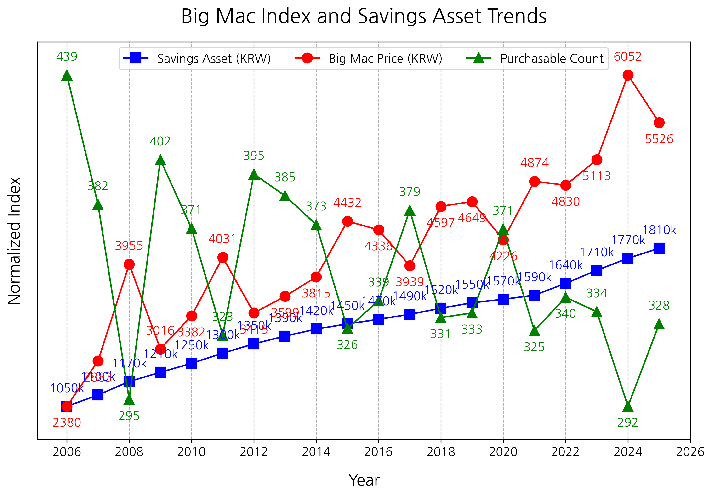

Bonds are structured so that governments or companies borrow money and pay interest. They provide relatively stable returns, but returns are limited. In a low-rate environment, bonds too often fail to keep up with inflation. What remains are real estate and stocks. Over the long term, these two assets have risen in value along with economic growth. In Korea as well, major real estate prices have risen several times over the past decades. The stock market has done the same. Volatility is large, but over the long term it has shown a steady upward trend. This is not simple speculation; it is the result of economic growth and corporate profits being reflected.

Now the choice becomes simple. We must decide in which area we will continue to remain. Will we repeatedly lose money in structures with low expected value, spend time and energy in structures with no expected value, or steadily accumulate time in structures with high expected value? The essence of investing is not complicated. It is not about where to put money, but about which structure to choose. Repeating low-expected-value structures ultimately leads to loss, while repeating high-expected-value structures allows us to see the power of compounding, where money gives birth to money.

So we must keep asking what structure we are currently inside.

## 1.7 Summing Up Chapter 1

When people talk about investing, most start by wondering what to buy: which stock is good, when to enter, which strategy has high returns. But there is something to consider before that: people. More precisely, myself. In this chapter, we first talked not about investment techniques but about human psychology. The reason is simple. If you do not understand psychology, any strategy you learn can eventually collapse in the same way. Let us briefly summarize the psychology covered in this chapter.

There is certainly a reason many people gather somewhere. But that does not mean the reason is an opportunity. More often, the fact that many people have gathered means it is already late. The moment we follow the crowd, we stop judging for ourselves and return to the average. If the answer lies in the crowd, why are only a few people rich?

Comparison psychology is the same. We constantly compare ourselves with others and evaluate ourselves. But comparison brings more harm than benefit. As Tit for Tat teaches, we must look at the whole rather than the person next to us and choose the path that lets us smile at the end, even if we endure a loss now.

We often assign unnecessary meaning to money: hard-earned money, easily earned money, money gained by luck. But money is just money. What matters more is not the source of the money, but how we handle it. This one simple standard alone can reduce many irrational choices.

We also think we will be different. Others may have failed, but I will not. Yet countless examples from history show how dangerous that thought is. Even some of the greatest intellects could not escape this trap.

We must overcome fear of loss. We feel losses far more strongly than gains. This emotion distorts judgment and makes us miss larger gains while trying to avoid small losses. This may be instinctively natural, but in investing it becomes a fatal weakness.

We must look far ahead using expected value as a standard. Hoping for short-term results is not investment but speculation. Our task is to repeat choices with high expected value and pursue the magic of compounding.

Ultimately, this chapter argued that investing is not a matter of technique, but of judgment. And judgment rests on human psychology. No matter how good a strategy is, if we follow the crowd, sway with comparisons, and are pulled by emotion, that strategy will not work properly. Conversely, if we understand psychology and control ourselves, we can create good results even without complex strategies.

So we must change the order. Before wondering what to buy, we must decide how to think. I hope you have now prepared your mind to some extent. In the next chapter, we will discuss how money moves and why certain assets rise over the long term. If we have understood psychology, it is now time to understand the structure of money before investing.

# Chapter 2. You Must Understand Money to See the Game

## 2.1 Money Keeps Being Created

In the previous chapter, we confirmed one important fact. The price of a Big Mac rose steadily, and although deposits increased during the same period, the number of Big Macs that could actually be bought fell. The numbers increased, but real purchasing power declined. Then a question arises. Why does this happen? Why do we feel that we are becoming poorer even while saving money? To answer this, we must understand how money is created and how it spreads.

In Philipp Bagus's book Why Only They Get Rich, there is a story about a gold mine. Imagine an era when gold served as money. The person who owned a gold mine did not merely possess a resource; in effect, they held the authority to create money. Being able to mine gold meant being able to supply new currency.

But the more important point is that not only the owner of the gold mine, but also the person who has just mined the gold, the first person to use it, gains a large benefit. Newly mined gold has not yet spread sufficiently through the market. At that moment, the person holding the gold can buy goods at existing prices. In other words, prices have not yet risen, but the amount of money has already increased. The person who spends at that point can take more value.

In the next stage, the people who receive that gold, the first-round beneficiaries, appear. They too trade under favorable conditions because they have not yet fully felt higher prices. As the gold spreads to second and third rounds, it gradually affects the overall market, and prices eventually rise. From that point, it becomes hard to expect additional benefits from the new gold. Since the amount of goods and services is unchanged while only the amount of money has increased, prices must rise.

Money, likewise, does not spread simultaneously and fairly. A clear difference arises between those who receive it first and those who receive it later. That difference eventually leads to wealth gaps. This process is the Cantillon effect.

Now bring this structure into modern society. Today, the central bank plays the role of the gold mine. The central bank creates money as needed, and that money flows into the market through commercial banks. But this money too is not delivered to everyone at the same time. The first places to encounter it are banks, companies, and asset markets. Companies use funds for investment and expansion, and investors buy stocks and real estate. In this process, asset prices rise first. Later, that influence spreads into consumer markets and becomes the inflation we experience.

The important point here is that the moment when we receive money as salary is near the very end of this flow. Only after asset prices have already risen and prices have already increased do we receive money. But the benefits of that newly printed money have already been taken in large part by those who encountered it first. So with the same money, we can buy less than before. As a result, even if our bank balance has increased slightly, life feels more difficult.

The Big Mac example from the previous chapter shows precisely this structure. Deposits increased steadily, but Big Mac prices rose faster, and the amount we could actually buy decreased. This is not simply a problem of rising prices; it is a problem of the order in which money spreads.

What should we do, then? Many people react emotionally at this point. They feel resentment about why such a structure exists and why they are always at the back. But that emotion is not very helpful, because this structure cannot be changed by an individual. It is the system society has chosen and the rules of the game operated by the state.

There is only one thing we can do. Understand the rules of this game and move within them. Simply saving money is not enough. We must understand where money is created and where it flows first. And within that flow, we must stand as close to the front as possible. If we merely wait for salary to arrive, we will always be at the end. By then, most opportunities will have already passed.

Inflation is not merely an economic phenomenon. It is an invisible structure and the rule of the game we live in. If we do not understand this rule, we fall behind even while working hard. Conversely, once we understand it, we naturally begin to see why certain assets keep rising and why some people become increasingly wealthy.

The conclusion is simple. Saving money alone is not enough; we must move to where money flows first. That is how to survive in this game.

## 2.2 What Is Interest?

Interest is the cost of borrowing money. When you borrow money, you pay interest, and the rate applied is the interest rate. But interest rates are not applied equally to everyone. Differences in interest rates can completely change our lives. That is why interest is not simply a number; it is a core factor that determines everyday life.

People borrow money to use future income in advance as collateral for what they do not have now. We borrow to buy houses, start businesses, or seize larger opportunities. In other words, interest is not merely a cost, but an exchange of time and opportunity. It is the price paid to pull future money into the present.

For this process to work, one premise is necessary: trust. The lender must believe the money will return, and the borrower must believe they can repay it in the future. The modern capitalist system is built on this trust. Banks lending money, companies investing, and individuals taking loans all work only when mutual trust is assumed.

So interest is not merely a number; it is also the price of trust. The more someone is trusted, the lower the interest rate applied. The less they are trusted, the higher the rate demanded. Understanding this makes it easy to see why, even when borrowing the same money, some borrow cheaply and others borrow expensively.

How is this interest rate determined? Basically, each country's central bank sets a base rate, and an additional spread is added. The base rate is literally the benchmark rate of the financial market. But the rate applied when we actually take a loan is not simply this base rate. The bank adjusts the rate by reflecting various factors related to each individual or company. The added part is the spread.

The spread varies greatly by creditworthiness. People or companies with high credit receive low spreads because the chance of not being repaid is low. Conversely, individuals, especially those with low credit or unstable income, receive high spreads. This is why, even for the same loan amount, some borrow at 3 percent while others borrow at 7 percent or nearly 10 percent.

This structure creates gaps in outcomes, not just simple differences. A person with a low rate can borrow money and seize more opportunities, while a person with a high rate must bear much higher costs even for the same opportunity. Over time, this difference grows larger. Interest is not merely a cost; it is an important device that determines the flow of wealth. Banks and institutions are again positioned to encounter money first. They raise funds at low rates and invest in larger assets with that capital. Individuals, by contrast, are at the back of the structure. They borrow at higher rates and access assets whose prices have already risen. They move in the same market, but their starting lines are different.

Therefore interest rates are not neutral numbers. On the surface they may appear to apply equally to everyone, but in reality they work far more favorably for people and institutions with assets. Those who can borrow money cheaply gain more opportunities, while those who must borrow expensively start under disadvantageous conditions. This may feel unfair. But as discussed earlier, this system cannot be changed by an individual. There is only one thing we can do: understand the structure and find a favorable position within it.

Interest has one more important function. It not only determines the price of money, but also controls the amount of money released into the market, that is, the money supply. As we saw through the gold mine example, when a lot of gold is supplied to the market, prices rise. In modern society, just as with gold, when the money supply increases, prices rise because more money is needed to buy the same goods.

Now consider how interest rates influence this process. Suppose you are someone who can earn a 10 percent annual return using money. If rates are low and you can borrow at 2 percent, what happens? Even by simple calculation, an 8 percent spread remains. In that case, borrowing as much money as possible to expand your business is a rational choice. This actually happens in markets. When interest rates fall, companies and individuals borrow more, and that money leads to investment and consumption, increasing the amount of money in the market.

Conversely, when rates rise, the situation changes. If the same person must borrow at 6 percent, the difference from expected return shrinks to 4 percent. After wages and other costs are considered, the business itself may not work. In that case, people borrow less and try to reduce existing debt. Money that had been flowing into the market returns to banks. As this repeats, the money supply is naturally adjusted. When rates are low, money is released; when rates are high, money is withdrawn. Changes in the money supply ultimately affect prices. More precisely, when the growth rate of money accelerates, inflation accelerates, and when it slows, inflation slows too.

Some people may think inequality would disappear if no more money were created. But in a capitalist system, preventing inflation is almost impossible because of the structure of interest. If someone borrows KRW 1 million, they must repay KRW 1 million plus interest. But across the whole market, the money that initially existed was only KRW 1 million. To fill the gap, additional money must keep being supplied. Conversely, if there were no interest, who would lend money? In other words, capitalism structurally requires an increase in the money supply, and as a result it inevitably accompanies inflation.

Capitalism is therefore born with inequality built in. At the center of that structure is interest. Whether you understand it or not completely changes the result.

## 2.3 The Poor Get Poorer, the Rich Get Richer

In the previous section, we looked at how inflation and interest rates work. Money does not spread simultaneously and fairly; it works in favor of those who access it first. Interest functions as the price of trust, and those who receive lower rates can seize more opportunities. What happens when these two structures combine? Those already in favorable positions can grow assets faster, while those who are not fall further behind. This is the so-called "poor get poorer, rich get richer" phenomenon. We need to check with data whether this phenomenon is actually occurring.

There are several ways to measure inequality. One familiar method is to see what percentage of total assets is held by the top few percent. For example, if the top 1 percent holds half of all assets, that society can be judged highly unequal. A more objective indicator is the Gini coefficient. It measures how evenly income or assets are distributed; the closer to 0, the more equal, and the closer to 1, the more unequal. However, because the Gini coefficient is complex to calculate and long-term data can be hard to obtain, this section focuses on the more intuitive shares of income and wealth held by the top 1 percent.

The two graphs below show the income share and wealth share of the top 1 percent in major countries. Based on World Inequality Database data, these graphs reveal a common pattern: in most countries, the share of the top 1 percent rises over time. This is not a temporary phenomenon but clear evidence that inequality is expanding over the long run. In other words, the rich take a larger share, while everyone else holds relatively less.
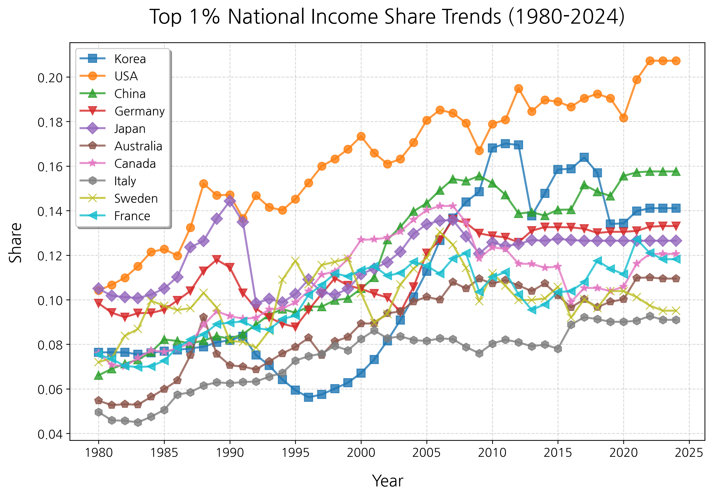

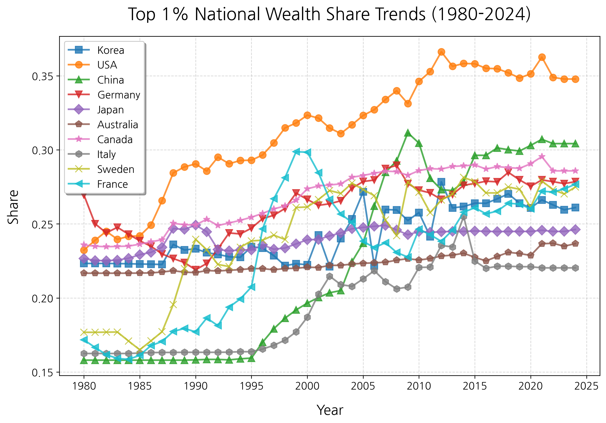

There is one more important indicator to examine: GDP per capita. GDP per capita does not simply show the size of an economy; it shows the average economic level enjoyed by one person. In other words, it is closely connected to the standard of living we actually feel. The graph below shows trends in GDP per capita for major countries. What matters in this graph is not just the absolute number, but the speed of increase, because that shows how fast the economy is growing.

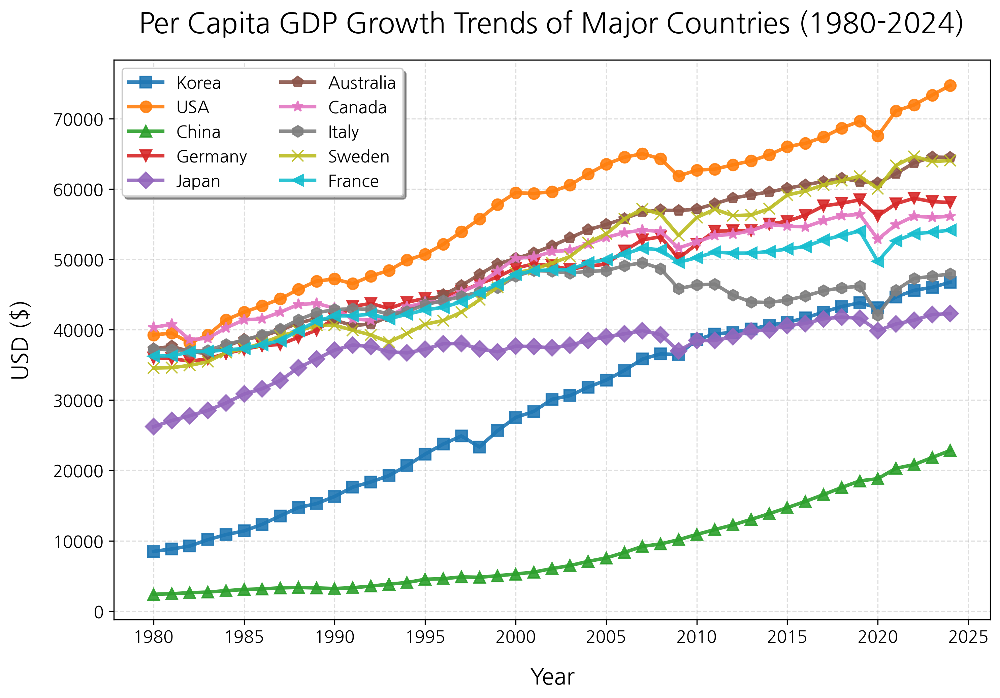

The next graph compares countries against the United States, setting the U.S. level at 1. Several important facts can be seen. Countries such as Korea grew rapidly and narrowed the gap with the United States, but since around 2010 the speed has noticeably slowed. Meanwhile, most advanced countries have shown declining ratios relative to the United States since the 1990s. In other words, they are growing in absolute terms, but relatively, the gap with the United States is widening.

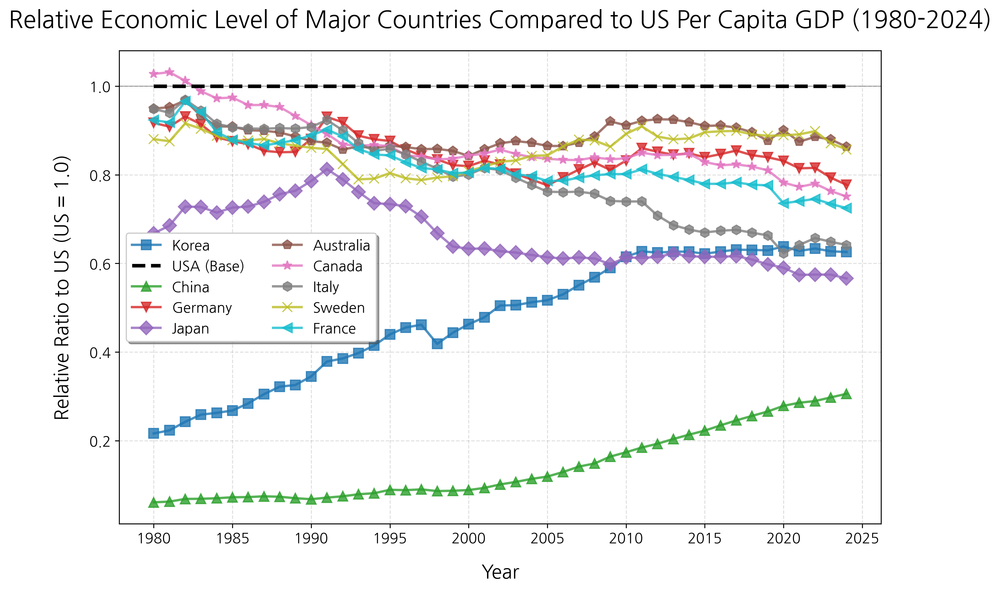

China stands out. It still shows a rapid upward trend relative to the United States. This is the result of manufacturing-centered growth, expanded state-led investment, and the combination of global capital and labor. China served as the world's factory using low-cost labor, and the capital accumulated through that process was reinvested into infrastructure and industry, creating rapid growth. But such a pattern has appeared before. When the Soviet Union was growing rapidly, many scholars believed the Soviet planned economy was more efficient and superior to capitalism. For a certain period, it did show remarkable growth. But the result, as we know, was collapse.

China too is currently in the midst of rapid growth, but whether this trend can be sustained over the long term remains debated. If you want to understand this issue more deeply, you can refer to Daron Acemoglu's Why Nations Fail. The book presents "inclusive institutions" and "extractive institutions" as key factors determining national growth. It explains that inclusive institutions protect individual rights and creativity and enable sustained growth, while extractive institutions allow particular groups to monopolize power and ultimately limit growth.

By contrast, Yuen Yuen Ang's Why Corrupt China Grows presents a somewhat different view. It emphasizes that corruption in China's growth process did not simply create inefficiency, but in some ways promoted economic activity. The same phenomenon can therefore be interpreted very differently. Scholars differ greatly on China's growth. If you are interested in the issue, it is important not to lean only toward one view, but to build a balanced perspective through diverse materials.

Returning to the main point, the graph of GDP per capita relative to the United States reveals one important fact. The rich-get-richer and poor-get-poorer phenomenon is not merely an individual problem or a problem within one society; it occurs between countries as well. At the center is the structure we examined earlier. The global economy effectively revolves around the dollar. U.S. monetary policy, especially interest rate policy, affects the entire world. When the United States lowers rates, global capital moves in search of higher returns; when it raises rates, capital returns to the United States. Within this flow, capital naturally moves toward stronger markets and places offering more opportunities.

Through data, we confirmed that neither nations nor even the United States, which has claimed to be the world's police, stands on the side of the poor. If you stay still, you naturally fall behind. In this structure, simply sitting still becomes a choice to fall behind. The conclusion is clear. As quickly and consciously as possible, we must get on the direction in which capital flows. In other words, we must move as soon as possible in whatever way lets us receive the benefits of capitalism.

## 2.4 Get on the Flow of Money

In the previous section, we confirmed one important fact: in the capitalist system, money does not spread fairly. Money always flows first to places that can access it first, and over time the gap widens between those inside that flow and those outside it. Most salaried workers are positioned toward the back of this structure because they receive money last when it is released. Meanwhile, asset prices have already risen, and we end up following the result at higher prices. This phenomenon does not occur only within one society. It occurs between countries too. Capital moves to stronger markets and places where higher returns are expected. At the center are always companies and the financial system.

Here is a question. What should we do in this structure? The answer is surprisingly simple. We should get on the flow of capital. When money is released, the first places it goes are banks and companies. These companies are positioned to raise money at the lowest rates. In other words, the most advantageous position in the capitalist system belongs to companies that create added value.

Of course, let us exclude states that print money. To be precise, it is the central bank that prints money. The central bank creates new money by buying government bonds or supplying funds to commercial banks. For example, when the government issues bonds, the central bank buys them, and new money is supplied to the market in exchange. It also increases liquidity by lending money to commercial banks. Money created this way does not go directly to individuals. It first flows through the financial system to banks and companies, and only afterward spreads throughout the market.

Considering this, we have two choices. We must either operate a company directly or own part of one. For most people, the former is realistically difficult. But the latter is easy. The means is stocks. A stock is not merely a piece of paper whose price rises and falls. A stock is equity in a company. It is the right to own part of a company. When a company grows, the profits ultimately return to shareholders.

Stocks first appeared for this very need. The Dutch East India Company, established in the seventeenth century, needed enormous capital for large-scale trade. The scale was too large for an individual to bear, so it received funds from many people and gave them shares in return. This was the beginning of the modern stock market. In other words, from the beginning, stocks were a device that allowed ordinary people to participate in the flow of capital.

If you have followed so far, you can see that to build wealth in the capitalist system, you must not merely save money but participate in corporate growth. Then which companies should you invest in? Before choosing individual companies, it is important to look at the large flow at the country level. Earlier, we examined growth data from major countries.

Most advanced countries tend to show sharply slowing growth after reaching a certain level. Their industries are already sufficiently developed, and they face various limits in demographics and productivity. Innovation may stagnate, and new growth engines may be lacking. By contrast, the United States has overcome such limits and continues to maintain steady growth. This can be seen not merely as economic size, but also as a signal that capital continues to flow into the United States. As the next chapter will explain in more detail, at the center of this flow are ultimately people. The direction of capital is determined by what kinds of people gather and what kinds of value they create.

China is also growing rapidly. But this needs a more cautious approach. Personally, I believe the United States is likely to maintain its advantage over the long term. In the past competition between the Soviet Union and the United States, the eventual winner was the United States. This was not simply a matter of growth trend, but of institutions. I do not think China has yet built sufficiently inclusive institutions. It is achieving rapid growth through strong state support, but questions remain about whether this is sustainable long term. It may look like growth accelerated by steroids. Of course, this is only one perspective, and many views exist. This point should be taken as a reference.

Returning to the main point, what we must do is understand the direction in which capital flows and get on that flow. Merely saving salary is not enough. We ourselves must become owners of part of companies that create added value, the foundation of capitalism. The most realistic and easiest way is to buy stocks.

More specifically, and from a long-term perspective, one direction is clear: get on the U.S. market, where capital flows most strongly. The rest of this book will discuss more concretely how to get on that flow and what approach to take.

## 2.5 The Essence of Investing Is Ultimately People

There are many investment assets in the world: real estate, stocks, bonds, gold, commodities, and more recently, cryptocurrency. Some invest in land, some in companies, and some in technology. When analyzing investments, many people focus on numbers and structures. Returns, prices, indicators, policies, and technology all matter. But there is an element more important than all of them: at the center of everything are people. If you do not understand what kinds of people are gathered and in what direction they are moving, it is difficult to judge even a good asset properly.

Mike Bird's How Real Estate Became Power shows this well from the perspective of real estate. The book explains how real estate became not merely an asset but power. In the past, land was the core means of production. Farming required land, and the person who owned that land naturally held power. Industrial structures changed over time, but the power of land did not disappear. If anything, it became stronger with urbanization.

The structure is not very different today. Consider a retail building. A shop owner works hard, raises sales, and activates the commercial district. People gather nearby, and the area revives. But who benefits most as a result? The building owner. The shop owner did the business well, but the building owner has the right to raise rent. Part of the added value created by the shop owner is transferred to the real estate owner. Real estate does not create value by itself, but it has a structure that absorbs value created on top of it. This is why real estate is attractive as an investment asset.

Real estate can also be used not only for price appreciation but as collateral, that is, leverage. Suppose you buy a KRW 1 billion house with KRW 400 million of your own capital and KRW 600 million in debt. If the loan rate is 5 percent and average housing price growth is 8 percent, even simple calculation shows a higher return on equity because not only your money but also borrowed money is affected by asset price appreciation. This allows higher returns relative to capital. But real estate has clear limits too. It is hard to liquidate immediately when needed, transaction costs are high, and taxes, regulations, and policy changes exert strong influence. Above all, information asymmetry is large, and finding good properties is not easy.

Although this book will mainly discuss it later, I believe we need to pay attention to stocks in addition to real estate. The reason is simple. Stocks, which are companies themselves, are ultimately investments in people. As the Chinese characters for company in Korean imply, a company is a place where people gather; in that sense it is the people themselves. And that organization continuously creates new value. If real estate absorbs value, companies create it. Good companies create more value over time, and the result returns to shareholders. Over the long term, excellent companies are said to create returns beyond real estate. Companies that grow through innovation especially expand the market itself and create value that did not exist before. This is not merely price appreciation, but structural growth.

What about cryptocurrency, which has recently attracted much attention? I believe we must look at people here too. Understanding blockchain technology matters, but technology alone is not enough. It is more important to see how many people believe in and use that technology, and how many more may do so in the future. Cryptocurrency differs from the existing monetary system through the concept of decentralization. Existing money is issued and controlled by the state and central bank. Money supply and interest rates are decided centrally. Cryptocurrency attempts to distribute that authority. The system is maintained not by a particular institution but by participants in the network.

Such a structure can appeal to people who distrust the existing system. As long as there are people who want to escape the control of governments and central banks, cryptocurrency may maintain a certain level of demand. Of course, volatility is high and regulatory risk exists. But this too is one flow. If you look at what kinds of people are creating that flow, you can understand its direction better.

Whatever the asset, the subject that creates value is people. Money gathers where people gather, and money leaves where people leave. So when investing, do not look only at numbers. Look at the people who create those numbers. That is ultimately an investment method that survives longer.

## 2.6 Summing Up Chapter 2

In Chapter 2, we examined the structure by which money moves. In conclusion, capitalism is not a structure in which one naturally becomes rich merely by working diligently and saving salary. Diligence is important, of course. But diligence alone is not enough. If we do not understand how money is created, where it flows first, and whom it favors, we remain at the back.

Money keeps being released. And that money does not spread simultaneously or fairly. Newly created money first flows to banks, companies, and asset markets. In that process, asset prices rise first, and we feel the impact much later in the form of salary. The number in the bank account may increase, but what that money can buy decreases. Inflation is not merely rising prices; it is a structural result created by the order in which money spreads.

Interest rates make this structure even clearer. Interest is the cost of borrowing money and the price of trust. People or institutions with high credit and many assets can borrow at low rates. Ordinary individuals borrow at higher rates. Even when borrowing the same money, the starting line is different. Those who can raise funds at low rates seize more opportunities, while those who must bear high rates start from a disadvantaged position.

As a result, the rich-get-richer and poor-get-poorer phenomenon is not just a feeling; it is occurring in our lives right now. Within societies, the income and wealth shares of the top 1 percent are growing, and similar patterns appear between countries. Capital moves to stronger markets, higher returns, and more opportunities. Staying still is not neutral; it is retreat. In this structure, not moving itself can become a choice to fall behind.

Therefore we must understand the direction in which capital flows and get on that flow. If directly operating a company is difficult, we can own part of one. That is stocks. Stocks are not merely numbers that rise and fall; they are the most realistic way to participate in corporate growth. Choosing markets where capital flows strongly over the long term is an important judgment.

At the center of all these judgments are ultimately people. Real estate, stocks, and cryptocurrency look like different investment assets on the surface, but people create and maintain their value. Money gathers where people gather, and leaves where people leave. If you cannot see what kinds of people are gathered and what value they are creating, you cannot properly see investing.

The key is that you must understand money to see the game. Capitalism is not something to accept emotionally. It is the structure we must understand to make money, and it is the system we live in. If we stop at feeling that it is unfair, nothing changes. What matters is understanding the structure and changing where we stand within it.

# Chapter 3. To Succeed in Investing

## 3.1 Cross the Entry Barrier

What comes to mind when you hear the word investing? Does a sense of challenge arise, or does danger come first? Then let us change the question. In this capitalist society, what is truly safe? Do you think cash is safe? Do you believe you can protect it by leaving it in a bank account? But we already know that the value of money falls over time. As the price of a Big Mac shows, the amount we can buy with the same money decreases. It has already been proven that doing nothing is not a safe choice. Fear of investing is natural. But that fear is the first barrier we must cross. The belief that doing nothing is safest is in fact the most dangerous.

Where there is money to be made, there is always an entry barrier. Places that are easy to enter have much competition, and results eventually converge toward the average. Conversely, the harder it is to enter, the more opportunities remain. Think of highly educated professions. Doctors, lawyers, and researchers are not occupations anyone can easily obtain. They require long time and effort. That is why they are highly rewarded. Craftspeople are the same. Because they have built skills over a long time, not everyone can replace them, and their value is recognized. Socially avoided occupations have a similar structure. Because psychological barriers exist, people do not choose them easily. As a result, relatively higher rewards are given.

Real estate follows the same principle. There are many reasons prices rise, but one is the entry barrier. Initial capital is needed. The more expensive the real estate, the larger the capital required. Because not everyone can access it, opportunities arise inside. Information also has barriers. Suppose there is a plan to build a new subway line in some area. Once the news comes out and many people know, the price has already reflected much of it. But those who earlier read urban planning documents, understood development trends, analyzed population movement, and judged in advance stand in a much more favorable position.

The stock market also has many barriers. Companies disclose abundant information through financial statements, filings, and reports. But in reality, most people lack the time to read and analyze all those materials, and they also lack the ability to interpret them accurately. Numbers overflow, but understanding what those numbers mean is another matter. Can we judge a company good simply because sales increased? We must also see whether the sales are temporary or structural growth and how the cost structure is changing. Ultimately, not only the presence of information, but the ability to interpret and connect that information becomes a barrier.

But the barrier I consider greater than information is patience. There is a stock market saying: "Buy at the knees and sell at the shoulders." It means buy reasonably low and sell reasonably high. It sounds easy, but few people actually act that way. In bull markets, people crowd in. We hear stories of people around us making money, and charts keep rising. Then we become anxious. We feel an urgency to enter even now. And often, that point is the shoulder. In bear markets, the opposite happens. When prices begin to fall, people hold at first. But as the decline lengthens, fear grows. Thinking it will fall further, they finally cut losses. And that point is the knee.

The simple principle of buying cheap and selling expensive is something humans instinctively do in reverse. They buy when prices rise and sell when prices fall. That is why most investors record returns lower than the market. The way to cross this barrier is simple: make time your ally. As will be discussed later, John Bogle said in his book The Little Book of Common Sense Investing to buy the entire market and hold it for a long time. Do not try to predict the ups and downs of individual stocks; get on the growth of the whole market. The essence of this method is patience.

Over time, the market eventually trends upward. In the short term there is volatility, but in the long term it grows. Enduring this process itself, that is, patience, is the barrier. Most people cannot cross it, so they miss opportunities. Unless you are a professional investor, what matters in investing is ultimately not sophisticated techniques or a vast amount of information. What matters is whether you can cross the barrier of patience. Fear, impatience, and enduring time. These three are the real entry barriers in investing.

Only those who cross those barriers deserve to taste the sweet fruit.

## 3.2 The Reality of Short-Term Trading

Even if you tie up money in a deposit for a full year, you may barely receive 4 percent, while stocks often fluctuate in a single day to a degree deposits cannot compare with. But analyzing this requires too much time and effort. So rather than study and analyze companies, people often become tempted by short-term trading, trying to time charts. When looking at a chart, it somehow feels as if I too can predict that flow. But first we must think about why this method is difficult.

Most information about listed companies is public. Financial statements, disclosures, business reports, and many other materials are available to anyone. But the first problem is that reading those materials itself is not easy. Even among people who invest in stocks, many cannot properly read financial statements, the official documents showing a company's operating results and financial condition. Leaving aside inside information, the reality for most individual investors is that they buy shares of a company without interpreting even the information publicly available to the world.

Another problem is that this information is expressed only in numbers. Numbers show results, but they do not sufficiently explain the process and context. To understand a company properly, one must go beyond seeing numbers and understand why those numbers were produced. This is often called reading between the lines. To judge why sales increased, why costs decreased, or whether profits are temporary or structural, one needs not just one or two checks but consistent observation and deep understanding.

Suppose you managed to analyze one company. The world still contains too many companies. The Korean stock market alone has more than about 2,500 listed companies. If the U.S. market is included, there are not thousands but tens of thousands of companies. And stocks are not the only investment targets. There are ETFs that bundle multiple stocks, bonds, derivatives, commodities, and endless choices. Understanding all these companies and assets, then selecting which will move in the short term, is realistically extremely difficult.

Even if you are lucky enough to understand a company well, you must climb the mountain of fees. Trading involves many buys and sells. The more transactions, the more fees accumulate. They may not feel large in one transaction, but repeated dozens or hundreds of times, the costs become significant. To make a profit, you must overcome not only the market, but also fees, taxes, and frequent judgment errors. From the start, you are playing a disadvantageous game.

Of course, some people actually live this way. Japanese individual investor Shigeru Fujimoto is a representative example. He made a large fortune through short-term trading, making dozens or hundreds of trades a day. His book The Joy of Stock Investing contains the daily life of a trader living in battle with the market. But when you look closely at that life, it requires more than a simple "skill to make money." It requires extreme concentration, constant tension, and a life of watching the market without rest. Many people imagine short-term trading as a quick way to make money, but in reality it is closer to high-intensity labor spent swimming through a flood of information for most of the day.

Personally, I am very skeptical of such a life. It may simply be a matter of preference, but a more fundamental question remains: what does it leave in the world? I aim to live in a way that benefits the world and shares what I have learned. Profits from short-term trading may be trophies earned through an individual's hard effort. But I still question what value that method adds to society. To me, investing is closer to an act of believing in and supporting someone or some company. It is participating in the value and growth potential that a company creates; merely moving money here and there according to expected daily price changes is not, in my view, the essence of investing.

I am not saying that trading itself is always wrong. Markets need diverse participants, and short-term trading does provide liquidity. But it is dangerous for individual investors to accept short-term trading as an easy way to make money. It requires information interpretation, quick judgment, emotional control, cost burden, and time commitment. And even after all that, success is not guaranteed. For most people, understanding companies, holding good assets for a long time, and using their lives for more productive work may be far more realistic and healthy. What matters in investing is not beating the market every day, but an attitude toward money and life that you will not regret over time.

## 3.3 What It Means to Invest in Individual Stocks

In the previous section, I discussed how difficult it is to understand company information. But the difficulty of individual stock investing does not end there. Buying a stock legally means owning part of that company. That is why we are called shareholders. But in reality, most individual investors have little practical influence on the company's management direction. We can attend shareholder meetings and exercise voting rights, but minority shareholders' voices are rarely reflected directly in corporate strategy, personnel decisions, or investment decisions.

The larger problem is the wall of inside information. It is difficult for ordinary investors to know exactly what discussions are taking place inside the company, what management is actually worrying about, or whether a particular business is proceeding as well as it appears from the outside. Disclosures are close to results that have already been organized and filtered. Business reports are documents written in language the company can present to the world. They do contain important information, but believing that they alone reveal the full reality of a company is dangerous.

Individual stock investing therefore begins in information asymmetry. Corporate insiders, institutional investors, analysts, and industry people are likely to have more information and interpretive ability than ordinary individuals. Individual investors must read already-public materials after the fact, follow news and reports, and judge within limited information. Of course, some excellent investors overcome this limitation. But at the very least, individual stock investing is clearly not a simple matter of picking one company that looks good.

When Korea's theme-stock culture is added, the problem becomes far more complex. Theme stocks are stocks whose prices move according to particular events, policies, people, or social mood rather than a company's fundamental performance or long-term competitiveness. Of course, some policies or industry changes can have a real effect on company earnings. But many theme stocks have extremely weak links, and expectations and rumors often run ahead of reality.

A representative example is stocks related to inter-Korean economic cooperation. Whenever relations between North and South Korea turned conciliatory, companies related to railways, construction, cement, fertilizer, and the Kaesong Industrial Complex drew attention. In particular, when the possibility of connecting inter-Korean railways or developing North Korean infrastructure was mentioned, stock prices of companies grouped as related often surged even before actual project orders were confirmed. Railway-related companies such as Daeati and Busan Industrial drew attention amid expectations for inter-Korean railway connections. What investors bought then was not current corporate performance, but the expectation that railways might someday connect to North Korea.

Political theme stocks are even more extreme. When a particular politician appears likely to win an election, companies connected to that politician through school ties, regional ties, personal networks, or past careers move together. AhnLab, for example, fluctuated whenever political events occurred because lawmaker Ahn Cheol-soo was its founder and major shareholder. Sunny Electronics was also classified as an Ahn Cheol-soo theme stock and was reported to have risen to the daily price limit.

Other politicians are the same. In relation to former president Yoon Suk Yeol, NE Neungyule and Seoyon were mentioned as theme stocks. In relation to former Daegu mayor Hong Joon-pyo, Gyeongnam Steel, Humax Holdings, and Bokwang Industry moved as political theme stocks. In relation to President Lee Jae-myung, Atec, Dongshin Construction, Hyungji group stocks, and Orient Precision were mentioned in the market as related stocks. The important point is that in many cases it is unclear how much these companies would actually benefit from the politician's election or policies.

This phenomenon worsens the inherent difficulty of individual stock investing. Analyzing companies is already difficult. But once a stock becomes a theme stock, the object of analysis becomes atmosphere rather than the company. Public opinion polls become more important than financial statements, political news becomes more important than business reports, and one word from a candidate can matter more than earnings. Investors enter a game of predicting what other people will become excited about, rather than judging company value.

The problem is that emotion easily intervenes in such games. If the company is in an industry I work in, it looks better. If it is a brand I like, I want to trust it more. If it is a stock connected to a politician I support, I see its possibilities before its weaknesses. Conversely, I easily undervalue companies connected to politicians or industries I dislike. We say investing should be done with numbers and logic, but actual investors are not free from emotion.

The stock market, however, does not reward my emotions. A company's profit does not increase because I like the company. The value of a company connected to a politician does not rise because I support that politician. Even if the stock price rises in the short term, if that rise is based not on actual value but on expectations and rumors, those expectations will eventually cool. Theme stocks seem to have many reasons when they rise, but when they fall, those reasons disappear instantly.

This does not mean individual stock investing is impossible. For those with enough time and expertise, individual stocks can certainly be meaningful choices. But for ordinary investors with main jobs, individual stock investing is much more difficult than it seems. One must understand companies deeply, judge within limited information, and above all guard against one's own emotions.

## 3.4 Various Products and What Lies Behind Them

Many people recommend investment products. Bank tellers, brokerage apps, YouTube videos, and news articles constantly say the same thing: you cannot rely only on deposits, you must make your money work, you must choose good products. The statement itself is not wrong. Money left idle loses value through inflation, and allocating assets properly is certainly important. But we must ask one question: are they really recommending these products for our sake?

The EBS documentary Capitalism clearly shows how financial companies recommend products to customers and what interests operate in that process. Financial companies are not charities. Banks, securities firms, insurance companies, and asset managers are all companies that must make profits. They create, sell, and advertise products not only because they worry about customers' futures. Inside are fees, management charges, sales commissions, and company performance.

This does not mean every financial product is bad. Deposits, savings accounts, funds, ETFs, pensions, bonds, and REITs each have purposes and functions. Some people need deposits; some need pension funds; some may benefit from low-cost ETFs. The problem is not the product itself, but failing to see for whom the product is designed to create greater benefit.

Consider funds. A fund gathers money from many people and lets an expert invest on their behalf. For people with little investment knowledge, it looks convenient. But funds carry management and sales fees. Whether I make a profit or not, certain costs keep being deducted. When returns are good, they may not feel large, but over long periods, small cost differences create large differences. I bear the market risk, while the financial company collects fees relatively stably.

When people talk about investing in buildings, stable rental income comes to mind. If invested well in good assets, steady cash flow can indeed be obtained. But real estate also carries risks such as vacancy, rising interest rates, falling asset prices, and lack of liquidity. If you do not directly own a building but invest indirectly through a product, asset managers, sellers, and various cost structures exist in between. You may think you are investing in real estate, but in reality you may be entering a structure designed by multiple interested parties.

From the perspective of financial companies, this structure becomes clearer. Financial companies want to gather people's money. Customers' deposits, insurance premiums, fund subscriptions, and pension money are all capital that financial companies can manage. To individuals, this money is retirement money, emergency savings, or a lifetime of savings. To financial companies, it is money that can be operated. So they constantly create products: stable products, medium-risk medium-return products, global diversified products, monthly payout products, tax-saving products, retirement products. The names vary, but ultimately they are trying to pull your money into their systems.

To put it bluntly, they cannot simply watch appetizing capital sit still. If a large sum accumulates in someone's bank account, it is an opportunity for a financial company. Someone's severance pay is also an opportunity. If someone sells a house and holds cash, receives an inheritance, or saves a lump sum, that money becomes the target of multiple products. The phrase "it is a waste to leave it alone" may be true. But you must also see why the person saying it is saying it. They need your money. The money you have is much more valuable than you think.

The problem is that many people underestimate the value of their own money. They think, "I do not know much about investing, so it is better to leave it to an expert," "A product recommended by the bank should be fine," or "Everyone signs up, so I should too." But the moment you hand it over, part of the value your money could create moves to someone else, under names such as fees, charges, business expenses, or sales commissions.

This does not mean you must do everything alone. Expert help can be necessary. Financial products, used well, can help life. Deposits can be safe cash-management tools, insurance can protect against major risks, and pension products can help prepare for old age. ETFs and index funds can be efficient tools for long-term investors. What matters is not rejecting products outright, but examining for whom the product was made, how much it costs, what the risks are, and how it differs from doing it yourself.

The more attractive the packaging of an investment product, the more careful you must be. Phrases such as "stable returns," "tax benefits," "expert management," "cash flow like a salary," and "returns higher than deposits" sound good. But the more good words there are, the more you must examine the structure behind them. Who makes money? What risk do I take? How much cost leaks out in the middle? Who bears responsibility if losses occur? If you cannot answer these questions, you did not invest; you were sold to.

Money is power. The money I have is managed assets to someone else, a source of fees to someone else, and leverage for creating larger returns to someone else. So when entrusting my money to others, I must be careful. Even if they treat my money as valuable, that does not necessarily mean they prioritize my interest.

Money is not just numbers. It is the time I earned through work, the consumption I postponed, and the future I must protect. The person who must best protect the value of that money is ultimately myself.

## 3.5 Give Up Excessive Greed

When investing, the mind easily becomes impatient. Someone says they made tens of percent in a few months, and someone says they multiplied their assets several times with a particular stock. Listening to such stories makes us feel that only we are falling behind and that we should invest more aggressively. But to invest for a long time, the first thing to give up is impatience, and the next is excessive greed.

If you are not yet very wealthy, you do not need to be easily swayed by terms such as hedge fund or private equity. This does not mean such products are always bad. But that world is generally accessible to people with information, capital, and networks. People with a lot of money can cross the capital barrier, have capacity to bear losses, and are more likely to access products on good terms. Above all, if someone truly knows a good investment opportunity, there is no reason for them to tell you for free. In investing, the phrase "good source" is usually dangerous. It sounds like an opportunity others do not know, but in reality it is often closer to a risk I do not understand.

Nor do we need to listen too closely when the person next to us says they made money from investing. This is especially true if we do not know what analysis they did, what risk they took, or whether the profit was luck or skill. People talk only about results. It is easy to hear "I made this much from this stock," "I made several times my money from crypto," or "I made a fortune from real estate." But they rarely talk about how much they were shaken in the process, how many losses they suffered, or whether they can still make money the same way now.

Investing is not a short race that ends by passing the person beside you; it is a long race that must be run without end. Among people I know, some once said they made money through investing. One even said that during the one or two hours we were eating together, his account had risen by hundreds of thousands of won. But I do not think the probability that they will continue earning that way is very high. More than anything, people talk only when things go well. When they profit, they speak confidently and brag to those around them. But when losses grow, when they are stuck, when they cannot sell, or when they regret a wrong choice, they become quiet. So most investment stories we hear are biased.

If we do not understand this bias, we lose composure. It feels as if everyone else is making money and only I am missing opportunities. Then we invest without principles. We enter products we do not understand, buy stocks we do not understand, and take risks we cannot bear. But people who survive long in the market are not the excited ones; they are the ones who maintain composure. Those who are not shaken by others' returns, invest within what they can understand, and take only risks they can bear last longer.

Where is the line between rational expectation and excessive greed? One benchmark is the S&P 500. The S&P 500 is an index of 500 leading U.S. large-cap companies and can be seen as the U.S. market itself. Investors and experts around the world compare their performance against this index. Yet not many investors consistently outperform it over the long term.

According to the 2024 year-end SPIVA, or S&P Indices Versus Active, U.S. scorecard, 65.2 percent of professional investors recorded returns below the S&P 500 in 2024. In other words, only 34.8 percent beat the S&P 500 that year. Over longer periods, the gap widens. Over five years, 76.3 percent failed to beat the S&P 500; over ten years, 84.3 percent; over fifteen years, 92.5 percent; and over twenty years, 94 percent underperformed the S&P 500. Put differently, only 6 percent of professional investors beat the S&P 500 over twenty years. Even countless experts pouring in time, manpower, and information find it far harder than expected to beat the whole market consistently.

The attitude ordinary investors should have is clear: do not force yourself to deviate greatly from the market average. The average may look unimpressive, but steadily following the average of a good market over the long term is a very powerful strategy. The problem is ignoring the average and getting lost while searching for a faster path. In investing, steady survival is more important than one flashy success.

There is a well-known "rule of 72" in investing. Divide 72 by the annual return, and you can roughly know how long it takes for assets to double. For example, if you can steadily earn 12 percent per year, assets double about every six years. KRW 100 million becomes KRW 200 million after six years, KRW 400 million after twelve years, and KRW 800 million after eighteen years.

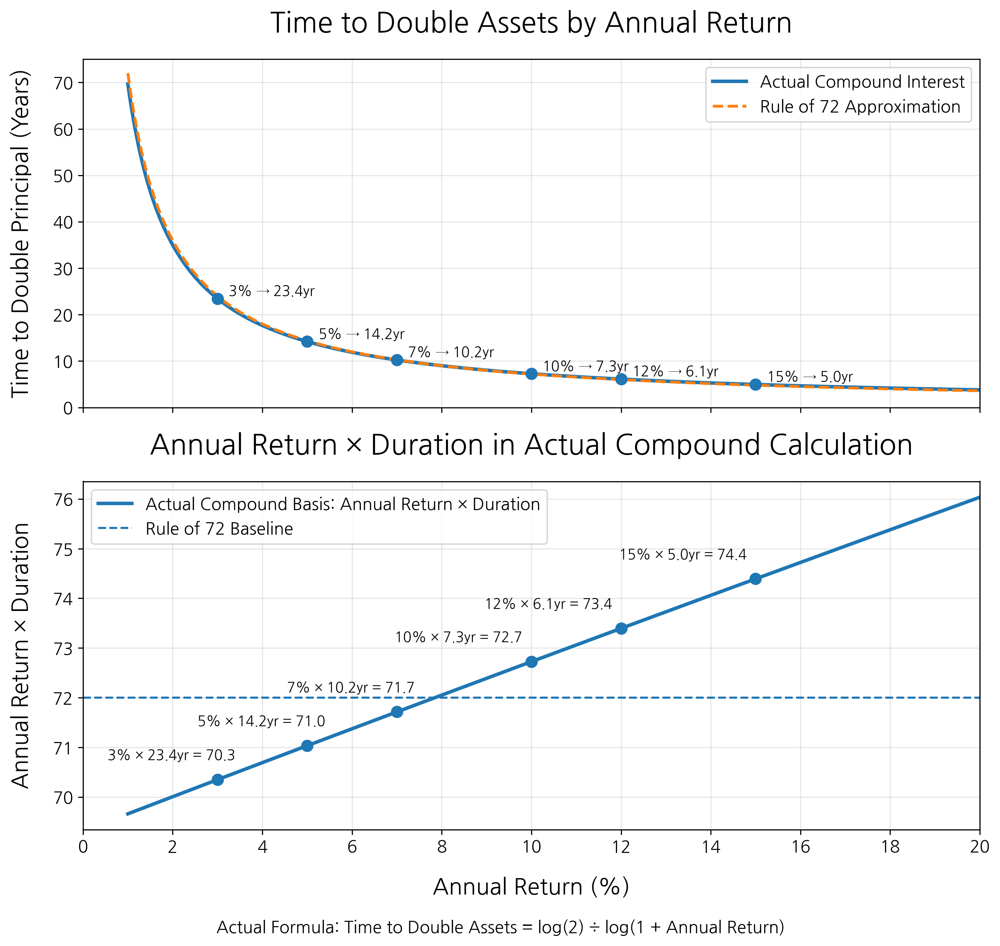

The upper graph shows how quickly the time required to double assets falls as annual returns rise. At 3 percent annual returns it takes 23.4 years, but at 10 percent it takes about 7.3 years, and at 12 percent about 6.1 years. We can intuitively see that even small differences in returns create large differences in asset growth over the long term.

The lower graph shows how close the rule of 72 is to actual compounding calculations. The rule of 72 is an empirical rule in which the annual return multiplied by the number of years needed to double assets is roughly 72. At an 8 percent annual return, assets double in about nine years, and 8 times 9 is close to 72. When returns are lower or higher than that, actual compound calculations deviate somewhat from 72. Still, it remains very useful for convenient calculation.

If we assume the long-term average return of the S&P 500 is about 10 percent, assets double about every 7.2 years by the rule of 72. For an investment that requires no study and only patience, this is by no means a small result. Yet many people are not satisfied even with such returns. With tiny and biased information they believe they have, they want to earn faster and bigger. So they search for unknown investment destinations, special information, and high-return products.

When someone says there is a good opportunity, the mind is shaken; when the phrase "investment ordinary people do not know" is attached, it becomes even more tempting. But excessive greed always ruins investing. Greed clouds judgment, makes risk look small, and makes us easily swayed by others' words. We cannot sell because we think we can earn more, take excessive risks because we want to earn faster, and jump in late because others say they made money. When losses occur, principles disappear and only emotion remains.

Giving up excessive greed does not mean giving up dreams. It means letting go of the desire to go faster than others and choosing a path that allows survival to the end. Investing resembles survival in many ways. It means judging your own situation objectively and becoming wealthy in a sturdier way. Only when we do not forget that fact can we maintain composure before the market.

## 3.6 Summing Up Chapter 3

In Chapter 3, we discussed the attitude needed to succeed in investing. Many people think that to invest well, one needs special information, quick judgment, and opportunities others do not know. But I think the opposite is closer to the truth. For most ordinary people, what truly matters in investing is not flashy skill, but the power to keep the basics, and not the ability to move faster than others, but the patience to endure for a long time.

First, we examined that investing always has entry barriers. Places where money can be made have reasons they cannot be accessed easily. Real estate has the barrier of capital, individual stocks have the barrier of interpreting information, and long-term investing has the barrier of patience. Many people think information is most important in investing, but what is actually harder is interpreting that information and protecting one's judgment amid market turbulence. The greatest barrier in investing may ultimately be not the market, but myself.

The reality of short-term trading is the same. When looking at charts, it somehow feels as if I can predict price flows. But short-term trading is far more difficult than it seems. One must understand companies, judge quickly within countless pieces of information, and overcome transaction costs, taxes, and emotional swings. A life of trying to beat the market every day may look free on the outside, but in reality it is closer to high-intensity labor in which one is tied to the market all day. For most people, holding good assets for a long time is a far more realistic choice than predicting the market every day.

Individual stock investing is not easy either. Buying a stock means owning part of a company, but ordinary investors find it hard to participate practically in that company's management. Inside information is limited, and even public materials are difficult to interpret properly. When theme stocks and politically related stocks, where emotions and expectations strongly intervene, are added, investing easily becomes betting on a story rather than analysis. We must constantly check whether we are really looking at the company or following the story we want to believe.

The same applies when dealing with financial products. Products recommended by banks, securities firms, insurance companies, and asset managers are not all bad. Deposits, funds, ETFs, pensions, and REITs each have their functions and purposes. But financial companies are not charities. The reasons they create and sell products always include fees, charges, sales commissions, and company performance. Therefore, when looking at an investment product, we must see the structure behind the visible return. If I do not understand who makes money, what risk I take, and how much cost leaks out in the middle, I may not have invested; I may have been sold to.

Finally, we discussed giving up excessive greed. When investing, stories of success around us sound large. Someone says they made a fortune in a few months, and someone says they multiplied assets with a particular stock. But people talk only when things go well. When they lose money, are stuck, or regret a wrong choice, they become quiet. Most investment stories we hear are therefore biased. If we are shaken by that bias, we lose composure, and when composure disappears, principles disappear with it.

The S&P 500 can be one benchmark for controlling this greed. Even countless professionals struggle to beat the market average consistently over the long term. Then an ordinary investor with a main job must be very cautious about thinking they can overwhelmingly beat the market. The market average may look unimpressive, but steadily following the average of a good market over the long term is not a weak strategy. Rather, because it allows survival for a long time, it may be the strongest strategy.

In summary, investing is not a game of beating others, but a game of surviving to the end. The greed to make money faster, the impatience to seize opportunities others do not know, and the mind shaken by others' success stories all pull us in dangerous directions. Conversely, investing in what I can understand, taking risks I can bear, and making time my ally help me endure for a long time.

# Chapter 4. Buy the Whole Market

## 4.1 You Should Buy the Whole Market

In the previous chapters, I discussed several factors that make investing difficult. Analyzing individual companies is not easy, short-term trading requires intense concentration and emotional control, financial products contain the seller's interests, and excessive greed easily pushes investors too far. What, then, should an ordinary individual investor do? I believe the simplest and most powerful answer is to buy the whole market.

One person who explained this idea most persuasively was John Bogle. John Bogle founded Vanguard, the U.S. asset manager, and popularized index fund investing for ordinary investors. He argued that rather than struggling to beat the market, it is far more rational to own the whole market at low cost and wait for a long time. His philosophy is not complicated. Do not try to guess the best companies; get on the growth of capitalism as a whole.

Near the beginning of Bogle's The Little Book of Common Sense Investing, there is a striking analogy about a wealthy family called the Gotrocks family. This family owns 100 percent of all U.S. stocks. The profits, dividends, and fruits of growth earned by U.S. companies all return to this family. Some companies do well and some struggle, but in total the family enjoys the wealth created by all U.S. companies. There is no need to buy or sell anything. There is no need to beat anyone. They simply need to hold the whole market.

Then one day, "helpers" come to the family. They say there is a better way than holding everything and offer to help. At first, it sounds plausible. If they choose a little better, returns may become better than others. Family members who become greedy to earn more than others start buying and selling stocks among themselves. Some win and some lose. But as a whole, the family still owns the same stocks. What changes is that fees and costs begin to leak out in the middle.

Over time, more advisers appear. Managers, brokers, consultants, and tax experts become involved in the family's investments. They promise better returns, but costs keep rising in the process. Part of the corporate profits the family originally enjoyed in full now flows to these "helpers." In the end, the family's overall share decreases. The point of the analogy is simple. The return created by the whole market is fixed, and the more investors trade among themselves, bring in advisers, and pay costs, the smaller the share left for investors becomes.

This story shows one of the most important facts in investing. Everyone tries to beat the market, but all investors together are the market itself. If someone earns more than the market, someone else must earn less. Once fees, taxes, and transaction costs are added, the average return of all investors falls below the market return. That is why Bogle saw the game of trying to beat the market as likely to become a loser's game after costs. By contrast, an index fund that owns the whole market at low cost lets investors take as much as possible of the share the market gives.

Of course, individual stocks can do well. Some companies grow several times or dozens of times in a few years. Investors who discover such companies early and hold them for a long time can earn large returns. But the opposite is also possible. Companies can fall behind in competition, fail in management, or fail to adapt to industry changes. In severe cases, they can be delisted. Investing in an individual stock means taking the full growth of that company, but also bearing the risk that the company fails. As discussed in Chapter 3, judging which company will do well requires enormous time and effort.

Buying the whole market is different. An index fund that follows an index does not hold a fixed set of companies forever. When companies' size and conditions change, the constituents change as well. Companies that grow and become influential enter, while companies that lose competitiveness or fail to meet criteria leave. In other words, buying the whole market includes a natural replacement mechanism. This does not mean there is no loss. If the whole market falls, the index fund falls too. But at least the risk that one company's collapse destroys my entire investment is greatly reduced.

Buying the whole market also means letting go of some greed. If you invest in individual stocks, you can fully enjoy the explosive growth of a specific company when you are lucky. But it is hard to know in advance which company that will be. By buying an index fund, you cannot monopolize all the fruit of one specific company. Instead, you receive a broad share of the fruit created by many companies. Some companies grow greatly, some disappear, and others newly enter the center of the market. Index funds automatically execute the diversification philosophy of not putting all eggs in one basket.

This is the essence of investing by buying the whole market. I do not know exactly which company will be the ultimate winner. But if I believe capitalism will continue to work, good companies will keep making profits, new companies will grow, and the market will develop over the long term, I do not need to struggle to pick one winner. Instead of guessing the winner, I can own the whole market that must include the winners.

Buying the whole market does not mean investing lazily. Rather, it means looking coldly at your abilities and limits and choosing the most common-sense path. Common sense in investing can be boring: low cost, broad diversification, and long-term holding. These three are not glamorous and are difficult to boast about. But over the long term, these simple principles can be stronger than many complex strategies.

I believe this is the closest path to common sense in investing. The English title of John Bogle's book is The Little Book of Common Sense Investing. Instead of trying to be smarter than others, acknowledge the power of the whole market. Instead of trying to identify the best stock, own the whole field where good companies grow. Instead of buying and selling impatiently, wait for that field to bear fruit over a long time. That is Bogle's common-sense investing, and it is the most realistic way for ordinary individual investors to survive for a long time.

## 4.2 What Is an ETF?

In the previous section, I said to buy the whole market. I said that rather than choosing one individual company, getting on the growth of the whole market may be a more realistic method for ordinary investors. Then a natural question arises. How is it actually possible to buy the whole market? Must we buy hundreds of U.S. companies one by one? Must we select Apple, Microsoft, Nvidia, Amazon, Google, and others individually and even match their weights? It is difficult for an individual to do that directly. There are too many companies, it is hard to match weights, and over time some companies grow while others shrink. New companies rise, and existing companies fall behind. It is not easy for an individual to follow and manage all those changes. This is why ETFs exist.

ETF stands for Exchange Traded Fund. In Korean it is usually called a listed index fund. The name makes the meaning clearer. "Exchange Traded" means it can be bought and sold on an exchange like a stock. "Fund" means a fund that holds multiple assets in one basket. An ETF is therefore a fund that bundles multiple stocks or assets and is listed on the stock market so that it can be easily bought and sold like a stock.

Suppose you buy an ETF that tracks the S&P 500. Then you gain the effect of investing in 500 leading large U.S. companies at once. You do not need to calculate how many shares of Apple, Microsoft, or Nvidia to buy. By buying one share of the ETF, you hold multiple companies inside it in certain proportions. The important concept here is index tracking. An index is a number created by grouping multiple stocks according to certain standards to show market movement. The S&P 500, Nasdaq-100, and KOSPI 200 are representative indexes. Index tracking means the ETF is designed to follow the movement of such an index as closely as possible.

The S&P 500 is an index composed of 500 large companies representing the United States. It does not simply invest equally in 500 companies. Generally, the S&P 500 follows a market-cap-weighted method. Market capitalization is the total value of a company's shares. In simple terms, it shows how much the market values the company. It is calculated by multiplying share price by shares outstanding. So companies with larger market capitalizations have larger weights in the S&P 500. Companies such as Apple and Microsoft occupy large weights, while smaller companies included in the S&P 500 have smaller weights.

Therefore, as strong companies become larger, their weights naturally increase, while companies that lose competitiveness shrink in weight. The companies included in the S&P 500 are not fixed either. New strong companies can eventually enter the index, and former strong companies that lose power can shrink and be removed. Even if individuals do not analyze and replace every company themselves, the index itself reflects market changes to some extent. By analyzing the companies included in a representative index fund such as the S&P 500, one can also see which industries a country is concentrated in.

Traditional funds gather investors' money and are actively managed by fund managers who decide which stocks to buy or sell. They buy companies that seem likely to improve, sell companies whose prospects look poor, and adjust weights according to market conditions. This is literally a human actively managing the fund. Many ETFs, especially representative index ETFs, focus on following a predefined index. For that reason, ETFs are generally simple and transparent. If I buy an S&P 500 ETF, I roughly know which companies I am investing in. If I buy a Nasdaq-100 ETF, I know I am investing mainly in large growth companies centered on technology.

There are many types of ETFs. The most representative are ETFs that follow the whole market: S&P 500 ETFs representing the U.S. market, Nasdaq-100 ETFs centered on U.S. technology stocks, and KOSPI 200 ETFs representing the Korean market. Such ETFs invest not in one specific company, but in a market or index. There are also sector ETFs: semiconductor ETFs, secondary battery ETFs, healthcare ETFs, financial ETFs, and energy ETFs. For example, if you believe the semiconductor industry will grow long term but find it hard to choose between Samsung Electronics and SK hynix, or between Nvidia and AMD, you can invest in the whole semiconductor industry through a semiconductor ETF. This reduces the burden of choosing a specific company and allows participation in the industry's growth. Country ETFs and asset ETFs also exist.

In the stock market, investors can trade ETF products that track indexes such as the S&P 500, Nasdaq-100, or KOSPI 200. QQQ is one representative ETF tracking the Nasdaq-100. VOO, SPY, and IVV track the S&P 500. KOSPI 200 is an index, while KODEX 200 and TIGER 200 are ETFs that track the KOSPI 200. An index is the standard for measuring the market, and an ETF is the actual investment product built from that standard.

The advantages of ETFs are clear. By buying one product, you gain the effect of investing across multiple companies or assets, and if you know which index or industry it follows, the investment target is relatively clear. But one of the largest elements that makes ETFs powerful is their suitability for long-term investing. The greatest concern when holding an individual stock long term is whether that company can survive ten years, twenty years, or even longer. However good a company looks, management mistakes, industry change, technological development, and new competitors can shake it for reasons we cannot control. In severe cases, it can disappear from the market. But as mentioned, ETFs have a structure in which companies enter and leave according to predefined standards. Companies that lose competitiveness see their weights reduced or are removed, while newly growing companies can be added.

Ultimately, ETFs are powerful tools that allow ordinary individual investors to buy the whole market. In the past, diversifying across many companies required much money and effort. Now, with just one ETF share, one can invest in U.S. large caps, technology stocks, the Korean market, specific industries, bonds, gold, and many other assets. In this sense, ETFs are innovative products that broaden investors' choices. Even so, ETFs are tools that make investing easier; they are not magic that removes the need to think.

## 4.3 Which ETF Should You Choose?

In the previous section, we looked at what ETFs are. They are funds that hold multiple stocks or assets in one basket, while also being products that can be traded on an exchange like stocks. Then a natural question arises: ETFs are good tools, but which should we choose among so many? This section and the following sections mainly discuss U.S. ETFs. As we saw in Chapter 2, money, and more importantly talent, still gathers in the United States.

When choosing ETFs, the first thing to decide is not what to buy, but what to avoid. This is especially true for beginners or people seeking medium- to long-term investment. There are too many ETFs in the market: artificial intelligence ETFs, semiconductor ETFs, secondary battery ETFs, high-dividend ETFs, monthly dividend ETFs, covered-call ETFs, leveraged ETFs, inverse ETFs, and more. Many choices mean freedom, but also many chances to make mistakes. The first products to avoid are inverse ETFs. An inverse ETF is designed to follow the movement of an index in reverse. For example, if the S&P 500 falls 1 percent in a day, an S&P 500 inverse ETF is designed to rise about 1 percent. Conversely, if the S&P 500 rises 1 percent, that inverse ETF falls about 1 percent. ProShares SH attempts to track -1 times the daily return of the S&P 500, and PSQ attempts to track -1 times the daily return of the Nasdaq-100. The problem is that such products are not suitable for long-term investing. They may be used as tools to bet on market declines for a day or two, but they are hard to view as tools for holding for years and growing assets. If you invest because you believe the stock market grows over the long term, staying long in a structure that profits only when the market falls does not fit that philosophy.

Next are the most basic market-representative ETFs. S&P 500 ETFs, representing the U.S. market, belong here. VOO, SPY, and IVV all track the S&P 500. VOO explains that it tracks the investment performance of the S&P 500 index and holds all stocks in market-cap weights similar to the index. SPY likewise aims to replicate the performance of the S&P 500 index as closely as possible. If you want to buy the entire U.S. market more broadly than the S&P 500, an ETF such as VTI exists.

Next, many people pay attention to QQQ. QQQ is a representative ETF tracking the Nasdaq-100. The Nasdaq-100 consists of 100 large non-financial companies listed on Nasdaq and has high weights in technology and innovative companies. Through QQQ, one can invest intensively in growth companies driving the modern economy, including technology innovation, artificial intelligence, cloud, semiconductors, and platform companies. In fact, large U.S. technology companies have played an important role in leading the market over recent decades. If AI and digital transformation continue, QQQ can be a powerful choice. But QQQ has weaknesses too. Because it has high weights in specific industries and growth stocks, it can be more volatile than the S&P 500.

In the AI era, semiconductor ETFs also stand out. As AI advances, chips, servers, equipment, and design software that process data become more important. If you are interested in the semiconductor industry but find it hard to choose among Nvidia, AMD, TSMC, ASML, and Broadcom, semiconductor ETFs can be a good alternative. SOXX, for example, tracks an index composed of U.S.-listed semiconductor companies, and SMH tracks the performance of companies related to semiconductor production and equipment.

There are countless other ETF types. Listing them all is unnecessary. However, dividend ETFs are worth briefly mentioning. Dividends are money companies distribute to shareholders from part of their profits. Dividend ETFs bundle companies that pay high or steady dividends. They are clearly attractive because they create cash flow for investors, and they can provide psychological stability especially for people nearing retirement or needing regular cash income. Personally, however, I do not particularly prefer dividend ETFs. It is healthy for good companies to earn profits steadily and return part of them to shareholders, but for investors in the stage of growing assets long term, it may be more efficient for that money to be used for growth inside the company or reflected in share price appreciation rather than being received as dividends.

Because I believe technology will continue changing human life and leading the center of industry, I personally view Nasdaq-tracking ETFs favorably. Fields such as artificial intelligence, semiconductors, cloud, platforms, and software have already become the core of the global economy, and their influence is unlikely to decline easily. The S&P 500 is also a sufficiently powerful ETF, as shown by how consistently it has served as an investment benchmark. Still, historical trends show that the Nasdaq-100 has often risen more than the S&P 500. Therefore, if you want to faithfully follow the market average, the S&P 500 is a good choice. If you believe in the growth of technology and want to take one step ahead, a Nasdaq-100 ETF such as QQQ can be considered.

There is no single correct answer to which ETF to choose. But beginning with ETFs that track long-proven indexes such as the S&P 500 or Nasdaq-100 is clearly reasonable in many ways.

## 4.4 ETFs Are Suitable for Long-Term Investing

For stock investors, the most frightening thing may be delisting rather than falling returns. If a stock price falls, there is at least a possibility of recovery over time. Delisting is different. Delisting means a company's stock is removed from the exchange and can no longer be traded normally. Reasons can include the stock price remaining below a standard for a long period, failing to meet market capitalization or shareholder-number requirements, failing to submit financial statements on time, or violating disclosure and governance standards.

Delisting does not immediately erase shareholders' rights. In some cases, shares may trade over the counter, and the company's chance of recovery does not completely disappear. In reality, however, liquidity falls greatly, information becomes harder to obtain, and transaction costs increase. If the company enters bankruptcy, little may remain for common shareholders. That is why investors often say a delisted stock has become a scrap of paper.

Companies fall into crisis for many reasons. Continuing losses and debt burdens can worsen financial condition, or accounting fraud and disclosure violations can destroy market trust. Industry structure can change, competitors can grow faster than expected, and government regulations or political environments can shake specific industries. Sometimes governance problems, such as the private life of an owner or executive, inappropriate remarks, moral issues, reckless expansion, or internal conflict, can severely shock the stock price.

This is the difficulty of individual stock investing. No matter how hard I analyze, I cannot know every risk in advance. Even if I read financial statements, study industry prospects, and look for management interviews, I cannot know everything happening inside the company. Moreover, company crises do not always begin with numbers. One wrong decision, one scandal, one regulatory change, or one technological change can push a company in a completely different direction.

ETFs reduce this risk substantially because they hold many companies at once. If you invest in one company, that company's crisis can shake your entire investment. If you invest in an ETF, one company's failure has limited influence on the whole because hundreds of other companies compose the portfolio together. ETFs that track indexes also change constituents according to predefined standards. Growing companies enter, while companies that lose competitiveness see their weights shrink or leave the index. Delisted companies are naturally removed as well.

Over the long term, what matters more than one year's performance is whether consistent performance was produced over many years. Hanno Beck says in The Way Rich People Think that when looking at a fund manager's returns, one should not look only at one particular year. A fund manager may record astonishing returns in a certain year. They may have luckily ridden the market trend or concentrated in a certain stock that worked out well. But what matters is whether that performance can be repeated over many years.

As we saw in Section 3.5, even fund managers find it difficult to beat the market over the long term. The data's message is simple. Some people can beat the market in the short term. But repeating that performance for a long time is an entirely different matter. In a bull market, someone who happened to pick a certain stock well may look like a genius. But as time lengthens, the power of luck weakens, while costs and consistency matter more. In long-term investing, the important thing is not victory in a particular year, but a structure that survives for a long time.

We must also be careful about predicting the future from past returns alone, especially for companies or assets with short histories. When seeing assets such as Bitcoin or Tesla, which showed explosive past returns, it feels as if the same thing will repeat. But prices already reflect people's expectations and disappointments. They may continue to grow, but expecting them to rise at the same speed as in the past is a separate matter.

By contrast, ETFs tracking well-known indexes reduce this uncertainty to some degree. First, indexes often have longer histories than individual companies. The S&P 500 was launched in its modern form in 1957 and has since been used as a representative indicator of the U.S. large-cap market. If broader long-term stock market data is also considered, one can examine market flows over far longer periods than for one individual company. A long record does not simply mean old age. It means the market has passed through many environments: high rates, low rates, inflation, recession, bubbles, wars, financial crises, and technological innovation.

Second, index investing reduces human judgment. Humans are easily shaken. When things go well, we want to buy more; when they fall, we want to sell. Stocks that have recently risen a lot look better, and stocks that have been weak for a long time feel finished. But an index-tracking ETF does not require me to decide every time which company to buy or sell. It follows predefined rules and standards. This is a major advantage in long-term investing. Many failures arise not from bad products, but from bad behavior.

That is why ETFs are suitable for long-term investing. They diversify delisting risk from individual companies, reflect market changes through the index's automatic replacement structure, and allow more reliable judgment based on long histories and abundant data. Most importantly, they reduce the need for investors to make every decision.

Ultimately, long-term investors should not try to guess one company's survival, but get on the survival and growth of the entire market. Some companies will disappear, and new ones will appear. But as long as capitalism keeps working and good companies keep creating value, the whole market absorbs those changes and moves forward. If I cannot predict the future of every company, it is wiser to own the whole market that must include future winners. ETFs are tools that let us get on that flow.

## 4.5 Comparing Expected Returns With Real Estate

Real estate cannot be ignored when discussing long-term asset investment. In Korea, real estate has long been not merely an investment target, but the most familiar and powerful means of building assets. Many people actually built wealth through homes, and apartments in core areas of Seoul showed remarkable price increases over long periods. So when stock investing, especially ETF investing, is discussed, the question naturally follows: would investing in real estate not be better?

To answer this, we must first set the basis of comparison. You may know valuable information others do not. You may know an area that will be developed in the future, or you may have an opportunity to buy at a better price than others. Or you may already own an apartment in a highly preferred area such as Mapo, Yongsan, or Seongdong. In such cases, an individual's actual return may be far higher than average.

But this section does not compare exceptional individual cases. In real estate, there are good and bad areas; in stocks, there are good and bad stocks. Comparing an apartment in Mapo-Yongsan-Seongdong with the S&P 500 can be as unfair as comparing recent Nvidia with the nationwide apartment average. To see more objectively, it is more appropriate to compare the average flow of Seoul real estate as a whole with the long-term return of the U.S. S&P 500.

Real-world investing is, of course, much more complex. Buying real estate involves acquisition tax and brokerage fees. Holding it may involve property tax and comprehensive real estate tax. Selling may involve capital gains tax. Stocks also involve ETF expense ratios, dividend tax, capital gains tax, and exchange rate fluctuations. Here, however, we will make a simple comparison to see the broad flow. Suppose taxes and transaction costs are excluded, Seoul housing rises 6 percent per year, and an S&P 500 ETF rises 10 percent per year with dividends reinvested.

For real estate, assume a KRW 1 billion home is purchased. The investor puts in 40 percent, or KRW 400 million, and borrows the remaining 60 percent, or KRW 600 million. When buying a home, loan interest must be paid; when buying stocks, rent must be paid. For simplicity, assume loan interest equals the rent generated by the home. Also assume the loan principal is repaid evenly over thirty years. Then real estate can be calculated not simply by the whole house price, but by net assets after subtracting the remaining loan from the house price. The S&P 500 ETF is assumed to grow the same KRW 400 million of equity at 10 percent per year.

The comparison formulas are therefore as follows.

Real estate net assets = KRW 1 billion x (1.06)^n - remaining loan
S&P 500 ETF asset value = KRW 400 million x (1.10)\^n

Here n is the investment period in years, and the remaining loan is simplified as KRW 600 million repaid evenly over thirty years. In other words, after n years, the remaining loan is KRW 600 million x (30 - n) / 30.

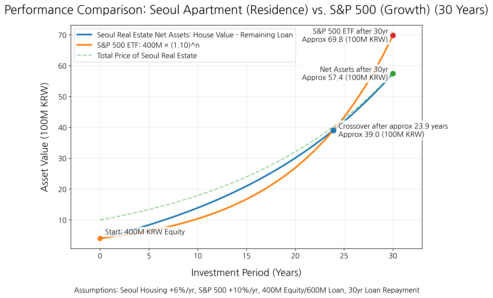

The graph shows that both investments start with KRW 400 million of equity. Real estate holds a KRW 1 billion home, but because KRW 600 million is bank money, initial net assets are KRW 400 million. The S&P 500 ETF also begins with KRW 400 million. In the early period, real estate net assets grow quite quickly. There are two reasons. First, house price appreciation applies not to KRW 400 million but to the full KRW 1 billion asset. Second, as loan principal decreases over time, net assets reflect both house price appreciation and principal repayment. This is the powerful advantage of real estate. With relatively small equity, one can hold a larger asset and grow net assets while reducing debt over time.

But as time lengthens, the compounding effect of the S&P 500 ETF also appears strongly. If Seoul housing rises 6 percent per year and the S&P 500 ETF rises 10 percent per year, the difference in return accumulates over time. In the graph, around year 24, the value of the S&P 500 ETF surpasses the net assets of the Seoul home. At first, the leverage and principal repayment effects of real estate are strong, but over a sufficiently long period, the compounding effect of higher returns catches up.

The comparison's message is simple. Real estate has the power of leverage and principal repayment; the S&P 500 ETF has the power of long-term returns and compounding. Real estate has the great advantage of allowing ownership of a KRW 1 billion asset with KRW 400 million. By contrast, the S&P 500 ETF starts with only KRW 400 million invested, so it can look relatively disadvantageous early on. But if an annual return of 10 percent is maintained for a long time, compounding grows stronger and can eventually surpass real estate's initial leverage effect. Real estate owners may consider the period between ten and twenty years, when this gap begins to widen, as a point to review asset reallocation.

Some may ask, "But after thirty years, does real estate not finally become my house?" That is true. Once the loan is fully repaid, the house remains entirely your asset. In addition, if you rent it out, you can receive monthly rent. If you live in it, you avoid paying monthly rent or jeonse costs. Real estate clearly has advantages.

But the same applies to stocks. After thirty years, stocks do not disappear. An S&P 500 ETF also remains with the value it has grown to. If the ETF pays dividends, those dividends can create cash flow similar to rent. If dividends are reinvested, assets can grow larger; when needed, part can be sold to create cash flow. In other words, real estate is not the only asset that remains over time. Good stock assets can also remain as larger assets over time.

What this simplified simulation emphasizes is that real estate is not the only answer. Many people view real estate as the most stable and certain asset. In Korea, real estate has indeed long been a powerful means of asset formation. But long-term investment in a broad market such as the U.S. S&P 500 is also a sufficiently powerful choice. If one can invest steadily over a long period, the power of compounding is far greater than many expect.

## 4.6 Summing Up Chapter 4

In Chapter 4, we discussed what choices ordinary individual investors should make to grow assets over the long term. Choosing individual stocks, predicting the market, and moving based on better information than others can certainly look attractive. But as the previous chapters showed, that path is never easy. Analyzing companies is difficult, information has limits, and human emotions are easily shaken. That is why I presented buying the whole market as an alternative.

Buying the whole market means letting go of the greed to correctly identify one single company. We cannot know exactly which company will grow the most or which will be pushed out of the market. But if capitalism continues to operate, good companies continue to make profits, and new companies enter the market, the whole market absorbs those changes and moves forward. Index funds and ETFs are tools that let us participate in that flow.

By buying one ETF share, we can gain the same effect as investing across hundreds of companies. We do not need to choose one individual company, and over time we do not need to worry about which companies to buy or sell in the portfolio. Companies enter and leave according to index standards, and market changes are reflected to some extent inside the ETF.

Of course, not every ETF is suitable for long-term investing. Products such as inverse ETFs, which bet on market declines, do not fit investors who believe the market grows over the long term. Narrow theme ETFs or ETFs concentrated in a small number of stocks also require caution. The name ETF does not make every product safe or good. What matters is checking which index it tracks, how broadly it is diversified, and whether I can understand and hold its structure long term.

From this perspective, proven broad indexes such as the S&P 500 and Nasdaq-100 can be realistic choices for ordinary investors. The S&P 500 represents the U.S. market, and the Nasdaq-100 has high weights in technology and innovative companies. If you want to get on the market average more stably, the S&P 500 can be a good benchmark. If you believe in the long-term growth of technology, the Nasdaq-100 is also worth considering. But we must not forget that higher expected returns come with higher volatility.

The same is true when compared with real estate. In Korea, real estate has long been a powerful means of building assets. Seoul apartments in particular have been considered the most familiar and trustworthy investment assets by many people. But as the simple simulation showed, long-term investment in a U.S. S&P 500 ETF is by no means a weak choice. Real estate has leverage and principal repayment; ETFs have long-term returns and compounding. The two assets have different strengths. What matters is not thinking that real estate is the only answer.

Buying the whole market means letting go of greed, but also choosing not to miss the largest flow. It is okay not to pick the single best company. You can own the whole market that must include future winners. That is the power of ETFs and the reason to buy the whole market in long-term investing. Remember: above all, you must always be in the market.

# Chapter 5. Why Leveraged ETFs Are Controversial Yet Powerful

## 5.1 What Is a Leveraged ETF?

In the previous sections, we looked at what ETFs are. Not all ETFs simply follow an index's movement as it is. Some are designed so that if an index rises 1 percent in a day, they rise 2 percent or 3 percent. Such products are called leveraged ETFs. Leverage simply means a lever. Just as a lever lets a small force move a larger object, leverage in investing is a structure that creates a larger investment effect than one's own money alone.

Suppose the S&P 500 rises 1 percent in a day. A 2x leveraged ETF tracking the S&P 500 aims to rise roughly 2 percent, and a 3x leveraged ETF aims to rise roughly 3 percent. Conversely, if the S&P 500 falls 1 percent in a day, the 2x leveraged ETF falls roughly 2 percent and the 3x leveraged ETF falls roughly 3 percent. There are also ETFs that move in the opposite direction of leveraged ETFs. These are inverse ETFs. An inverse ETF is designed to profit when the index falls. There are also inverse leveraged ETFs that add leverage to this structure. If the index falls 1 percent in a day, they aim to rise 2 percent or 3 percent. Conversely, if the index rises, losses expand by that amount. Because stocks trend upward over the long term, I never recommend any inverse product as a long-term investment.

Let us look at some representative leveraged ETFs. General ETFs tracking the S&P 500 include VOO, SPY, and IVV. They follow the movement of the S&P 500 at about 1x. Representative leveraged products are SSO and UPRO. SSO tracks 2x the daily return of the S&P 500, while UPRO tracks 3x. For the Nasdaq-100, QQQ is the representative general ETF. QQQ tracks the Nasdaq-100 at 1x. QLD applies 2x leverage, and TQQQ applies 3x leverage. In other words, if QQQ follows the Nasdaq-100 as it is, QLD seeks to magnify its daily movement by 2x and TQQQ by 3x. There are leveraged ETFs in semiconductors too. USD, for example, tracks 2x the daily return of a U.S. semiconductor-related index. For investors who believe the semiconductor industry will grow long term, it can look very attractive. But because the semiconductor industry itself is sensitive to economic cycles and technological change, adding leverage makes volatility much larger.

You do not need to know every detail of how this is possible, but in brief, leveraged ETFs usually use derivatives such as futures, swaps, and options, along with short-term financial instruments, to create target exposure. This is not free. Leveraged ETFs have more complex structures than ordinary ETFs. They must use derivatives and adjust portfolios daily to maintain target leverage. So expense ratios are higher than ordinary ETFs. For example, QQQ's total expense ratio is about 0.18 percent, while representative leveraged ETFs such as SSO, UPRO, QLD, TQQQ, and USD generally have expense ratios around 0.9 percent. Looking only at fees, they are more expensive than ordinary index ETFs, but because stocks trend upward over the long term, higher fees alone do not make them simply worse.

Leverage magnifies profits when you are right about direction, but it also magnifies losses when you are wrong. The market does not only rise; it shakes severely from time to time. Leveraged ETFs make investors experience even those shakes in enlarged form. Compared with an investor in a normal index ETF, losses can become two or three times larger when prices fall, so the burden is inevitably greater.

This book discusses leveraged ETFs not because they are unconditionally good products. Rather, many people avoid them simply because they are risky, while others approach them simply because they think they can make a lot of money quickly. Both are judgments made without sufficient understanding. This chapter will address common misunderstandings about leveraged ETFs and dig into how they should be handled.

## 5.2 Why Are They Called Dangerous?

Whenever leveraged ETFs are discussed, one phrase almost always follows: "Do not invest in them long term." Many experts and investment-content creators actually say leveraged ETFs are unsuitable for long-term investing. A famous Korean YouTuber, Shuka World, has also discussed the issue under the idea of "why you should not invest in leveraged ETFs long term." Why, then, do so many people call leveraged ETFs dangerous?

The biggest reason is daily rebalancing. As mentioned earlier, leveraged ETFs are not products that make long-term returns exactly 2x or 3x. They are designed to follow daily returns at 2x or 3x. This means that after every market close, the portfolio is adjusted to maintain 2x or 3x exposure again the next day.

This structure works powerfully when the market moves steadily in one direction. But problems arise when the market goes up and down sideways. Suppose you have 100 won. On the first day it rises 10 percent, becoming 110 won. On the next day it falls 10 percent. It does not return to 100 won; it becomes 99 won, because the 10 percent fall on the second day is calculated from 110 won, not the original 100 won. Conversely, if it falls 10 percent on the first day, 100 won becomes 90 won, and if it rises 10 percent the next day, it becomes 99 won. Whether it rises then falls or falls then rises, the result is the same. A 10 percent rise and a 10 percent fall seem to offset each other, but in reality a 1 percent loss remains.

This occurs even in ordinary ETFs. But in leveraged ETFs, the effect grows larger. Consider a 2x leveraged ETF in the same situation. If the underlying index rises 10 percent, the 2x ETF rises about 20 percent. 100 won becomes 120 won. If the underlying index falls 10 percent the next day, the 2x ETF falls about 20 percent. A 20 percent fall from 120 won leaves 96 won. The index merely rose 10 percent and fell 10 percent, but the 2x ETF lost 4 percent. With a 3x leveraged ETF, the result is more extreme. If the underlying index rises 10 percent, the 3x ETF rises about 30 percent, and 100 won becomes 130 won. If the underlying index falls 10 percent the next day, the 3x ETF falls about 30 percent. A 30 percent fall from 130 won leaves 91 won. The loss is 9 percent. The reverse order, falling 10 percent first and rising 10 percent next, produces a similar result: 100 won becomes 70 won, then rises 30 percent to 91 won.

People describe this as assets melting in a sideways market, or call it volatility decay. Even if the market ends where it started, if there are large ups and downs in between, assets in leveraged ETFs can gradually decrease. The underlying index may return to its starting point, but the leveraged ETF may not. That is why people say leveraged ETFs are unsuitable for long-term investing, where sideways markets can occur.

This explanation is not wrong. It is essential for understanding leveraged ETFs. Companies that manage leveraged ETFs also state this clearly. ProShares explains that TQQQ targets 3x the daily return of the Nasdaq-100, and that if held longer than one day, actual returns can be higher or lower than the target multiple and the difference may be significant. It especially warns that small index movements and high volatility can produce results worse than the target multiple.

But one more point must be considered. This explanation mainly assumes sideways or highly volatile markets. If the market trends upward over the long term, the story changes completely. Looking day by day, the stock market rises and falls, but over long periods it has trended upward. The Nasdaq-100, centered on U.S. technology stocks, has shown a particularly strong upward trend over recent decades. Then were leveraged ETFs truly always unfavorable over the long term?

Comparing representative ETFs tracking the Nasdaq-100 produces interesting results. QQQ tracks the Nasdaq-100 at 1x, QLD at 2x, and TQQQ at 3x. From TQQQ's listing on February 11, 2010 to June 10, 2026, including dividend reinvestment, over sixteen years QQQ rose about 17 times, QLD about 106 times, and TQQQ about 335 times. What do you think of the result over a fairly long period of sixteen years? Does it still feel right to say leveraged ETFs are unsuitable for long-term investing?

The statement that leveraged ETFs must never be held long term is overly simple. Shuka World's explanation of the loss structure in sideways markets is certainly correct. But as the result proves, when the actual market rises strongly for a long period, the leverage effect can exceed the negative compounding effect. There is, however, a point to be careful about. As of June 2026, when this book is being written, the U.S. stock market is generally rising, and technology stocks in particular have risen greatly. Leveraged ETFs shine more in such periods. Therefore, looking only at the current result and immediately buying TQQQ or another 3x leveraged ETF can be a hasty judgment. TQQQ had periods of astonishing returns, but it also had enormous declines. In 2022, it fell about 79 percent in one year, and from the 2021 high to the end of 2022, the maximum drawdown exceeded 80 percent. Enduring such a decline is not easy. Few people can keep holding when an account shrinks from KRW 100 million to around KRW 20 million.

At this point, you may be more confused. If I say not to rely only on past data and also warn that even TQQQ, which made an astonishing 335x return, can suffer huge declines, what exactly should you buy? Just as no clothing fits everyone perfectly, stocks are the same. What matters is knowing your own situation and limits before entering. 2x and 3x are not merely one number apart. They become completely different products in volatility, recovery period, and psychological burden. The next section will discuss this in more detail.

Some people worry that leveraged ETFs may be delisted. This worry is not entirely baseless. In theory, if the underlying index of a 2x leveraged ETF falls 50 percent in one day, its asset value can approach zero; if the underlying index of a 3x leveraged ETF falls about 33.3 percent in one day, it can approach a total loss. But the U.S. stock market has circuit breakers that temporarily halt trading when the whole market plunges. If the S&P 500 falls 7 percent, 13 percent, or 20 percent from the previous close, market-wide trading is halted in stages. Because of circuit breakers and the breadth of indexes underlying 2x and 3x ETFs, a broad-index leveraged ETF suffering delisting-level losses in one day is realistically close to impossible.

Leveraged ETFs are risky. This statement is half true and half incomplete. The word risky alone is not enough. We must examine why they are risky, in what situations they are risky, and whether the risk is exaggerated relative to reality. In Rich Dad Poor Dad, Robert Kiyosaki says in effect that if one cannot take risks, it is hard to escape a poor life. Of course, taking risk does not mean jumping in blindly. What matters is not avoiding risk, but understanding its true nature.

This book does not aim to lean entirely to one side. I do not want to condemn leveraged ETFs as unconditionally dangerous, nor call them unconditionally good investments. Removing both fear and overconfidence and understanding leveraged ETFs as they are: that is what we must do in this chapter.

## 5.3 The Optimal Leverage Ratio

So far, I have explained why leveraged ETFs can be useful. They are tools that can enlarge returns based on the belief that the market trends upward over the long term. But a natural question follows. Among many leveraged ETFs, which index and which leverage ratio should be chosen? If one thinks only about returns, the answer looks easy. If the market rises, 3x should rise the most. But there are more points to consider. As leverage rises, expected return increases, but volatility also increases. In addition, as discussed earlier, the erosion of assets in sideways markets must be considered.

For this section, I ran a simple backtest using historical Nasdaq data. Backtesting is a method of using past data to check how an investment strategy would have worked. Past results do not guarantee the future, of course. But they help us see in what environments a strategy was strong and what risks it carried. The analysis method was as follows. First, I collected historical daily closing data for the Nasdaq. Then I calculated how much the index rose or fell each day. For example, if yesterday's index was 100 and today's is 101, the daily return is 1 percent. If it fell from 100 to 99, the daily return is -1 percent. After calculating all historical daily returns, I multiplied them by leverage ratios. Actual ETFs tracking the Nasdaq exist, but because their histories are short, I created virtual index-tracking ETFs from the Nasdaq itself. These correspond to virtual QQQ (1x), QLD (2x), and TQQQ (3x).

Actual leveraged ETFs have expense ratios, so I considered those. Next, I randomly selected many long investment periods of at least four years from the historical data. Choosing only one specific period can distort results. Results differ greatly depending on whether the starting point is just after the dot-com bubble, after the financial crisis, or after COVID. Therefore, this analysis randomly selected sufficiently long intervals from historical data and repeated the process 1,000 times. For each interval, I calculated the compound annual growth rate, or CAGR, for each leverage ratio. CAGR does not simply show final return; it shows the average annual growth rate as if the investment grew at the same rate each year. Because investment periods can differ, CAGR is fairer than simple return. After calculating this, I obtained the average CAGR and standard deviation for each leverage ratio. The average CAGR shows expected average performance, and standard deviation shows how much the results fluctuate. Simply put, the larger the standard deviation, the greater the return volatility.

The graph below shows the result with the standard deviation doubled to represent a 95 percent confidence interval.

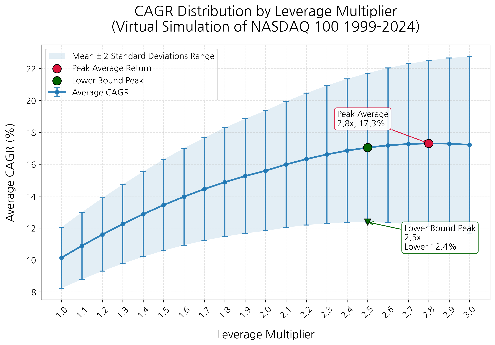

The graph shows that as leverage increases, average CAGR rises as well. At 1x, average CAGR is about 10 percent, and as leverage rises, returns gradually increase. Looking only at returns, the highest point appears around 2.8x. In that region, average CAGR is highest. But one should not look only at return. The long vertical bars represent standard deviation. In other words, they show how much actual results can fluctuate even at the same leverage ratio. As leverage rises, average return increases, but standard deviation also increases. Expected return grows, but the volatility investors must endure grows with it. If the lower end of the graph is treated as a worst-case assumption, 2.5x appears optimal. Also, returns rise sharply from 1x at first, but after 2x the increase in return gradually slows, while the volatility shown by the upper and lower bars continues to grow. This is important. In investing, we must not simply choose the point with the highest return; we must ask whether the additional reward is sufficient for the additional risk.

From this perspective, the optimal ratio changes somewhat. Looking only at returns, around 2.8x looks best. But considering the rate of increase and volatility together, somewhere between 2x and 2.5x appears to be a better balance point. One small problem is that 2.x leveraged ETFs do not exist in the real market. To create the desired ratio, QQQ, QLD, and TQQQ must be mixed. QLD is a 2x leveraged ETF, while TQQQ is 3x. If the two are mixed half and half, the average leverage ratio is 2.5x. But buying two products means one product may be less volatile while the other is strongly affected by volatility. In this sense, adjusting leverage by mixing leveraged ETFs is not, strictly speaking, the same as finding an optimal leverage ratio. Still, if one truly wants to find a mathematically optimal ratio, it is a possible method.

There is also a simpler method: just buy 2x QLD or 3x TQQQ. QLD's expected return is about 15 percent. Applying the rule of 72, one can earn a return equal to the original principal in under five years (72/15 = 4.8 years). For a return available after reading one book, this is by no means bad. More detail will be discussed in the next section, but buying only 3x TQQQ requires enduring greater volatility. TQQQ's advantage is clear: it can produce very high returns in bull markets. If we assume Nasdaq started at 100 in 1972 and look as of June 12, 2026, while this book is being written, virtual QQQ would be 25,888, QLD 683,337, and TQQQ 1,762,596. QQQ became 259x, QLD 6,833x, and TQQQ 17,626x. The difference between Nasdaq and QLD is about 26x, while the difference between Nasdaq and TQQQ is 68x; the difference between QLD and TQQQ is also 2.6x. However, the truly important warning is that the present is a very large bull market. In bear markets, TQQQ's return can be lower than QLD's and recovery can take longer. For example, in the data after the large decline in March 2009, when 1x QQQ was 12x, 2x QLD was 26x, and TQQQ was 16x.

If QQQ, QLD, and TQQQ had existed since 1972, their virtual overall returns would look like the graph below. Note that the y-axis is logarithmic. Without a log scale, the differences among QQQ, QLD, and TQQQ would be too large to grasp the trend at a glance. Overall, in many periods, choosing QLD or TQQQ rather than virtual QQQ appears to have been the better choice.

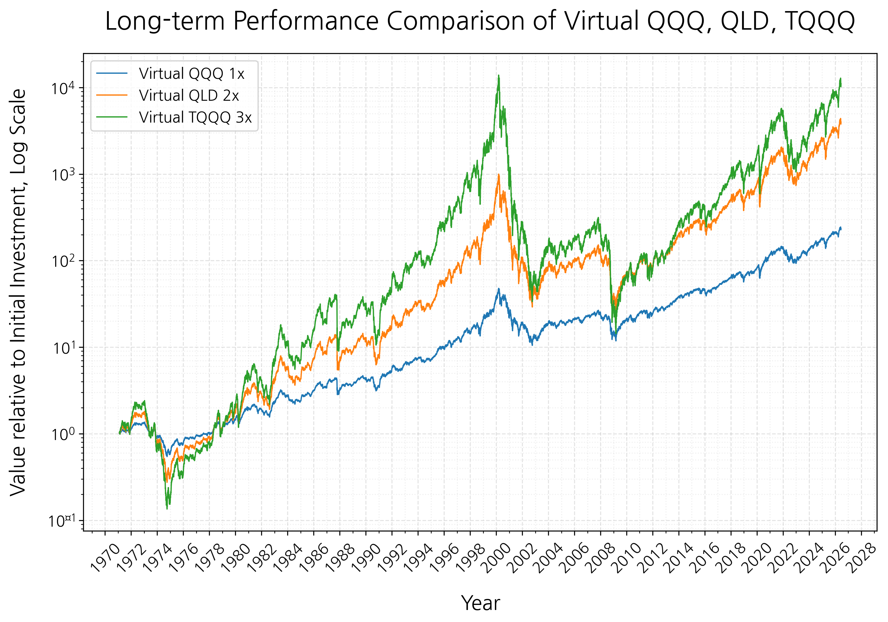

This analysis is only a simulation based on past data. In actual investing, taxes, timing of trades, exchange rates, investor psychology, and rebalancing methods also affect results. Nevertheless, the analysis teaches that higher leverage is not always better and that leverage ratio must balance volatility and return. Moreover, the leverage ratio suitable for each person is not determined simply by mathematics. It must consider how long I can invest, how much decline I can endure, whether I have capacity to buy more, and whether I can avoid being shaken during the investment. No matter how good backtesting looks, it is meaningless if I cannot endure it. Investing does not end in formulas; it continues in a real account.

## 5.4 Start Even One Day Earlier

As we have seen, leveraged ETFs are volatile. They rise far more than 1x ETFs and fall far more. In bull markets, assets can grow quickly, but in bear markets the account can feel as if it is collapsing. But as risk increases, expected returns also increase. In the previous section, we created virtual index-tracking ETFs using historical Nasdaq data. The result showed that if 1x QQQ's annual average return is about 10 percent, 2x QLD can be expected to return about 15.5 percent and 3x TQQQ about 17 percent. This is only a simulation based on past data, and there is no guarantee the same result will repeat. Still, it clearly confirmed that leverage can greatly increase long-term returns.

Then a natural question arises. What is the probability of losing principal when investing in leveraged ETFs? In other words, if I begin investing at some point, what is the chance I will still be in loss after one year? What about after three years? Five, ten, or twenty years? Over the long term, markets have trended upward. Of course, there were terrible bear markets in between: the dot-com crash, the financial crisis, the COVID plunge, and the 2022 technology-stock bear market. Periods that frightened investors have repeatedly arrived. But given enough time, the market recovered and moved to higher levels. The problem is that saying "it eventually recovers" is not enough. What matters to investors is whether they can wait for that recovery.

So I constructed another simulation to examine how the probability of principal loss changes by holding period. The method is as follows. As in the previous section, I first used historical Nasdaq data to create virtual QQQ, QLD, and TQQQ. Then I used actual consecutive intervals that existed in the historical data. For a one-year holding period, for example, I looked at actual one-year intervals in history: 1975 to 1976, 1988 to 1989, 2000 to 2001, and so on. For a ten-year holding period, I looked at actual ten-year intervals; for twenty years, actual twenty-year intervals. The calculation was simple. Initial investment was set to 1. If final assets at the end of a given holding period were greater than 1, it was counted as profit; if less than 1, as principal loss. This process was repeated for holding periods from one to thirty years. This shows, "If one had invested at any point in Nasdaq history, what was the probability of losing principal after a certain number of years?" The graph below shows the result.

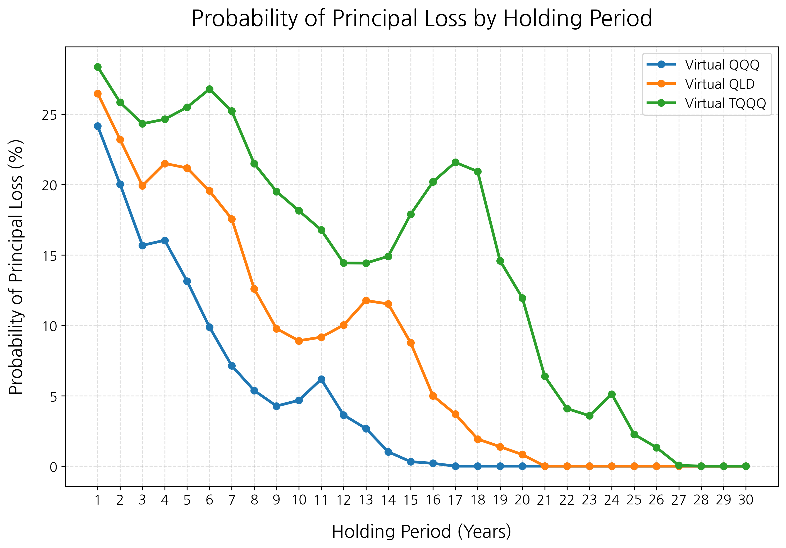

In the graph, blue represents virtual QQQ, orange virtual QLD, and green virtual TQQQ. The overall trend is clear. As the holding period lengthens, the probability of principal loss generally decreases. When holding for only one year, the probability of loss is fairly high because the market can fall over any one-year period. But as holding periods lengthen to five, ten, and twenty years, the probability of loss gradually decreases because the market's long-term growth effect accumulates. The three products show clearly different trends. Virtual QQQ's loss probability falls relatively quickly. Because it is a 1x product, volatility is lowest and the return needed to recover from a large decline is relatively small. Virtual QLD and TQQQ require more time. Virtual TQQQ, especially, has the highest short-term loss probability because it has 3x leverage, and it takes longer before the probability of loss falls sufficiently.

The graph does not show loss probability decreasing smoothly every year. Some sections bulge upward again. This occurs because actual historical data was used. The Nasdaq experienced very strong bear markets in the past, especially the dot-com crash. If investment began near the 2000 peak, one had to endure a very large decline for several years. The technology-heavy Nasdaq was hit hard during this period. It was painful even for 1x investors, but far more damaging for 2x and 3x leveraged investors. Leveraged products fall more when markets fall, and after large losses they require much larger rises to recover principal. Therefore, intervals beginning at certain peaks can remain in loss even after more than ten years. Also, as the holding period changes, the historical intervals included change as well. A ten-year interval and a fifteen-year interval are not simply the same investment plus five more years. Start and end combinations change, and some intervals include the dot-com crash, the financial crisis, or the 2022 technology-stock bear market. Therefore, when actual consecutive intervals are used, loss probability does not always decline smoothly and can temporarily jump at certain holding periods.

Even so, the overall direction is clear. As time lengthens, the probability of principal loss falls. Virtual QQQ approaches zero relatively quickly, and virtual QLD also sees loss probability decrease greatly over time. Virtual TQQQ stabilizes latest, but over very long holding periods its loss probability also decreases. This result provides a view different from the argument that leveraged ETFs must be treated only as short-term trading products. The problem is not leverage itself, but whether enough time has been secured to endure it. The core point is that investors in leveraged ETFs may need to be more patient for longer.

Many people search for the best time to invest: "I will buy if it falls more," "I will buy when rates fall," "I will buy when the recession ends," "I will buy after the election." But the perfect starting point is known only afterward. What investors can actually do is not perfectly hit the bottom, but secure enough time. The surest way to secure a long period is to start even one day earlier. The essence of long-term investing is not accurately predicting the market, but staying in the market for a long time. Results over a day, a month, or a year are heavily influenced by luck. But results over ten, twenty, and thirty years are increasingly influenced by time and compounding. This principle is even more important for volatile assets such as leveraged ETFs. To expect high returns, one must endure high volatility; to endure high volatility, one needs enough time.

So the conclusion is simple. You must be in the market. And if possible, you should start even one day earlier. Waiting may feel as if you are avoiding risk, but it may also mean losing time for compounding to work. The greatest asset for a long-term investor is not perfect predictive ability, but time. To make time your ally, you must eventually begin.

## 5.5 Summing Up Chapter 5

Chapter 5 examined leveraged ETFs. They are products that provoke much debate. Some say they must never be held long term, while others say they are powerful tools that can change your life. Both sides have a point. By taking volatility and risk, one also takes the possibility of higher returns.

The basic structure of leveraged ETFs is simple. If the underlying index rises 1 percent in a day, a 2x product aims to rise about 2 percent and a 3x product about 3 percent. Conversely, if the underlying index falls, losses grow by the same multiple. Because leveraged ETFs move based on daily returns through daily rebalancing, long-term returns do not simply become 2x or 3x the underlying index. Because the target multiple is reset every day, in a sideways market where prices go up and down, assets can gradually shrink. This is what people call volatility decay.

But we cannot conclude that leveraged ETFs are always unsuitable for long-term investing. If the market strongly trends upward over the long term, returns can exceed volatility decay. Historical long-term performance of QQQ, QLD, and TQQQ, which track the Nasdaq-100, shows that leveraged ETFs have produced enormous returns in some periods. Of course, the process was never smooth. A 3x product such as TQQQ can show large rises, but in bear markets the account can also fall 70 percent, 80 percent, or more.

Therefore, the important question is not simply whether leveraged ETFs are good or bad. The more important question is what return you target and how much volatility and risk you can bear. 2x and 3x are not merely one number apart. Volatility, drawdown, recovery period, and psychological pressure are completely different. In backtests, 3x may look most attractive, but if you cannot endure an 80 percent decline in a real account, that strategy does not fit you.

Using Nasdaq index data, we created several simulations and observed the results. The highest return came from about 2.8x leverage, but considering volatility and the possibility of principal recovery, around 2x to 2.5x also appeared appropriate. Leverage beyond that offered limited additional returns relative to the volatility and risk that had to be borne. Another simulation showed that the higher the leverage ratio, the greater the possibility of principal loss. Therefore, based on the Nasdaq, 2x leverage is a fairly reasonable choice. If you decide to invest in leveraged ETFs, you need a mindset of greater patience than others.

The fruit of leveraged ETFs is sweet. The annual average return of QQQ, which tracks the Nasdaq at 1x, is about 10 percent; QLD at 2x is about 15 percent; TQQQ at 3x is about 17 percent. A 10 percent annual return is by no means bad. But if we subtract 5 percent to account for factors such as housing prices or inflation and calculate real return, QQQ produces 5 percent, QLD 10 percent, and TQQQ 12 percent. This resembles the reason the wealth gap widens between rich and poor. Suppose a rich person receives KRW 6 million, spends KRW 3 million, and saves KRW 3 million. A poor person receives KRW 2 million, spends KRW 1.5 million, and saves KRW 500,000. Salary differs by 3x, but saveable money differs by 6x. This kind of difference is what makes leveraged ETFs powerful. Investing in leveraged ETFs may mean enduring painful periods longer than others. But if you believe in the power of long-term investing and are convinced that the whole market grows over the long term, you can enjoy that fruit.

More important than the optimal leverage ratio is long-term investing. The longer you remain in the market, the lower the probability of losing principal, and the real return you can obtain can increase two to three times. Therefore I recommend starting now, even with a small amount. The next chapter will present concrete strategies for execution.

# Chapter 6. Execution Strategy

## 6.1 How Much and How Should You Invest?

So far, we have examined why we must invest, what assets we should invest in, and what advantages and disadvantages broad-market ETFs and leveraged ETFs have. But no matter how good an investment method is, it means nothing if not executed. Investing does not end with understanding in the head. What matters is how much of my income I set aside, when I buy, and how I continue steadily.

Generally, when first beginning investing, it is good to start within a range that is not excessive. Investing is not a sprint but a long-distance race. Rather than putting in a lot for one or two months, you must be able to keep investing for more than ten years. This is even more true when investing in volatile products such as leveraged ETFs. If a bear market comes and living expenses are short, forcing you to sell, even a good strategy can end in failure. Investment money must therefore be money that can remain tied up for a long time.

One way to invest consistently is to set aside investment money as soon as salary arrives. Many people think, "I will invest what remains after spending this month," but human psychology is not that simple. If money is in the account, things to spend it on appear. Expenses that look necessary arise, and small rewards to oneself increase. After a month passes, less money than expected remains for investing.

So when salary arrives, first buy ETFs with a predetermined amount. Then use the remaining money for living expenses, food, transportation, and hobbies. This turns investing from a matter of willpower into a matter of system. There is no need to worry every month, and no need to be shaken by market conditions. Just as with a savings plan, invest a fixed amount on a fixed date. This is commonly called periodic investment or dollar-cost averaging. It means steadily investing the same amount every month. Because you keep buying whether the market rises or falls, there is no need to try to time the market.

The greatest advantage of periodic investment is that the psychological burden of timing is low. It is generally hard to endure a bear market happily, but if you are investing periodically, a bear market is not necessarily bad. For someone who will continue buying investment products, a bear market is an opportunity to accumulate assets at lower prices.

Conversely, people who already have a lump sum may worry more. Suppose you have a large amount that can be invested at once, such as severance pay, a bonus, part of a jeonse deposit, or savings accumulated for a long time. Many people then wonder: "Can I put it in all at once now? What if it falls right after I buy? Should I wait a little longer?"

Investing a lump sum at once can be called lump-sum investing. It means putting a certain amount into the market at once instead of dividing it over multiple purchases. The biggest worry is that timing may be bad and a bear market may arrive right after investing. Strangely, it feels as if the market falls whenever I buy. If only I had waited a few more days, I could have bought cheaper; I should have been more cautious. Because of such experiences, people postpone investing and wait for better timing.

But on a long-term chart, differences of days, weeks, or months may not be as large as they feel. If you buy today and it falls 5 percent tomorrow, your mind is shaken. But over ten, twenty, or thirty years, that short-term difference can become a small fluctuation in the overall result. In long-term investing, what matters more than finding the perfect entry point is securing the longest possible time in the market. When people around me ask for investment advice, I always tell them to start even one day earlier. Their answer is always the same: it seems too expensive now.

Hanno Beck said in The Way Rich People Think that in the short term we regret what we did, but in the long term we regret what we did not do. Investing is the same. In the short term, you may regret, "Why did I buy then?" But after enough time passes, you may regret much more, "Why did I not start then?" The market always looks uncertain. Now it seems too high, later a recession may come, and at some point interest rates become a worry. But if you keep waiting for such reasons, you may miss the period when the market rises.

Everyone's situation differs, but the method that causes the least worry is to invest whenever spare money appears. Then do not sell those assets and keep them in the market as long as possible. Is that not simple? You may not yet have conviction. Even so, I recommend starting now with a small amount. If you do nothing, you stay where you are. But if you move forward even 1 percent every day, after one year it becomes about 38 times ($1.01^{365}\approx37.78$), and after three years about 54,000 times ($1.01^{365\times3}\approx53939$). I hope you create that beginning today.

## 6.2 Buying Fractional Shares

When trying to buy stocks for the first time, one may encounter an unexpected barrier: stocks are basically traded in units of one share. Just as we buy apples one by one at the market, in the stock market we usually buy and sell whole shares: one share, two shares, ten shares. The problem is that some stocks are too expensive per share.

A representative example is Berkshire Hathaway Class A shares. Berkshire Hathaway, led by Warren Buffett, is a globally famous company, but its Class A shares are also famous for being extremely expensive. One share can cost hundreds of millions of won, so it is difficult for ordinary individual investors to casually think, "I will buy just one share." Berkshire also has lower-priced Class B shares, but Class A shares are a representative example showing the limit of whole-share trading.

Even without an extreme case like Berkshire, similar problems arise often. U.S. large technology stocks or high-priced stocks can cost hundreds of thousands or even millions of won per share. If I decide to invest KRW 300,000 every month but the ETF or stock I want costs KRW 2 million per share, what should I do? Should I wait two or three months to buy one share? If the price rises in the meantime, should I wait again? Such situations make periodic investment difficult.

Companies know this problem. That is why they sometimes do stock splits. For example, if a stock priced at $1,000 per share is split 5-for-1, each existing share becomes five shares, and the theoretical price per share becomes $200. The important point is that the total value does not change. One $1,000 share simply becomes five $200 shares. It is like cutting one pizza into four slices or eight slices; the amount of pizza does not change.

Tesla is a representative company that has done stock splits. Tesla conducted a 5-for-1 split in 2020 and then a 3-for-1 split in 2022. If someone held one Tesla share before the first split in 2020, it became five shares after the 5-for-1 split, and after the later 3-for-1 split, it became a total of fifteen shares. Of course, simply having more shares does not make one rich. As the number of shares increases, the price per share decreases. But stock splits lower the price per share and make it easier for more investors to access the stock.

These days, however, one does not even need to wait for stock splits. Fractional trading has become possible. Fractional trading means buying not by whole shares, but in pieces such as 0.1 share, 0.01 share, or 0.001 share. More simply, it allows buying based on amount of money rather than number of shares. Suppose one ETF share costs KRW 1 million. In the past, you needed KRW 1 million to buy one share. But with fractional trading, you can buy only KRW 100,000 worth. In that case, you own 0.1 share of the ETF. If you buy KRW 50,000 worth, you own 0.05 share. This allows you to invest exactly according to a predetermined monthly amount.

In the United States, brokerage apps such as Robinhood support fractional share purchases. Investors can decide not "how many shares to buy," but "how many dollars' worth to buy." For example, they can buy $50 of Apple, $30 of Tesla, and $100 of QQQ. Regardless of the price of one share, they can invest the amount they want.

Fractional trading of overseas stocks is also possible in Korea. In the past, overseas stocks were basically traded in whole-share units, but now many securities apps allow U.S. stocks or U.S. ETFs to be bought fractionally. The details differ by brokerage, but the basic structure is similar. When an investor enters a desired amount such as KRW 10,000, KRW 50,000, or KRW 100,000, the brokerage aggregates orders from multiple investors, trades whole shares, and reflects fractional ownership for each investor.

The actual process is not difficult. First, open a brokerage account that supports overseas stock trading. Then apply for overseas stock trading in the app and, if necessary, set up currency exchange or Korean-won order services. Next, search for the U.S. stock or ETF you want. You can search for tickers such as QQQ, QLD, TQQQ, or VOO. Then choose a menu such as "fractional order," "amount order," or "overseas stock fractional trading" rather than a normal order. Enter the amount you want to invest. Even if you do not have enough money to buy one share, you can buy KRW 10,000, KRW 50,000, or KRW 100,000 worth.

As mentioned, the biggest advantage of fractional trading is that it allows investment amounts to be matched cleanly. This fits periodic investing very well. The essence of periodic investing is steadily investing a fixed amount every month. If you can buy only whole shares, it is hard to invest exactly the same amount every month. When prices rise, you may not be able to buy even one share, and when prices fall, money may remain. With fractional trading, however, you can keep buying the amount you set regardless of share price. Like making a savings deposit, when salary arrives, buy a predetermined ETF with a predetermined amount.

Another advantage is that diversification becomes easier. Suppose you have only KRW 300,000 to invest but want to buy several securities. If you must trade only whole shares, choices are limited. Expensive securities cannot be bought at all, and dividing money among several securities is difficult. But with fractional trading, you can divide KRW 300,000 among multiple ETFs or stocks. Dividing too finely among too many securities is not always good, but the ability to begin diversification even with a small amount is clearly an advantage.

In investing, even small amounts cannot be ignored once the powerful weapon of time is added. Today's KRW 10,000, KRW 50,000, or KRW 100,000 may look insignificant now, but if that money enters the market every month and grows through compounding over time, it can create completely different results. What matters is not how many shares you bought. What matters is whether you participated in the market and whether you can continue that participation for a long time. Fractional trading is a very realistic tool that lets ordinary individual investors take that first step.

## 6.3 What If a Crash Comes?

If you remain in the stock market for a long time, you will inevitably meet a bear market. Stock prices falling sharply over a short period is more common than many think. Usually, when major indexes fall more than 10 percent from a recent high, it is called a correction; when they fall more than 20 percent, it is called a bear market or crash. The names may differ, but the emotion investors feel is similar. Accounts shrink, news pours out anxious stories, and people say a larger decline is coming.

If you are invested in leveraged ETFs, that fear feels even larger. When the market falls 10 percent, a 2x ETF can fall about 20 percent by simple calculation, and a 3x ETF about 30 percent. If the market falls 20 percent, losses become much larger. These numbers are understandable in the head, but seeing the loss in a real account is entirely different. Even while thinking that long-term investing is necessary, when the account shrinks greatly, the thought "Should I sell even now?" arises.

We often say, "Buy at the knees and sell at the shoulders." In words, it is obvious. But in an actual bear market, strangely, we do not want to buy at the knees; we want to sell there. The fact that prices have fallen feels less like an opportunity and more like a threat. It feels as if they will fall further and we should reduce losses even now. The hardest thing in investing is not knowing knowledge, but keeping that knowledge amid fear.

I had a similar experience. I began investing in the U.S. market while COVID was in full swing. At the time, enormous liquidity was released into the U.S. market under the pretext of supporting people's lives, interest rates fell, and the stock market rose quickly. At first, everything looked smooth. But as prices later rose sharply, the Federal Reserve raised policy rates to control inflation. When rates rose, growth and technology stocks shook severely, and the stock market fell quickly. Because I was invested in leveraged ETFs, my losses were much larger than the market's.

My mind was not comfortable then. When I checked my account, I felt anxious, and I wondered whether I should sell before it was too late. But looking back, that was not a time to run away from the market; it was a time to remain in the market. Over time, the market recovered, and investors who held steadily tasted the fruit of recovery. Of course, we cannot assert that every bear market will recover in the same way. But we must have conviction that the whole market grows over the long term.

Then what is the most basic way to prepare for a bear market? Surprisingly, it is simple. As emphasized many times, stay in the market for a long time. In Section 5.4, we looked at holding periods and the probability of principal loss. As that graph showed, the longer one remains in the market, the lower the probability of principal loss generally becomes. Perfectly avoiding bear markets and re-entering at the bottom is not as easy as it sounds. People think they can avoid declines, but in reality, as many have already done, they sell in fear before confirming the bottom and enter near the end of bull markets after being swayed by people around them.

Therefore, the most realistic way to prepare for bear markets is periodic investing. It is not flashy, but it is powerful. Above all, it does not interfere with your main job. If you try to predict the market every day and waver between fear and greed, you may fail to focus on what you actually need to do. Investing is meant to help life, not consume it. If you lose sleep whenever a bear market comes, check your account while working, and search for market news even during time with family, that investment cannot be sustained. A good strategy is not merely one with high returns, but one that can be maintained consistently for a long time. For most people, strategies that can be maintained are simple strategies.

Bear markets test investors. In bull markets, anyone can speak like a successful long-term investor. But the real skill of a long-term investor appears in bear markets. Can you keep the principles you set when your account shrinks, news is anxious, and people around you sell? That is the skill of a long-term investor. If a crash comes, first remember this: it is not the first, and it will likely not be the last. The market has experienced countless crises in the past, and investors feared them each time. But over long periods, the market has passed through crises and grown.

If you are investing because you believe in the long-term growth of the whole market, a crash is not a time to flee; it is a moment to confirm your principles.

## 6.4 Should You Rebalance Your Portfolio?

When studying investing, you often hear the word portfolio. It sounds grand, but it simply means the bundle of investment assets you own. If I own only QQQ, my portfolio consists of QQQ alone. If I own QQQ and QLD, it consists of two ETFs. If individual stocks, cash, bonds, and gold are added, it becomes a portfolio composed of more diverse assets. A portfolio is therefore not a special investment technique. It is simply a term showing what and how much I own. But because of the feeling the word gives, many people think portfolios are too difficult. Some feel that if they build an excellent portfolio, money will automatically be earned. But the portfolio itself does not make money. What makes money is whether the assets I hold grow over the long term.

Many investors set their own ratios, such as 40 percent S&P 500 ETF, 30 percent Nasdaq-100 ETF, 10 percent individual stocks, 10 percent bonds, and 10 percent cash. The problem is that these ratios naturally change over time. Suppose you initially buy QQQ and QLD each at 50 percent. If QLD rises more over time, its share of total assets exceeds 50 percent. Conversely, if a bear market arrives and QLD falls more, its share decreases. The ratios initially set keep shifting as prices change.

Portfolio rebalancing, which is different from ETF daily rebalancing, means adjusting these ratios back to the original. If you initially set QQQ at 50 percent and QLD at 50 percent, and later QLD rises to 70 percent, you sell some QLD and buy more QQQ to return close to 50:50. Conversely, if QLD falls greatly to 30 percent, you sell some QQQ or add new money to buy more QLD. In theory, rebalancing has advantages. It can prevent one asset from growing too large and excessively increasing the risk of the whole portfolio. Because it sells some of assets that rose a lot and buys assets that rose less or fell, it can also have the effect of "reducing what became expensive and increasing what became cheap." Especially when holding assets with different characteristics, such as stocks and bonds, rebalancing can help manage risk.

But that does not mean every individual investor must rebalance regularly. Especially for investors who, as this book suggests, steadily accumulate growth assets such as the whole U.S. market or Nasdaq-100 for the long term, buying and selling existing holdings to rebalance may create losses through taxes and fees. It is worth thinking carefully before bearing such costs simply because ratios broke. However, rebalancing to some degree with new investment money is worth trying. Everything is relative. Assets whose weight has fallen below the original ratio can be seen as relatively cheaper. Buying more of those assets than usual can gradually adjust portfolio ratios without triggering taxes.

In particular, this book's investment philosophy is closer to simple continuation than complex management: buy the whole market, accumulate periodically, do not leave during crashes, and hold as long as possible. The essence of such a strategy is not frequent trading. Rather, it is reducing frequent trading, minimizing taxes and costs, and giving compounding time to work. Therefore my view on portfolio rebalancing is simple. If it is not necessary, there is no need to do it often. Rather than rebalancing for its own sake, buy relatively cheaper assets with new investment money.

A portfolio does not make money for you. Rebalancing is not magic that creates returns; it is only a tool for managing risk. Use the tool when needed, but using the tool should not become the purpose itself. What actually makes money is assets that grow over the long term and the patience to hold those assets without selling for a long time.

## 6.5 So Which ETF Should You Buy?

Based on everything so far, you probably have some sense of which ETFs to buy. You should buy the whole market, hold long term, and choose a leverage ratio that fits your risk tolerance. But from a reader's perspective, you may still feel frustrated about exactly which stocks or ETFs to buy. I hope this section resolves some of that frustration.

The core ETFs ordinary individual investors can consider for long-term asset growth can be divided into three broad axes. First is the S&P 500, second is the Nasdaq-100, and third is semiconductors. The most basic is the S&P 500. As mentioned earlier, it is widely used as the representative index showing the flow of U.S. large-cap stocks. Therefore, ETFs tracking the S&P 500 are relatively stable choices. Because they are equity ETFs, they fall when bear markets come. But they are more diversified than ETFs concentrated in a specific industry or company. Based on historical data, long-term expected returns are roughly 8 to 10 percent per year.

If investing directly in the United States, representative 1x S&P 500 ETFs are SPY, VOO, and IVV. If looking for Korean-listed ETFs tracking the S&P 500, products include TIGER U.S. S&P 500, KODEX U.S. S&P 500, ACE U.S. S&P 500, and RISE U.S. S&P 500. Korean-listed ETFs can be traded in won and used in accounts such as pension savings or ISA accounts. Among U.S.-listed ETFs, SSO tracks 2x the daily return of the S&P 500, and UPRO tracks 3x. Among Korean-listed products, TIGER U.S. S&P 500 Leverage (Synthetic H) is a representative 2x S&P 500 leveraged product. In Korea, however, it is generally difficult to find 3x ETFs tracking indexes such as the S&P 500.

Because the S&P 500 is a broad index representing the United States, it is relatively more stable than the Nasdaq-100 or semiconductors. It may be hard to expect dramatic returns, but the shock in bear markets may also be relatively smaller. Therefore, if your investment period is relatively short or you are new to leveraged ETFs, it is good to consider S&P 500 products first.

Next is the Nasdaq-100. Personally, I prefer ETFs tracking the Nasdaq-100 most. The reason is simple: I believe technology leads the world. Industries such as artificial intelligence, cloud, semiconductors, software, platforms, data centers, electric vehicles, and robotics have already become central to the global economy, and their influence is unlikely to decline easily. The Nasdaq-100 is an index with high weights in such technology and innovative companies.

As discussed several times, the representative U.S. 1x Nasdaq-100 ETF is QQQ. QQQ is one of the most famous ETFs tracking the Nasdaq-100. Products applying 2x and 3x leverage to it are QLD and TQQQ. Korea also has products tracking the Nasdaq-100. Representative 1x products include TIGER U.S. Nasdaq 100, KODEX U.S. Nasdaq 100, and ACE U.S. Nasdaq 100. 2x leveraged products include KODEX U.S. Nasdaq 100 Leverage (Synthetic H) and TIGER U.S. Nasdaq 100 Leverage (Synthetic). As with the S&P 500, 3x products are hard to find domestically.

If I had to choose just one without knowing anything else, I would see a 2x Nasdaq-100 ETF as the most realistic choice. It is difficult to invest in 3x leveraged products domestically, and as our simulations showed, 2x leverage has a relatively good balance between return and volatility. If one can think in terms of a long-term expected return around 15 percent per year, it is a very powerful choice for ordinary investors.

The third is semiconductor ETFs. If you believe in the AI era, semiconductors cannot be left out. Training and running AI models requires enormous computing power, and at the center is the semiconductor ecosystem: GPUs, memory, foundries, equipment, and design software. Companies such as Nvidia, AMD, TSMC, ASML, Broadcom, and Micron provide the core infrastructure of the AI era.

Representative U.S.-listed 1x semiconductor ETFs include SOXX and SMH. SOXX invests in U.S.-listed semiconductor companies, while SMH is known for large weights in major semiconductor companies such as Nvidia and TSMC. USD is a 2x leveraged product, and SOXL is a representative 3x leveraged product. I also hold USD, a 2x semiconductor ETF, and based on returns so far it has been one of the best-performing products. Korea also has products such as TIGER U.S. Philadelphia Semiconductor Leverage (Synthetic), which aims for 2x returns on a U.S. semiconductor index. But semiconductor ETFs are extremely volatile. If leverage is added, losses can expand greatly in bear markets.

With the recent AI boom, semiconductor-related stocks have drawn great attention. At the same time, concerns exist that today's AI enthusiasm may be a bubble similar to the dot-com bubble. These concerns should not be ignored. Even a good industry can undergo a large correction if stock prices get too far ahead. During the dot-com bubble, the view that the internet would change the world was itself correct. The problem was that the prices of many companies were too far ahead of reality.

As someone who personally uses AI often, I do not think AI will end as a temporary trend. AI is already entering many areas quickly: writing, coding, image generation, search, work automation, education, and research. It is likely to penetrate deeper into our daily lives. Therefore, I remain positive about the long-term growth of the semiconductor industry. But one must also remember that short-term bubbles can form in prices, and leveraged products can produce large losses when such bubbles burst.

In summary: if stability is most important, S&P 500 ETFs are good. A 1x S&P 500 ETF can be the foundation of long-term investing, and a 2x S&P 500 product can be a relatively stable leveraged choice. If you want both growth and balance, a 2x Nasdaq-100 ETF can be a good choice. Personally, I believe a 2x Nasdaq-100 ETF such as QLD offers the best balance between return and volatility. If you expect larger growth and believe in the long-term growth of AI and semiconductors, a 2x semiconductor ETF can also be considered. In that case, however, the risks of bubbles and sharp crashes must be accepted.

Investing is not a game won by knowing many complex products. It is a game won by choosing good assets, taking appropriate risk, and enduring for a long time. Do not forget that the S&P 500, which recorded annual average returns of 8 to 10 percent, beat most professional investors over the long term with that alone. By understanding leveraged ETFs, you can take one more step from there.

## 6.6 Summing Up Chapter 6

Chapter 6 examined how to actually execute investing. In the previous chapters, we discussed why we must invest, why we must buy the whole market, and what advantages and disadvantages leveraged ETFs have. But no matter how good an investment philosophy is, nothing happens unless it is executed. Investing is completed not by thought, but by action.

The first important task is deciding the investment amount. Many people begin by wondering which ETF to buy, but the more important question is, "How much can I steadily invest every month?" Investing is hard to continue with willpower alone. So when salary arrives, create a structure in which you first invest a predetermined amount and live on what remains. Set a sustainable investment amount by considering income and expenses, with the mindset that once you buy, you will not sell.

Periodic investing is a good way to practice this structure. Whether the market rises or falls, steadily invest a predetermined amount. There is no need to try to time the market, and if a bear market comes, the same amount can buy more shares. If you have a lump sum, you may consider lump-sum investing, but even then what matters is not finding the perfect entry point, but staying in the market for a long time. In long-term investing, how long you hold becomes more important than exactly when you bought.

Fractional trading makes this execution easier. In the past, stocks or ETFs with high per-share prices were difficult to buy with a fixed monthly amount. Now they can be purchased fractionally, such as 0.1 share or 0.01 share. Thanks to this, one can begin investing without enough money to buy one full share and can put almost the exact predetermined amount into the market each month. What matters is not how many shares you bought. What matters is whether you participated in the market and whether you can continue that participation for a long time.

We also examined attitudes toward crashes. The stock market can fall at any time. A 10 percent correction comes more often than expected, and bear markets of more than 20 percent repeat. If you invest in leveraged ETFs, fear in bear markets can be much greater. But what matters to long-term investors is not the ability to avoid crashes perfectly. It is the structure and mindset to keep investing as planned without leaving the market when crashes come.

A portfolio is ultimately the bundle of assets you own. Rebalancing adjusts the ratios, but long-term investors accumulating assets do not have much need to sell frequently just to match ratios. Selling can create taxes and fees, and frequent trading can interfere with the time compounding needs. If rebalancing is needed, a realistic method is to first use new investment money to buy more of assets whose weights have become relatively low.

Finally, we organized which ETFs to buy. There are many choices, but for ordinary individual investors, long-term candidates can be grouped into three axes: S&P 500 if stability is emphasized, Nasdaq-100 if growth and balance are desired, and semiconductor ETFs if one believes in the long-term growth of AI and semiconductors. Among them, 2x leveraged products can be realistic choices when considering the balance between return and volatility.

Of course, no ETF is the correct answer for everyone. S&P 500 2x is relatively stable but may have less explosive return potential. Nasdaq-100 2x has good balance but can shake in bear markets. Semiconductor 2x has large growth potential but also large bubble and crash risk. Ultimately, what matters is whether I understand what I am investing in, can bear its volatility, and can hold it for a long time. Still, if I had to recommend just one, I would recommend a balanced Nasdaq-100 2x leveraged ETF.

The core message of Chapter 6 is simple. An executable strategy is more important than a complex one. The hardest thing in investing is not finding the perfect method, but maintaining a good method for a long time. First invest a fixed amount from income, use fractional trading to buy steadily, do not leave the market when crashes come, reduce unnecessary trading, and choose ETFs you can understand. This is the most realistic execution strategy ordinary individual investors can practice.

Investing is not completed by one great resolution. It is completed by small actions repeated every month. As Robert Kiyosaki said in Rich Dad Poor Dad, send money to your future self first whenever income arrives. Keep your plan even when the market shakes. Start fractionally even when you do not have enough money to buy one full share. Rather than obsess over complex adjustments, hold good assets for a long time. Choose an ETF you can bear and take it to the end. Even with such simple methods, within a few years you can surpass the investment returns of most professional investors.

# Chapter 7. Taxes and Reality

## 7.1 Domestic vs. U.S. Stock Taxes

When investing, many people look only at returns. They care which stock will rise more and which ETF will produce higher returns. Returns are important, of course. But the money that actually remains in my hands is not determined by returns alone. Taxes must be considered as well. Even with the same KRW 10 million profit, taxes differ depending on what asset was invested in, which country's stock it was, whether the money came as dividends, or whether it was a capital gain from selling.

Let us first look at domestic stocks. Korea also has representative indexes showing the flow of the market, just as the United States has the S&P 500 and Nasdaq-100. Representative examples are KOSPI and KOSDAQ. KOSPI is the market where large Korean companies such as Samsung Electronics, Hyundai Motor, SK hynix, and LG Energy Solution are mainly listed. You can think of it as the market where Korea's representative players gather. KOSDAQ, by contrast, has many smaller and midsize companies with higher growth potential, including bio, IT, content, and secondary battery materials companies. By U.S. analogy, KOSPI is closer to the S&P 500, while KOSDAQ partly resembles Nasdaq, with its heavier weight in growth and technology stocks. They are not exactly the same, but this is a useful broad understanding.

There are three main taxes to know when investing in domestic stocks. First is the securities transaction tax. This tax is applied when selling stocks. It arises when selling regardless of whether you made a profit or loss. The rate can change depending on market and period, so when actually investing, it is best to check your brokerage or National Tax Service materials.

Second is dividend income tax. When receiving dividends from domestic stocks or ETFs, dividend income tax is withheld at source. Usually, tax is deducted first and the remaining amount enters the account. Therefore, investors often receive dividends as after-tax amounts without calculating separately. However, if combined financial income from interest and dividends becomes large, comprehensive taxation of financial income can become an issue.

Third, and the one we care about most, is capital gains tax. Capital gains tax is tax paid when profit arises from selling assets such as stocks or real estate. For domestic listed stocks, however, if you are an ordinary small shareholder, commonly called an "ant" investor in Korea, capital gains tax is generally not a major issue when buying and selling on the exchange. Simply put, in ordinary cases, most individual investors who buy domestic listed stocks such as Samsung Electronics or Hyundai Motor and sell at a higher price do not pay capital gains tax on that trading profit.

This is one major advantage of domestic stocks. From the perspective of ordinary individual investors, the tax burden on trading gains is relatively small. Whether you earn KRW 1 million or KRW 10 million from domestic stocks, if you are a small shareholder trading listed shares on the exchange, you generally do not need to worry about capital gains tax. Dividend income tax and transaction tax still matter, but the low tax burden on capital gains is clearly an advantage.

U.S. stocks have a different structure. If you invest in U.S. stocks or U.S. ETFs through a Korean brokerage, earn a profit, and sell, you must pay capital gains tax on that gain. The current general structure for overseas stock capital gains tax is that an annual basic deduction of KRW 2.5 million is applied to capital gains, and the excess is taxed at 22 percent including local income tax. For example, suppose you sold U.S. stocks during one year and made a total profit of KRW 10 million. KRW 2.5 million is deducted. The remaining KRW 7.5 million is taxable, and applying 22 percent produces about KRW 1.65 million in tax. Even though you earned KRW 10 million, the amount actually left after tax is about KRW 8.35 million.

This tax arises when profits are realized. In other words, no tax is paid while you simply hold. Even if the U.S. ETF you bought has risen by KRW 10 million, if you have not sold it, the tax is not yet fixed. But once you sell and realize the gain, capital gains tax becomes an issue. Therefore, for long-term U.S. stock investors, reducing unnecessary trading is important. Every time you buy and sell, profits may be realized, and when profits are realized, taxes may arise.

U.S. stock dividends are also taxed. When you receive dividends from U.S. stocks or ETFs, tax is usually withheld first in the United States. In many cases, Korean investors receive U.S. dividends after 15 percent withholding. They are also managed as dividend income under Korean tax law. The exact handling can differ depending on brokerage, account type, and investment product, so it is best to check detailed brokerage guidance.

Should we avoid U.S. stock investing because of taxes? I do not think so. As discussed in Section 2.3, the greatest advantage of U.S. stocks is clearly returns. The United States has gathered world-class companies, and indexes such as the S&P 500 and Nasdaq-100 have shown strong long-term growth. Even after considering taxes, the sufficient returns and the robustness of the large, long-standing U.S. market remain attractive.

Taxes are not an entertaining topic. But to protect money, they are something we must know. Returns are created by the market, but after-tax returns are created by investors' decisions. In the next section, we will examine tax-saving strategies that can be used when investing in U.S. stocks.

## 7.2 Tax-Saving Strategy

In the previous section, we examined taxes to know when investing in U.S. stocks and U.S. ETFs. For domestic listed stocks, ordinary small shareholders generally have little tax burden on capital gains, but for U.S. stocks, capital gains tax can become significant. Under the current standard, KRW 2.5 million is deducted from annual capital gains, and the excess is taxed at 22 percent including local income tax. Once you learn this system, it is natural to wonder whether the deduction can be used as much as possible to reduce taxes.

For example, suppose you made about KRW 2.5 million of profit from a U.S. ETF this year. If you sell the ETF to realize the profit and then buy the same ETF again, you can use that year's KRW 2.5 million deduction. Because you bought again, you continue holding the asset. On the surface, this looks like a fairly rational tax-saving strategy. Realizing profits little by little each year and using the basic deduction seems as if it could reduce taxes due when selling all at once later. Investors often mention this method. It looks especially useful in the early stage when profits are not large, because realizing profit below KRW 2.5 million creates little or no tax.

To check whether this strategy is truly advantageous over the long term, I ran a simple simulation. In the previous chapter, we viewed QLD's expected annual average return as about 15 percent. This simulation also assumes a 15 percent annual return. It also assumes investing KRW 10 million at the beginning of each year. The investment period is thirty years. Under these conditions, I compared two strategies.

The first strategy sells everything at the end of each year and buys again. KRW 10 million is newly invested at the beginning of each year, and a 15 percent return occurs that year. At year-end, the entire asset is sold and profits are realized. At that time, KRW 2.5 million is deducted from capital gains, and 22 percent tax is paid on the excess profit. The after-tax amount is reinvested the following year.

The second strategy is to keep holding. KRW 10 million is added at the beginning of each year, and 15 percent return occurs each year, just as in the first strategy. But nothing is sold in the middle. It is not sold after one year or after ten years. It is held for thirty years and sold all at once only in the final year. Then KRW 2.5 million is deducted from the total capital gain, and 22 percent tax is paid on the remainder.

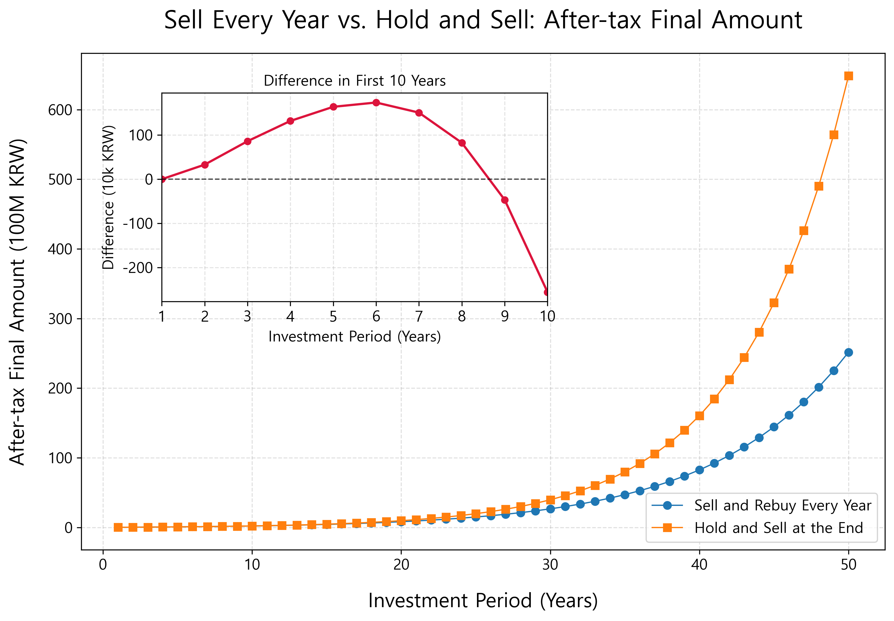

The graph above shows the result. In the early period, the annual sell-and-rebuy strategy has an advantageous section. Especially in the early stage, profits are not large, so the KRW 2.5 million basic deduction has a large effect. Even if profits are realized every year, little or no tax is created, and therefore the after-tax amount can be higher than the continuous-holding strategy. If returns are lower, this favorable period can last longer because the slower profits accumulate, the longer the annual KRW 2.5 million deduction remains effective.

But as time lengthens, the situation changes. Over the long term, the continuous-holding strategy becomes more favorable. The reason is simple. The annual selling strategy pays taxes little by little in advance. Money paid as tax can no longer be invested. In other words, amounts lost to tax lose the chance to compound from the next year onward.

By contrast, the continuous-holding strategy does not pay taxes in the middle. Of course, if everything is sold at the end, the tax bill is large. Because tax must be paid on the entire gain accumulated over a long period, the final tax alone can look burdensome. But what matters is that the unpaid tax also remained invested and grew together during the period. Deferring tax allowed even that money to compound.

Some may say that instead of selling everything, one could use only the KRW 2.5 million deduction by selling partially. That is true. But for simplicity, this simulation did not include many other variables either. In actual investing, annual returns are not constant, and one must calculate each time how much profit to realize to use the basic deduction efficiently. Transaction fees, currency exchange costs, and price differences between sale and repurchase must also be considered. Once all these factors are included, buying and selling stocks every year may not be as profitable as it seems. In addition, when trading through Korean brokerages, Korean investors do not receive the long-term capital gains tax benefits applied to U.S. residents. Ultimately, repeated trading for tax savings is theoretically possible, but in practice it is troublesome to calculate and execute, and additional costs and mistakes can occur.

This is a very important concept in long-term investing. Reducing taxes matters, but when taxes are paid also matters. The same tax produces different results depending on whether it is paid early or later. KRW 1 million paid as tax today can no longer be invested, but KRW 1 million paid twenty years later could have stayed invested and contributed to building larger assets during that time. Deferring tax can have an effect similar to receiving an interest-free loan.

The graph also shows this flow. In the early period, the annual selling strategy stays ahead or similar, but as time lengthens, the continuous-holding strategy grows faster. In long-term periods where compounding fully begins to work, the gap widens. Even if a large tax is paid at the end, the effect of not paying tax and compounding the money beforehand is greater.

Of course, the same answer does not apply to everyone. The optimal choice can differ depending on investment size, return, needed cash flow, holding period, and whether other losing positions exist. But once again we can confirm that complex investment methods do not always create better results. Simplicity often wins. Selling and buying again every year, calculating taxes, and matching deduction limits may look clever. But over the long term, quietly holding good assets can produce better results.

Just as what matters in investing is not moving often but surviving for a long time, the same applies to taxes. A simple strategy of not selling unnecessarily can be the strongest tax-saving strategy for long-term investors.

## 7.3 Giving Stocks to Children

When transferring assets to children in Korea, taxes cannot be ignored. Wanting to give hard-earned money to children is natural, but gift tax arises once certain amounts are exceeded. Korea's gift and inheritance taxes are relatively heavy by global standards. Therefore, as assets begin to grow, "how to pass them on" becomes as important as "how much to earn."

Korea's gift tax is progressive. As the amount received as a gift increases, the tax rate rises. The deduction amount over each ten-year period is KRW 50 million, and the tax rate is 10 percent when the tax base is KRW 100 million or less, but rises to a maximum of 50 percent when it exceeds KRW 3 billion. Actual taxes vary depending on deductions, progressive deductions, family relationships, and past gift history. But broadly speaking, Korea is a country that taxes asset transfers very heavily.

Compared with major countries, Korea's burden is high. The United States also has a progressive structure, but as of 2026, lifetime gifts and estate transfers can be combined for an exemption of up to $15 million per person. In Korean won, that is about KRW 23 billion, and if a couple plans together, the exemption can rise to about KRW 46 billion. In addition, up to $19,000, or about KRW 30 million, can be given per recipient without a separate gift tax filing.

Therefore, in the United States, unless someone is an extremely large asset holder, federal estate and gift tax is often not actually paid. By contrast, Korea has high maximum rates and much smaller exemptions than the United States, so many people feel inheritance and gift taxes as realistic issues even when they are not extremely wealthy. That is why tax planning is necessary. Tax saving here does not mean tax evasion. It means planning in advance within the law and preparing to avoid unnecessarily large taxes. If you intend to pass assets to children, one of the best methods is to use time: instead of giving a large sum all at once, gift small amounts in the child's name as early as possible and invest that money long term.

In Korea, when parents give money to children, gifts are exempt up to certain amounts. In general, when lineal ascendants give to children, adult children can receive up to KRW 50 million over ten years as a gift property deduction, and minor children up to KRW 20 million over ten years. However, this limit is not simply calculated separately for each giver. Amounts received from the same lineal ascendant group, such as parents, can be combined, so caution is needed. In addition, property given when needed, for needed purposes, and within the socially accepted range can be treated as non-taxable gift property, so small amounts steadily given in ordinary life can also be seen as non-taxable.

The simplest way to use this system is to open a stock account in the child's name and accumulate ETFs under the child's name. From the time the child is young, buy leveraged investment assets tracking S&P 500 ETFs or Nasdaq-100 ETFs in a stock account under the child's name. Children have relatively more time, so they can sufficiently handle the volatility of leverage. If KRW 200,000 is invested every month in QLD for twenty years, the principal is about KRW 50 million, but the amount can become about KRW 300 million. This method can reduce the tax burden that might arise when giving KRW 300 million all at once. Excluding the KRW 50 million deduction, a 10 percent tax rate would produce KRW 25 million in tax.

This is the core of the strategy of gifting early and investing long term. Do not try to transfer assets after they have become large; transfer them while they are still small and grow them with the child's time. The greatest gift parents can give children may not simply be the size of the money. It is also important that children can learn a philosophy of long-term investing from you.

Accounts in children's names can be opened early. Generally, documents such as a parent's identification, family relationship certificate, and basic certificate based on the child are required. These days, depending on the brokerage, many child accounts can be opened non-face-to-face. In practice, once a child is born, the birth is registered, and documents such as family relationship and basic certificates can be issued, you can prepare to open an account in the child's name.

Taxes cannot be avoided, but they can be prepared for. And time, the most powerful weapon in investing, is what children have the most of. Giving stocks to children is not simply giving money. It is giving time, giving compounding, and giving direct or indirect learning about long-term investing and capitalism. Through this, children can build a firm foundation to stand as members of society. That is precisely what society expects from parents.

## 7.4 Summing Up Chapter 7

Chapter 7 examined an unavoidable reality in investing: taxes. When first beginning investing, only returns catch the eye. We worry which ETF will rise more and which stock will produce greater returns. But as time passes and assets grow, taxes become increasingly important. What ultimately matters is not pre-tax return, but after-tax return actually left in our hands.

Domestic stocks and U.S. stocks have different tax structures. For ordinary small shareholders, domestic listed stocks have relatively small tax burdens on trading gains. By contrast, U.S. stocks, including U.S. ETFs, require tax on annual capital gains exceeding KRW 2.5 million. Therefore, if investing in U.S. stocks, one must think not only about high returns, but also about when to sell and how long to hold.

We also examined tax-saving strategies. Intentionally selling and buying again each year to use the KRW 2.5 million basic deduction can be advantageous early on. But over the long term, continuing to hold may be better. Once sold, taxes are fixed, and money lost to tax can no longer compound. For long-term investors, the strongest tax-saving strategy is surprisingly simple: buy good assets and do not sell unnecessarily.

Because Korea has a high gift and inheritance tax burden, if you intend to pass assets to children, prepare as early as possible. Rather than transferring a large sum at once, opening an account in the child's name, gifting gradually within deduction limits, and letting that money be invested in ETFs long term can achieve tax savings and investment education at the same time.

Taxes are difficult and boring even for me. But if you do not understand taxes, you can unnecessarily lose part of the returns you worked hard to obtain. Conversely, if you understand taxes, you can keep more money at the same return. It is not only scammers who want to take our money. The state too, for various reasons, tries to take our money under the name of taxes. What matters in investing is not only earning a lot. Protecting what you earn is just as important.

The core message of Chapter 7 is simple. There is no need to fear taxes, but they must not be ignored. Taxes can be a cost that eats into investment returns, but if understood well, they can also become a standard that makes long-term investment strategy sturdier. Hold good assets for a long time, reduce unnecessary trading, and prepare in advance even for your family's future. That is a wise attitude that considers taxes and reality.

# Chapter 8. Closing: What Is a Rich Person?

Calling someone rich simply because they have a lot of money feels insufficient. But we also cannot define wealth only with words created by people without much money to comfort themselves. Standards for wealth differ by person, but I think at least one thing is clear. Wealth should be proven by assets, not consumption. Someone who drives an expensive car and eats expensive food is not necessarily rich.

We can easily find people who look glamorous only on the outside on social media. Not all of them are like that, but behind their flashy posts, their inner reality may be empty. By contrast, someone who lives modestly on the outside yet has sufficient cash flow and can choose their own time is closer to what I consider rich.

Several books influenced my personal definition of wealth, but Robert Kiyosaki's Rich Dad Poor Dad inspired me especially. The book repeatedly emphasizes the view that we should not live for money, but make money work for us. From this perspective, I define a rich person as someone who can control time. Someone who has enough assets to do what they need to do, and because of those assets can use their time for themselves. That is the rich person I imagine.

This definition differs somewhat from the outcome-based standard of "how much money is needed to be rich." It is closer to a process. If someone can eat, study, work, and use their time for themselves now, they already belong to the process of being rich. Conversely, even with much money, if someone is still dragged around by money and time, I do not see them as truly rich. The reason the process matters is simple. A person who knows how to control time is more likely to create more assets in the future, and even if they obtain a large sum, they are more likely to protect and grow it.

Some readers may think I define wealth this way as a form of self-comfort because I am not yet enormously rich. But I am confident. I am building assets while pursuing values I believe are important, and I believe that process itself is already the direction of wealth. If you find me again after time has passed, I hope then to prove this thought more clearly through results as well.

Whether you are a soldier or not, you can become this kind of rich person. The method, however, differs depending on each person's situation and environment. I cannot give every person a custom answer. The way each person moves toward wealth is not written in textbooks, nor is it usually contained in easy advice from adults. So we must read books, gain inspiration, understand our own situations, and turn that into small actions. I hope this book becomes a milestone that helps you set at least a minimal direction in that process.

I like the phrase dono jeomsu, which I first encountered in Park Woong-hyun's Eight Words. It is a core practice attitude in Seon Buddhism: sudden enlightenment followed by gradual cultivation. Investing is the same. It is not completed by one realization. Once you understand good principles, you must repeat them for a long time. Through repetition, the realization gradually melts into your life. I hope this book becomes such a small opportunity for you.

# Appendix. Special Weapons Soldiers Have

## Appendix 1. Military Mutual Aid Association

If you are a soldier, you have probably heard of the Military Mutual Aid Association at least once. Many people have heard seniors or peers say after commissioning or appointment, "You must sign up for military mutual aid." The association provides various financial and welfare services for soldiers and civilian military employees. Representative products include member retirement benefit savings, lump-sum deposits, member loans, and various member welfare programs.

From the outside, it looks fairly good. A certain amount is deducted from salary and saved long term, a relatively higher rate than ordinary banks can be received, and when needed, loans can be taken based on amounts paid in. For busy soldiers, it is a convenient system. There is no need to visit banks and compare rates, and because money is automatically deducted from salary, it creates a forced-saving effect. For junior officers who have not yet built saving habits, it can certainly help.

The association's representative product is member retirement benefit savings. During service, a fixed amount is paid each month, and upon discharge or retirement it can be received as a lump sum or in payments similar to an annuity. Simply put, it is a long-term savings product for soldiers and civilian military employees. A certain number of units is set, paid monthly, and interest is added according to the association's rate. If member retirement benefit savings resembles an installment savings account, lump-sum deposit products resemble bank deposits. A certain amount is entrusted and operated for periods such as six months, one year, or two years, after which interest is received.

Member loans are another distinctive system. Based on the principal accumulated in member retirement benefit savings, money can be borrowed up to a certain ratio. Looking only at this structure, it can feel attractive. The money you saved earns interest, and you can borrow against it at a relatively low rate. Depending on timing and membership conditions, member welfare programs may also provide benefits such as childbirth subsidies.

Up to this point, the Military Mutual Aid Association looks like a decent system. It cannot be called simply bad. For people without saving habits, it can become a forced-saving tool, and for those who want stable interest, it can be a comfortable choice. For busy soldiers who want to save money without much study, it has its advantages.

But by the standards discussed throughout this book, the association has clear limits. The greatest limits are return and the fact that if you withdraw early, you cannot receive interest until discharge. The association explains that because of tax settlement issues, only principal is paid upon early withdrawal, while interest continues to accumulate compound and is paid at withdrawal from membership or discharge. Because of this characteristic, retirement benefit savings has a nature close to long-term savings. Rates differ by period, but they are only slightly higher than commercial banks. From a long-term investment perspective, this return is not high. Compared with the long-term returns of broad U.S. market ETFs or leveraged ETFs examined earlier, the difference becomes much larger.

Soldiers without financial knowledge often take military mutual aid too much for granted. The phrase "If you are a soldier, you should do military mutual aid" is familiar, but it is not always the answer. Before joining any financial product, you must ask questions. What is the expected return? When can I freely withdraw my money? What disadvantages arise if I cancel early? How are taxes handled? How does it compare with investing the same money in ETFs? Joining simply because seniors do it or people around you say it is good is dangerous.

If you are a soldier just beginning military life, your investment period is long. Including military life or, if you leave the military, civilian life afterward, you still likely have more than twenty years remaining. This long time is your greatest weapon. It is too wasteful to tie it up relying only on military mutual aid. By investing long term in broad-market ETFs or using leveraged ETFs according to your risk tolerance, you can obtain far greater opportunities to build assets.

Soldiers have a special occupation. Stable salary is a major advantage, but they also carry heavy responsibility, live busily, and work in environments where it is hard to obtain information unless they make their own effort. For that reason, I especially hope you understand and practice the contents of this book. Individual situations differ, but in most cases I recommend only 20 units, or KRW 100,000, enough to receive welfare benefits.

The Confucian classic The Great Learning contains the phrase "cultivate oneself, regulate the family, govern the state, and bring peace to the world." Without money, I collapse first. I sincerely hope that those of you who defend the nation also stand firmly yourselves.

## Appendix 2. Real Estate

Ordinary office workers naturally feel the need for a home not only as an investment asset but also because of marriage, commuting, children's education, and distance from work. Soldiers often do not. Official quarters or bachelor housing may be provided, units move every few years, and it is hard to predict where one will live for a long time. Therefore, it is easy to think, "Do I really need a house?" Instead of feeling a house as a necessity of life, soldiers easily postpone it as something to consider around the time of discharge. But precisely here, soldiers can miss an important opportunity to build assets.

Richbee's How Soldiers Became Rich shows a similar concern. Soldiers begin earning stable income at relatively young ages, and in many cases their income is higher than civilian beginners of the same age. Yet their homeownership rate is lower than expected. This is not simply because they do not need houses. It comes from seeing real estate only as "a house I will live in" because of the nature of the military profession, rather than seeing it as "a tool for building assets."

Real estate does not have to be viewed only as a house I will live in. A house is a living space, but it is also an investment asset. Even if I do not live in that house, I can buy real estate in a good location and rent it out. I can receive monthly rent or use jeonse. Even if the distance from the unit makes immediate residence difficult, holding real estate as an asset is possible.

This does not mean buying any house. Real estate requires much more money than stocks, transaction costs are high, and location choice matters greatly. If loans are used, interest burden must be considered. Tenant management, vacancy, repair costs, and taxes must also be considered. Therefore, real estate should not be approached lightly. But completely ignoring real estate because one is a soldier is also not a good choice. If the special conditions of soldiers are used well, real estate can become a powerful means of asset formation.

The key is leverage. Real estate is a representative asset for which individuals can borrow relatively large amounts to invest. Borrowing a large amount from a bank to invest in stocks is difficult and risky. But when buying a home, one can use the home as collateral and take a large loan. Even without all the money oneself, one can combine a certain amount of equity and a loan to hold a larger asset. This is the powerful force of real estate.

In Section 4.5, we compared expected returns between real estate and an S&P 500 ETF. We assumed buying a KRW 1 billion home with KRW 400 million of equity and KRW 600 million in debt. Seoul housing was simplified as rising 6 percent per year, and the S&P 500 ETF as rising 10 percent per year. In that comparison, real estate net assets increased quite rapidly early on. The reason is clear. My own money is KRW 400 million, but house price appreciation applies to the full KRW 1 billion asset. On top of that, loan principal decreases over time.

Soldiers need to understand this structure well. Even if soldiers buy homes, they do not need to live in them because the military supports official quarters. Therefore, they can rent out the house and use that rent to pay interest and principal. After thirty years, when repayment is complete, the house belongs entirely to you. If you borrowed 60 percent, that 60 percent of money was paid without you putting in a single won directly, in effect. Any increase in the home's value over time is an additional benefit.

But many soldiers fail to use this strength properly. Because they can live in official quarters, they think they do not need to buy a house; because they move units often, they think real estate is a later problem. Living in official quarters can help reduce consumption, but by itself it does not create assets. If housing costs are saved, that amount must be invested. If official quarters reduce living expenses, that money must be converted into assets, whether ETFs or real estate.

It is said that humanity emerged in harsh Africa because the environment was extremely severe. Because of that, civilians fight desperately to secure housing and win it. Soldiers, however, tend to settle into military housing provided by the state. Even though they are in a better environment to own homes, fewer own houses for a stable old age.

What we must guard against is not the environment, but inertia. When civilians build a shelter against wind and rain with bare hands in a rough storm, soldiers begin the battle already inside a sturdy fortress. We must recognize this overwhelming advantage. There is no need to voluntarily seek harsh trials. Within the stability provided by official quarters, it is enough to expand the investment map one step ahead of others.

# Closing Remarks

Thank you for choosing my book and following its contents to this point. If you practice what this book suggests, you are applying most of the investment philosophy I acquired while reading many books. I do not know much more beyond what I have described here. I simply believed what I read in books, practiced it, and waited.

In trying to convey as much as possible, the book became longer than expected. I thought a lot about this. If I wrote at length, the explanation could become too verbose; if I wrote too briefly, I worried there would not be enough support for my claims. I tried to remove as much repetition as possible, but please understand that the volume is still somewhat long.

Even though the book became a little long, there are certainly many things I could not cover. This book's goal is to provide minimal basic financial literacy and introduce an easy, practical method for those troubled by too many choices. I hope you use this book as a foundation to broaden your knowledge. If you are curious about more detailed topics, the books that inspired or helped me write this book are listed at the end, so I recommend reading them.

The sources of the data I used are also listed in the "Data Sources" section at the end. The Python code and data I used to draw the graphs are open sourced on my GitHub, so those who want to run the code directly or change variables and test other scenarios can refer to it.

https://github.com/jay-nuclear-phd/leverage-etf

In my experience, people who are financially comfortable also work more flexibly and better. When there is room, one's field of view widens, and one does not swing between joy and despair over small immediate results or current reputation. People with financial solidity gain the psychological stamina to respond flexibly and boldly to unfair orders or sudden bad events. Ironically, compared with people who anxiously cling to promotion, the attitude of someone who has something to rely on besides promotion reveals professional ease and confidence, and organizations tend to give higher marks to that relaxed competence.

Finally, I hope you remember that money does not guarantee happiness, but without money there is a high probability of unhappiness. I hope money does not interfere with your main work. Rather, I hope money allows you to enjoy true freedom within the capitalist system.

# References

## Books Worth Reading Together

The books below were references while I wrote this book and helped me establish my own financial knowledge and investment philosophy. I included books that help understand not only money and investing, but also the structure of capitalism, institutions and power, and individual judgment and attitude.

### Attitude Toward Life and Execution

- The 5 Second Rule — Mel Robbins
    A book that helps build the habit of reducing hesitation and acting immediately.
- Go Forward Boldly Like a Rhinoceros Horn — Scott Alexander
    A book that helps think about moving forward according to one's own principles and judgment without being shaken by others' evaluations in an uncertain world.

### Cooperation, Institutions, and How Society Works

- The Evolution of Cooperation — Robert Axelrod
    Explains how cooperation emerges and is maintained even when individuals pursue only their own interests. This book had the greatest philosophical influence on writing this book.
- Why Nations Fail — Daron Acemoglu and James Robinson
    A good book for understanding national prosperity and decline from the perspective of institutions and power structures.
- Why Corrupt China Grows — Yuen Yuen Ang
    Uses the Chinese case to show that corruption and economic growth are not necessarily a simple opposite relationship.
- How Real Estate Became Power — Mike Bird
    A book that examines how real estate connects to political and economic power beyond being a simple asset.

### Capitalism and the Structure of Wealth

- EBS Capitalism — EBS Capitalism Production Team
    An introductory book that helps readers easily understand the basic structures of finance, consumption, and capitalism.
- Why Only They Get Rich — Philipp Bagus
    A book that helps think about the structure in which wealth concentrates in certain classes and the causes of asset gaps.
- The Way Rich People Think — Hanno Beck
    Helpful for understanding differences in how people think about money, investing, and risk.

### Money, Investing, and Asset Formation

- Rich Dad Poor Dad — Robert Kiyosaki
    A popular explanation of the difference between assets and liabilities and the importance of cash flow.
- The Attributes of Money — Kim Seung-ho
    Helps readers think about attitudes toward money and perspectives on protecting and growing assets.
- Leverage — Richbee
    Covers how to use time, capital, and systems to create larger results.

### Index Investing and Long-Term Investing

- The Principles of Value Investing — John Bogle
    Helpful for understanding the importance of low costs, diversification, and long-term investing.
- Own All Stocks — John Bogle
    Best shows the philosophy of index investing by owning the whole market.
- The Best ETF That Changes Your Life — Jaemturi
    A practical long-term ETF guide by an author who went from ordinary employee to FIRE through ETF investing.

## Data Sources

### 2.1 Inflation

Dollar-won exchange rate: https://www.index.go.kr/unity/potal/main.do

Big Mac Index: https://statbase.org/data/kor-bigmac-price/

Deposits: https://kosis.kr/edu/index/index.do?sso=ok

### 2.3 The Rich Get Richer, the Poor Get Poorer

Gini coefficient: https://ourworldindata.org/grapher/economic-inequality-gini-index

### 3.5 Give Up Excessive Greed

2024 Year-End S&P Indices Versus Active U.S. Scorecard: https://www.spglobal.com/spdji/en/documents/spiva/spiva-us-year-end-2024.pdf

### 4.4 ETFs Are Suitable for Long-Term Investing

KB Real Estate Data Hub (KB Statistics): https://data.kbland.kr/

yfinance (Yahoo Finance): https://finance.yahoo.com/

### 5.3 Optimal Leverage Ratio

FRED Nasdaq Composite Index page: https://fred.stlouisfed.org/series/NASDAQCOM

### 7.3 Giving Stocks to Children
